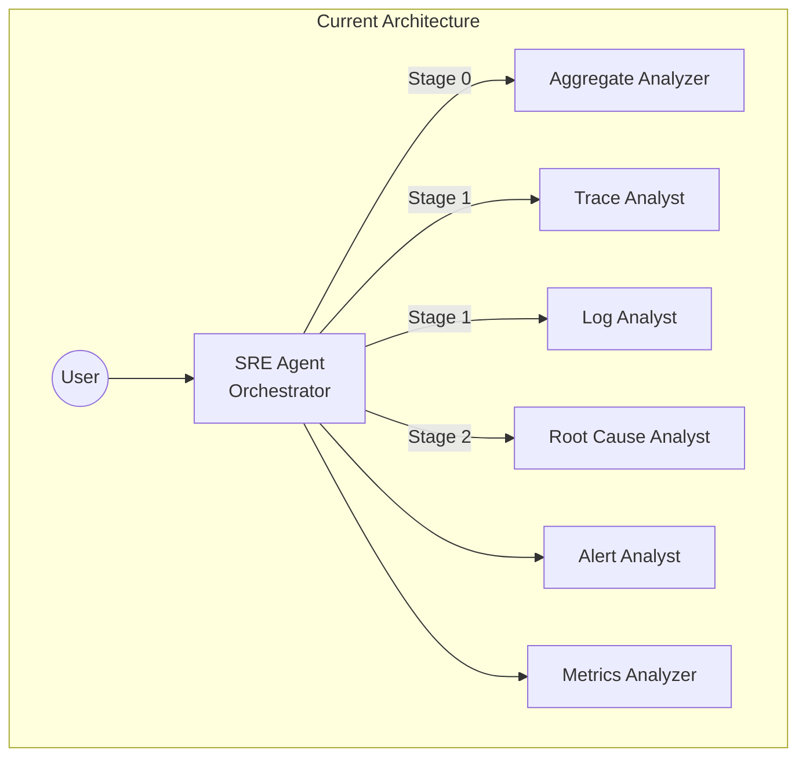
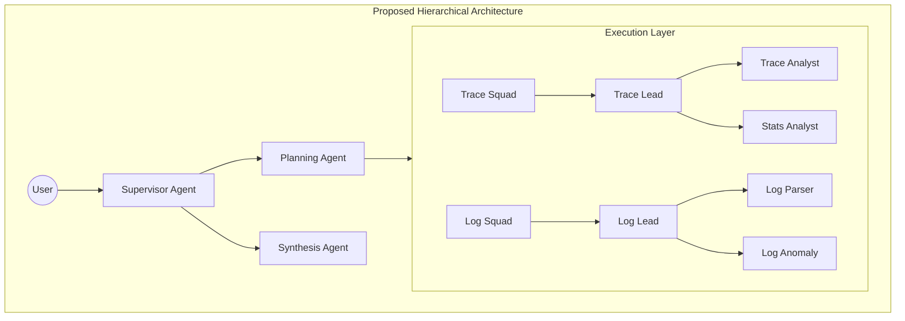

# SRE Agent: Implementation Plan

This plan outlines the roadmap for transforming the SRE Agent from a monolithic, reactive tool into a modular, proactive, and memory-aware diagnostic expert.

# AutoSRE Agent: Comprehensive Improvement Plan

## Executive Summary

This document outlines architectural improvements and enhancements to transform the SRE Agent into the **world's best AutoSRE solution for Google Cloud**. The analysis identified 8 major improvement areas spanning multi-agent architecture patterns, tool organization, error recovery, and new capabilities.

> [!IMPORTANT]
> This is a strategic improvement plan. Implementation should be phased to minimize disruption while maximizing impact.

---

## Current State Assessment

### Architecture Overview

The current implementation follows a **"Core Squad" orchestration pattern**:



### Strengths ✅

| Aspect | Details |
|--------|---------|
| **Documentation** | Excellent CLAUDE.md, AGENTS.md with clear patterns |
| **Tool Architecture** | Dual-strategy MCP + Direct API with fallback |
| **Observability** | OTel instrumentation via `@adk_tool` decorator |
| **Schema Validation** | Pydantic with `extra="forbid"` catches LLM hallucinations |
| **3-Stage Pipeline** | Logical progression: Aggregate → Triage → Deep Dive |

### Issues Identified ⚠️

| Issue | Impact | Priority |
|-------|--------|----------|
| Monolithic [server.py](file:///Users/summitt/work/sre-agent/server.py) (2400+ lines) | Maintainability | **High** |
| No shared memory between sub-agents | Loss of context in handoffs | **High** |
| 70+ tools may overwhelm LLM | Selection paralysis | **Medium** |
| No explicit reasoning patterns (ReAct/CoT) | Reduced reliability | **High** |
| Basic error recovery only | Fragile under failures | **Medium** |
| No context windowing/compression | Token limit issues | **Medium** |
| Missing incident learning loop | No continuous improvement | **Low** |

---

## Improvement Areas

### 1. Multi-Agent Architecture Patterns

#### 1.1 Implement ReAct (Reasoning + Acting) Pattern

**Current**: Agents receive instructions and make tool calls implicitly.

**Proposed**: Adopt explicit ReAct loop in prompts:

```
Thought: [What I need to investigate]
Action: [Tool to use]
Observation: [Result from tool]
... (repeat)
Thought: [Final synthesis]
Answer: [Conclusion]
```

**Files to Modify**:
- [prompt.py](file:///Users/summitt/work/sre-agent/sre_agent/prompt.py) - Add ReAct template
- [sub_agents/trace.py](file:///Users/summitt/work/sre-agent/sre_agent/sub_agents/trace.py) - Update prompts
- [sub_agents/root_cause.py](file:///Users/summitt/work/sre-agent/sre_agent/sub_agents/root_cause.py) - Update prompts

---

#### 1.2 Leverage ADK Memory + Vertex AI Memory Bank

**Current**: Sub-agents are stateless between invocations.

**Proposed**: Use built-in ADK memory services + Vertex AI Memory Bank:

```python
# Use ADK's MemoryService for investigation context
from google.adk.memory import VertexAiMemoryBankService

# Configure Memory Bank for SRE investigations
memory_service = VertexAiMemoryBankService(
    project=project_id,
    location=location,
)

# Memory features to leverage:
# - Memory Extraction: Auto-extract key findings from conversations
# - Memory Consolidation: Merge new evidence with existing knowledge
# - Similarity Search: Find relevant past investigations
# - Scope Isolation: Per-user/per-investigation memory
```

**Documentation**:
- [ADK MemoryService](https://google.github.io/adk-docs/sessions/memory/)
- [Vertex AI Memory Bank](https://docs.cloud.google.com/agent-builder/agent-engine/memory-bank/overview)

**Files to Modify/Create**:
- [sre_agent/agent.py](file:///Users/summitt/work/sre-agent/sre_agent/agent.py) - Add `memory_service` to agent config
- `sre_agent/memory/__init__.py` - Memory module init
- `sre_agent/memory/investigation_memory.py` - SRE-specific memory schema

---

#### 1.3 Hierarchical Agent Structure

**Current**: Flat sub-agent delegation via orchestration tools.

**Proposed**: True hierarchical delegation with supervisor pattern:



**Files to Create**:
- `sre_agent/agents/supervisor.py`
- `sre_agent/agents/planner.py`
- `sre_agent/agents/synthesizer.py`

---

### 2. Agent Communication & Coordination

#### 2.1 Structured Agent-to-Agent Messages

**Current**: Sub-agents return free-form text.

**Proposed**: Define Pydantic schemas for inter-agent communication:

```python
# MODIFY: sre_agent/schema.py
class AgentHandoff(BaseModel):
    """Structured handoff between agents."""
    model_config = ConfigDict(frozen=True, extra="forbid")

    source_agent: str
    target_agent: str
    context: InvestigationContext
    task: str
    constraints: list[str]
    expected_output: str
```

---

#### 2.2 Blackboard Pattern for Coordination

**Proposed**: Implement shared "blackboard" for agents to post/read findings:

```python
# NEW: sre_agent/coordination/blackboard.py
class InvestigationBlackboard:
    """Shared workspace for multi-agent coordination."""

    async def post_finding(self, agent: str, finding: Finding) -> None: ...
    async def get_findings(self, filter: FindingFilter) -> list[Finding]: ...
    async def post_hypothesis(self, agent: str, hypothesis: str) -> None: ...
    async def vote_hypothesis(self, agent: str, hypothesis_id: str, vote: Vote) -> None: ...
```

---

### 3. Tool Organization & Selection

#### 3.1 Structured Tool Categories (Fetch vs Analyze per Signal)

**Current**: All 70+ tools presented without clear categorization.

**Proposed**: Organize tools by signal type AND operation:

```python
# MODIFY: sre_agent/tools/config.py
class ToolCategory(str, Enum):
    # Discovery
    DISCOVERY = "discovery"           # Find data sources

    # FETCH tools (retrieve raw data)
    TRACE_FETCH = "trace_fetch"       # fetch_trace, list_traces
    LOG_FETCH = "log_fetch"           # list_log_entries, get_logs_for_trace
    METRIC_FETCH = "metric_fetch"     # list_time_series, query_promql
    ALERT_FETCH = "alert_fetch"       # list_alerts, get_alert

    # ANALYZE tools (process/interpret data)
    TRACE_ANALYZE = "trace_analyze"   # analyze_trace_comprehensive, compare_span_timings
    LOG_ANALYZE = "log_analyze"       # extract_log_patterns, analyze_log_anomalies
    METRIC_ANALYZE = "metric_analyze" # detect_metric_anomalies, calculate_series_stats
    ALERT_ANALYZE = "alert_analyze"   # correlate with other signals

    # Cross-signal
    CORRELATION = "correlation"       # build_cross_signal_timeline
    AGGREGATE = "aggregate"           # BigQuery fleet analysis

    # Remediation
    REMEDIATION = "remediation"       # suggestions, risk estimation

# Tool selector for dynamic filtering
def get_tools_for_phase(phase: InvestigationPhase) -> list[Callable]:
    """Return only tools relevant to current phase."""
```

**Tool Matrix**:

| Signal | Fetch Tools | Analyze Tools |
|--------|-------------|---------------|
| Traces | `fetch_trace`, `list_traces`, `get_trace_by_url` | `analyze_trace_comprehensive`, `compare_span_timings`, `analyze_critical_path` |
| Logs | `list_log_entries`, `get_logs_for_trace`, `mcp_list_log_entries` | `extract_log_patterns`, `analyze_log_anomalies`, `compare_log_patterns` |
| Metrics | `list_time_series`, `query_promql`, `mcp_list_timeseries` | `detect_metric_anomalies`, `compare_metric_windows`, `calculate_series_stats` |
| Alerts | `list_alerts`, `list_alert_policies`, `get_alert` | `correlate_incident_with_slo_impact`, `analyze_alert_context` |

---

#### 3.2 Tool Grouping with "Meta-Tools"

**Proposed**: Create composite tools that encapsulate common workflows:

```python
# NEW: sre_agent/tools/composite/investigation_toolkit.py
@adk_tool
async def investigate_latency_regression(
    baseline_trace_id: str,
    target_trace_id: str,
    project_id: str
) -> str:
    """
    Complete latency investigation workflow:
    1. Fetch both traces
    2. Compare timings
    3. Identify critical path changes
    4. Correlate with logs/metrics
    5. Generate hypothesis

    Returns comprehensive report.
    """
```

---

### 4. Error Recovery & Resilience

#### 4.1 Graceful Degradation Framework

**Current**: Basic try/catch with fallback to Direct API.

**Proposed**: Multi-level fallback with quality tracking:

```python
# MODIFY: sre_agent/tools/mcp/gcp.py
class FallbackChain:
    """Execute tool with cascading fallbacks."""

    strategies = [
        ("mcp_primary", mcp_execute_sql),
        ("mcp_retry", lambda: mcp_execute_sql(timeout=30)),
        ("direct_api", direct_bigquery_query),
        ("cached_result", get_from_cache),
        ("degraded_response", generate_partial_response),
    ]
```

---

#### 4.2 Agent Self-Correction Loop

**Proposed**: Allow agents to retry with modified approach:

```python
# NEW: sre_agent/agents/mixins/self_correction.py
class SelfCorrectionMixin:
    """Enables agents to detect and recover from failures."""

    MAX_RETRIES = 3

    async def execute_with_correction(self, task: str) -> str:
        for attempt in range(self.MAX_RETRIES):
            result = await self.execute(task)
            if self.validate_result(result):
                return result
            task = self.generate_correction_prompt(task, result)
        return self.graceful_failure(task)
```

---

### 5. Context Management

#### 5.1 Sliding Window with Summarization

**Current**: Full context passed to each invocation.

**Proposed**: Implement context compression:

```python
# NEW: sre_agent/context/manager.py
class ContextManager:
    """Manages conversation context with sliding window."""

    async def compress_history(
        self,
        messages: list[Message],
        max_tokens: int = 4000
    ) -> list[Message]:
        """Compress old messages while preserving key findings."""

        # Recent messages: Keep full detail
        # Older messages: Summarize key points
        # Findings: Always preserve
```

---

#### 5.2 Investigation State Machine

**Proposed**: Track investigation progress explicitly:

```python
# NEW: sre_agent/state/investigation_state.py
class InvestigationState(str, Enum):
    INITIATED = "initiated"
    GATHERING_CONTEXT = "gathering_context"
    ANALYZING_SIGNALS = "analyzing_signals"
    FORMING_HYPOTHESIS = "forming_hypothesis"
    VALIDATING_HYPOTHESIS = "validating_hypothesis"
    SYNTHESIZING_CONCLUSION = "synthesizing_conclusion"
    RECOMMENDING_REMEDIATION = "recommending_remediation"
    COMPLETE = "complete"
```

---

### 6. Server Refactoring

#### 6.1 Split Monolithic [server.py](file:///Users/summitt/work/sre-agent/server.py)

**Current**: Single 2400+ line file.

**Proposed**: Modular router structure:

```
sre_agent/api/
├── __init__.py
├── app.py              # FastAPI app creation
├── middleware.py       # Auth, CORS, logging
├── routers/
│   ├── __init__.py
│   ├── agent.py        # /agent/* endpoints
│   ├── tools.py        # /tools/* endpoints
│   ├── sessions.py     # /sessions/* endpoints
│   ├── config.py       # /config/* endpoints
│   └── health.py       # /health endpoint
└── dependencies.py     # Shared dependencies
```

---

### 7. Testing Improvements

#### 7.1 Agent Behavior Tests

**Proposed**: Add tests for agent decision-making:

```python
# NEW: tests/unit/sre_agent/agents/test_agent_behavior.py
class TestAgentBehavior:
    """Test agent reasoning and tool selection."""

    async def test_latency_investigation_uses_correct_tools(self):
        """Verify agent selects trace tools for latency issues."""

    async def test_error_investigation_checks_logs(self):
        """Verify agent correlates errors with log patterns."""

    async def test_agent_handles_tool_failure(self):
        """Verify graceful degradation on tool failure."""
```

---

#### 7.2 Multi-Agent Integration Tests

**Proposed**: Test agent coordination:

```python
# NEW: tests/integration/test_multi_agent_coordination.py
class TestMultiAgentCoordination:
    """Test agent handoffs and shared memory."""

    async def test_aggregate_to_trace_handoff(self):
        """Verify context preserved in handoff."""

    async def test_shared_memory_persistence(self):
        """Verify findings survive agent transitions."""
```

---

### 8. New Capabilities

#### 8.1 Runbook Automation

**Proposed**: Allow agent to execute predefined runbooks.

**Runbook Sources** (Priority Order):
1. **Built-in SRE Runbooks**: Create standard runbooks in `sre_agent/runbooks/library/`
   - `restart_pod.yaml` - Restart failing pods
   - `scale_deployment.yaml` - Scale up/down
   - `rollback_deployment.yaml` - Rollback to previous version
   - `drain_node.yaml` - Drain node for maintenance
   - `clear_cache.yaml` - Clear application cache
2. **Google Cloud Operations Suite**: Integrate with [Cloud Monitoring Runbooks](https://cloud.google.com/monitoring/alerts/creating-runbooks)
3. **User-Defined Runbooks**: Allow users to add custom runbooks via config
   - Path: `~/.sre_agent/runbooks/` or project-level `./runbooks/`
4. **Incident.io / PagerDuty**: (Future) Import runbooks from incident management tools

```python
# NEW: sre_agent/runbooks/engine.py
class RunbookEngine:
    """Execute operational runbooks with safety checks."""

    RUNBOOK_SOURCES = [
        Path(__file__).parent / "library",  # Built-in
        Path.home() / ".sre_agent" / "runbooks",  # User global
        Path.cwd() / "runbooks",  # Project-local
    ]

    async def execute_runbook(
        self,
        runbook_id: str,
        params: dict[str, Any],
        dry_run: bool = True,  # ALWAYS dry-run by default
        require_approval: bool = True,
    ) -> RunbookResult:
        """Execute runbook with approval gates."""
```

**Safety Features**:
- `dry_run=True` by default (no automatic mutations)
- Require human approval for destructive actions
- Audit logging for all executions

---

#### 8.2 Incident Learning Loop

**Proposed**: Learn from past investigations:

```python
# NEW: sre_agent/learning/incident_memory.py
class IncidentLearningSystem:
    """Store and retrieve past incident learnings."""

    async def record_resolution(
        self,
        incident: IncidentSummary,
        resolution: Resolution,
        effectiveness: float
    ) -> None: ...

    async def find_similar_incidents(
        self,
        current_signals: list[Signal],
        limit: int = 5
    ) -> list[PastIncident]: ...
```

---

## Implementation Phases

### Phase 1: Foundation (Weeks 1-2)
- [ ] Refactor [server.py](file:///Users/summitt/work/sre-agent/server.py) into modular routers
- [ ] Implement ReAct pattern in prompts
- [ ] Add tool phase categorization (fetch vs analyze per signal)

### Phase 2: Memory & State (Weeks 3-4)
- [ ] Integrate ADK `VertexAiMemoryBankService`
- [ ] Implement investigation state machine
- [ ] Add inter-agent handoff schemas

### Phase 3: Resilience (Weeks 5-6)
- [ ] Implement fallback chain framework
- [ ] Add self-correction loop
- [ ] Enhance context compression

### Phase 4: Advanced (Weeks 7-8)
- [ ] Add hierarchical supervisor pattern
- [ ] Implement blackboard coordination
- [ ] Add incident learning system
- [ ] Create runbook library and engine

---

## Verification Plan

> [!IMPORTANT]
> **All changes MUST include both unit tests AND E2E integration tests.** No exceptions.

### Testing Requirements

| Change Type | Unit Tests Required | E2E Tests Required |
|-------------|--------------------|--------------------|
| New tool | Mock GCP calls, test logic | Test full tool chain |
| New sub-agent | Test prompt, tool selection | Test delegation flow |
| Memory integration | Test read/write ops | Test cross-session persistence |
| Runbook execution | Test dry-run logic | Test approval flow |
| Server refactor | Test each router | Test full API flow |

### Automated Tests

| Test Type | Command | Coverage |
|-----------|---------|----------|
| Unit Tests | `uv run poe test` | All new modules |
| Integration | `uv run pytest tests/integration/` | Agent coordination |
| E2E | `uv run pytest tests/e2e/` | Full investigation flows |

### Manual Verification

1. **ReAct Pattern Verification**
   - Start agent: `uv run poe dev`
   - Ask: "Investigate latency spike in checkout-service"
   - Verify: Agent shows explicit Thought/Action/Observation cycle

2. **Tool Selection Verification**
   - Ask: "What's causing high error rates?"
   - Verify: Agent uses error-focused tools, not all 70+

3. **Error Recovery Verification**
   - Disable MCP server
   - Ask: "Analyze traces for order-service"
   - Verify: Agent falls back to Direct API gracefully

---

## User Review Required

> [!CAUTION]
> This plan proposes significant architectural changes. Please review and provide feedback on:

1. **Priority of changes** - Which improvements are most valuable for your use case?
2. **Phase ordering** - Should any phases be reordered based on your timeline?
3. **Scope** - Are there improvements you'd like to add or remove?
4. **Testing approach** - Are the verification steps sufficient?

---

## Summary

This improvement plan transforms the SRE Agent from a solid foundation into a world-class AutoSRE solution by:

1. **Enhancing reasoning** with ReAct patterns
2. **Improving coordination** with shared memory and structured handoffs
3. **Reducing LLM burden** with smart tool selection
4. **Increasing reliability** with robust error handling
5. **Enabling learning** with incident memory

The phased approach ensures incremental value delivery while maintaining system stability.

---

Here's where we are now:

## Phase 1: Foundation & Modularization (COMPLETED)
**Goal**: Technical debt reduction and reasoning structure.

- [x] **Modularize API**: Refactor `server.py` (2400 lines) into a domain-driven package structure (`sre_agent/api/`).
- [x] **ReAct Reasoning**: Implement explicit Reasoning + Acting loops in all sub-agent prompts.
- [x] **Tool Categorization**: Regroup 70+ tools into signal-based categories for better LLM selection.
- [x] **Cleanup**: Fix mypy/linting issues and update test suites to match new structure.

## Phase 2: Memory & Proactive State (IN PROGRESS)
**Goal**: Context retention and guided investigation.

- [ ] **Vertex AI Memory Integration**: Replace in-memory session history with `VertexAiMemoryBankService`.
- [ ] **Investigation State Machine**: Implement a structured state (Triage -> Analysis -> Root Cause) to guide the agent.
- [ ] **Cross-Agent Handoffs**: Standardize how the Orchestrator passes context to specialized sub-agents.
- [ ] **Proactive Signal Fetching**: Teach the agent to automatically check related signals (e.g., check logs when a trace shows an error).

## Phase 3: Advanced Diagnostics
**Goal**: Deep technical capabilities.

- [ ] **Anomaly Correlation Engine**: Automate the "Z-score comparison" across metrics and logs.
- [ ] **Circular Dependency Detection**: Add sophisticated graph analysis for microservices.
- [ ] **Resource Saturation Analysis**: Deep dive into OOMKilled, CPU Throttling, and Connection Pool exhaustion logic.

## Phase 4: UX & Refinement
**Goal**: User delight and operational safety.

- [ ] **Structured Reporting**: Standardize the "Executive Summary" output.
- [ ] **Remediation Verification**: Add a step to verify if a suggested fix would have helped in the past.
- [ ] **Interactive Widgets**: Expand GenUI support for complex dependency graphs.
