# Auto SRE

[]()
[](https://opensource.org/licenses/Apache-2.0)
[]()
[]()
[]()
[]()
[](https://github.com/astral-sh/ruff)
[](https://github.com/pre-commit/pre-commit)
[](https://mypy-lang.org/)
[](tests/README.md)

<div align="center">
  
</div>


**Auto SRE is an experimental SRE Agent for Google Cloud.** It analyzes telemetry data from Google Cloud Observability: **traces**, **logs**, **metrics**.

## Architecture

The agent is built using the Google Agent Development Kit (ADK). It uses a **"Core Squad"** orchestration pattern where the main **SRE Agent** coordinates specialized analysis.

**Key Features:**
- **Trace-Centric Root Cause Analysis**: Prioritizes BigQuery for fleet-wide analysis.
- **Autonomous Investigation Pipeline**: Sequential workflow from signal detection to root cause synthesis.
- **Root Cause Analyst**: Synthesizes causality, impact, and triggers (deployments).
- **Trace Analyst**: Consolidated expert for Latency, Errors, Structure, and Resiliency.
- **Friendly Expert Persona**: Combines deep technical expertise with a fun, approachable response style.
- **Mission Control Dashboard**: A "Deep Space" themed Flutter GenUI with glassmorphic visuals and real-time canvas visualizations.
- **Project ID Enforcement**: Global context awareness ensuring the correct GCP project is always targeted.
- **Investigation Persistence**: Automatic sync and storage of investigation sessions with Firestore support.
- **Memory Bank**: Long-term recall of confirmed findings using Vertex AI Vector Search (Production) or SQLite (Local).
- **Multi-Session History**: View, load, and manage previous investigations through the Mission Control history panel.
- **End-User Credentials (EUC)**: Users authenticate with their Google account; the agent uses their credentials to access GCP resources.
- **Dual-Mode Execution**: Supports both local development and production Agent Engine deployment.

### Deployment Architecture

Auto SRE supports **two execution modes** to optimize for both development velocity and production scalability:

```
┌─────────────────────────────────────────────────────────────────────────────────┐
│                          DEVELOPMENT MODE (Local)                                │
│                          SRE_AGENT_ID is NOT set                                 │
├─────────────────────────────────────────────────────────────────────────────────┤
│                                                                                  │
│  ┌────────────┐      HTTP       ┌────────────────┐      Direct     ┌──────────┐│
│  │  Flutter   │ ─────────────► │   FastAPI      │ ───────────────► │ADK Agent ││
│  │  Web App   │                │   Server       │                  │ (Local)  ││
│  │  :3000     │ ◄───────────── │   :8001        │ ◄─────────────── │          ││
│  └────────────┘                └────────────────┘                  └──────────┘│
│                                                                                  │
│  • Fast iteration during development                                             │
│  • Credentials via ContextVars (same process)                                    │
│  • Session storage: SQLite or in-memory                                          │
│  • Memory Bank: Local SQLite (`.sre_agent_memory.db`)                            │
│                                                                                  │
└─────────────────────────────────────────────────────────────────────────────────┘

┌─────────────────────────────────────────────────────────────────────────────────┐
│                          PRODUCTION MODE (Deployed)                              │
│                          SRE_AGENT_ID IS set                                     │
├─────────────────────────────────────────────────────────────────────────────────┤
│                                                                                  │
│  ┌────────────┐              ┌────────────────┐    Vertex AI    ┌─────────────┐│
│  │  Browser   │ ───────────► │   Cloud Run    │ ──────────────► │Agent Engine ││
│  │            │              │ (Flutter+Proxy)│ async_stream    │ (ADK Agent) ││
│  │            │ ◄─────────── │                │    _query       │             ││
│  └────────────┘              └────────────────┘ ◄────────────── └─────────────┘│
│                                      │                                │         │
│  • Scalable, managed infrastructure  │ Session State:                 │         │
│  • Credentials via session state     │ _user_access_token ──────────►│         │
│  • Session storage: VertexAI         │ _user_project_id ────────────►│         │
│  • Memory Bank: Vertex AI            │                                ▼         │
│                                                               ┌─────────────┐   │
│                                                               │  GCP APIs   │   │
│                                                               │ (User EUC)  │   │
│                                                               └─────────────┘   │
└─────────────────────────────────────────────────────────────────────────────────┘
```

**Mode Detection**: The `/agent` endpoint automatically detects the mode based on the `SRE_AGENT_ID` environment variable:
- **Not set** → Local mode (run agent in FastAPI process)
- **Set** → Remote mode (forward to Agent Engine)

### End-User Credentials (EUC) Flow

Auto SRE implements OAuth 2.0 credential propagation for multi-tenant access:

```
1. User signs in via Google OAuth (Flutter Web)
   └─► Scopes: email, cloud-platform

2. Frontend sends request with headers:
   └─► Authorization: Bearer <access_token>
   └─► X-GCP-Project-ID: <selected_project>

3. FastAPI middleware extracts credentials:
   └─► Local mode: Sets ContextVars
   └─► Remote mode: Passes to session state

4. Tools access credentials via get_credentials_from_tool_context():
   └─► Priority: ContextVar → Session State → Default (if allowed)

5. GCP API calls use user's credentials:
   └─► User sees only their authorized resources
```

### System Architecture

```mermaid
graph TD
    %% Styling
    classDef agent fill:#e1f5fe,stroke:#01579b,stroke-width:2px;
    classDef subagent fill:#e0f2f1,stroke:#00695c,stroke-width:2px;
    classDef llm fill:#f3e5f5,stroke:#4a148c,stroke-width:2px;
    classDef tool fill:#fff3e0,stroke:#e65100,stroke-width:1px;
    classDef user fill:#fff,stroke:#333,stroke-width:2px;
    classDef orchestration fill:#fff9c4,stroke:#fbc02d,stroke-width:2px,stroke-dasharray: 5 5;

    %% User Layer
    User((User)) --> SRE_Agent

    %% Main Agent Layer
    subgraph "Orchestration Layer"
        SRE_Agent[SRE Agent]:::main
        subgraph "Reasoning Core"
            LLM["Gemini 2.5 Flash"]:::external
            SRE_Agent <--> LLM
        end
    end

    %% Orchestration Tools (The bridge to sub-agents)
    subgraph "Orchestration Tools"
        RunAgg[run_aggregate_analysis]:::orchestration
        RunTriage[run_triage_analysis]:::orchestration
        RunDeep[run_deep_dive_analysis]:::orchestration
        RunLog[run_log_pattern_analysis]:::orchestration
    end

    SRE_Agent --> RunAgg
    SRE_Agent --> RunTriage
    SRE_Agent --> RunDeep
    SRE_Agent --> RunLog

    %% Sub-Agents (Core Squad)
    subgraph "Core Squad"
        direction TB

        subgraph "Stage 0: Analysis"
            Aggregate["Aggregate Analyzer<br/>(BigQuery Ninja)"]:::subagent
            Alert["Alert Analyst<br/>(First Responder)"]:::subagent
        end

        subgraph "Stage 1: Triage"
            TraceAnalyst["Trace Analyst<br/>(Latency, Errors, Resiliency)"]:::subagent
            LogAnalyst["Log Analyst<br/>(Log Whisperer)"]:::subagent
        end

        subgraph "Stage 2: Deep Dive"
            RootCause["Root Cause Analyst<br/>(Causality, Impact, Changes)"]:::subagent
        end

        subgraph "Specialists"
            Metrics["Metrics Analyzer<br/>(Metrics Maestro)"]:::subagent
        end
    end

    %% Orchestration Flow
    RunAgg --> Aggregate
    RunTriage --> TraceAnalyst & LogAnalyst
    RunDeep --> RootCause
    RunLog --> LogAnalyst
    SRE_Agent --> Alert
    SRE_Agent -- "Direct Delegation" --> Metrics

    %% Tools Layer
    subgraph "Tooling Ecosystem"
        direction TB

        subgraph "GCP Observability APIs"
            TraceAPI[Cloud Trace API]:::tool
            LogAPI[Cloud Logging API]:::tool
            MonitorAPI[Cloud Monitoring API]:::tool
            AlertAPI[Cloud Alerts API]:::tool
        end

        subgraph "Analysis Engines"
            BQEngine[BigQuery Analysis]:::tool
            Drain3[Drain3 Pattern Engine]:::tool
            StatsEngine[Statistical Engine]:::tool
            MegaTool[Trace Mega-Tool]:::tool
        end

        subgraph "Model Context Protocol (MCP)"
            MCP_BQ[MCP BigQuery]:::tool
        end
    end

    %% Tool Usage Connections
    Aggregate --> BQEngine & TraceAPI
    Alert --> AlertAPI & MonitorAPI
    TraceAnalyst --> MegaTool & TraceAPI & StatsEngine
    RootCause --> TraceAPI & LogAPI & MonitorAPI & StatsEngine
    LogAnalyst --> Drain3 & LogAPI & BQEngine
    Metrics --> MonitorAPI & StatsEngine

    %% Main Agent Direct Tool Access
    SRE_Agent --> TraceAPI & LogAPI & MonitorAPI & AlertAPI
    SRE_Agent --> MCP_BQ
```


<details>
<summary>Mermaid Diagram Source</summary>



</details>

## Multi-Stage Trace Analysis Pipeline

```
┌─────────────────────────────────────────────────────────────────┐
│  Stage 0: Analysis (BigQuery)                                   │
│  • Analyze thousands of traces                                  │
│  • Identify patterns, trends, problem services                  │
│  • Select exemplar traces (baseline + outliers)                 │
└─────────────────────────────────────────────────────────────────┘
                            ↓
┌─────────────────────────────────────────────────────────────────┐
│  Stage 1: Triage (Trace Analyst)                                │
│  • Comprehensive Trace Analysis (Mega-Tool)                     │
│  • Latency (Critical Path, Bottlenecks)                         │
│  • Errors (Forensics)                                           │
│  • Structure (Topology Changes)                                 │
│  • Resiliency (Retry Storms, Cascading Timeouts)                │
└─────────────────────────────────────────────────────────────────┘
                            ↓
┌─────────────────────────────────────────────────────────────────┐
│  Stage 2: Deep Dive (Root Cause Analyst)                        │
│  • Causality (Correlation across signals)                       │
│  • Impact (Blast Radius)                                        │
│  • Triggers (Deployment & Config Change Correlation)            │
└─────────────────────────────────────────────────────────────────┘
```

## Project Structure

```
sre_agent/
├── sre_agent/                    # Main backend package
│   ├── agent.py                  # SRE Agent & Orchestrator Tools
│   ├── auth.py                   # EUC (End User Credentials) handling
│   ├── prompt.py                 # Agent personality and instructions
│   ├── schema.py                 # Pydantic models (all with extra="forbid")
│   ├── api/                      # FastAPI application
│   │   ├── app.py                # Application factory
│   │   ├── middleware.py         # Auth middleware (token extraction)
│   │   └── routers/
│   │       ├── agent.py          # /agent endpoint (dual-mode: local/remote)
│   │       ├── sessions.py       # Session management endpoints
│   │       └── ...
│   ├── services/                 # Infrastructure services
│   │   ├── agent_engine_client.py # Remote Agent Engine client (production)
│   │   ├── session.py            # ADK session management
│   │   └── storage.py            # User preferences storage
│   ├── sub_agents/               # Core Squad specialists
│   │   ├── trace.py              # Consolidated Trace Analyst
│   │   ├── root_cause.py         # Root Cause Analyst
│   │   ├── logs.py               # Log Analyst
│   │   ├── metrics.py            # Metrics Analyst
│   │   └── alerts.py             # Alert Analyst
│   └── tools/                    # Modular tools for GCP & Analysis
│       ├── clients/              # Direct GCP API clients (low-latency)
│       │   ├── factory.py        # Client factory with EUC support
│       │   ├── trace.py          # Cloud Trace client
│       │   └── ...
│       ├── mcp/                  # Model Context Protocol (heavy queries)
│       ├── analysis/             # Pure analysis functions
│       │   ├── trace_comprehensive.py # Mega-Tool for Traces
│       │   └── trace/            # Trace logic modules
│       └── common/               # Shared utilities
│           ├── decorators.py     # @adk_tool decorator
│           ├── cache.py          # Data caching
│           └── telemetry.py      # OpenTelemetry instrumentation
├── autosre/                      # Flutter frontend
│   ├── lib/
│   │   ├── services/
│   │   │   ├── auth_service.dart # Google Sign-In integration
│   │   │   ├── api_client.dart   # ProjectInterceptorClient
│   │   │   └── project_service.dart
│   │   └── pages/
│   │       └── login_page.dart   # Google OAuth login
│   └── web/
│       └── index.html            # Google Client ID configuration
├── deploy/                       # Deployment scripts
│   ├── deploy.py                 # Deploy agent to Agent Engine
│   ├── deploy_web.py             # Deploy frontend to Cloud Run
│   ├── deploy_all.py             # Unified deployment
│   └── Dockerfile.unified        # Combined Flutter + FastAPI container
└── tests/                        # Test suite
    ├── unit/                     # Unit tests
    ├── integration/              # Integration tests
    └── e2e/                      # End-to-end tests
```

### Key Modules

| Module | Purpose |
|--------|---------|
| `sre_agent/auth.py` | EUC handling: ContextVars, session state extraction, token validation |
| `sre_agent/services/agent_engine_client.py` | Remote Agent Engine client for production mode |
| `sre_agent/api/routers/agent.py` | Dual-mode `/agent` endpoint (local vs remote) |
| `sre_agent/tools/clients/factory.py` | GCP client factory with credential injection |
| `autosre/lib/services/auth_service.dart` | Flutter Google Sign-In integration |

## Quick Start

### Prerequisites

*   Python 3.10+
*   Google Cloud SDK configured
*   Access to a GCP project with Cloud Trace data

### Installation

```bash
# Install dependencies using uv
uv sync

# Copy and configure environment
cp .env.example .env
# Edit .env with your GCP project settings
```

### Environment Configuration

```bash
# ============================================================
# Required: GCP Configuration
# ============================================================
GOOGLE_CLOUD_PROJECT=your-gcp-project
GOOGLE_CLOUD_LOCATION=us-central1
GOOGLE_CLOUD_STORAGE_BUCKET=your-bucket  # For Agent Engine deployment

# ============================================================
# Agent Engine (Production Mode)
# ============================================================
# Set this to enable remote Agent Engine mode
# When set, the /agent endpoint forwards to Agent Engine instead of running locally
SRE_AGENT_ID=projects/xxx/locations/xxx/reasoningEngines/xxx

# Alternative location config for Agent Engine
AGENT_ENGINE_LOCATION=us-central1

# ============================================================
# Authentication & EUC
# ============================================================
# Google OAuth Client ID for Flutter web (also set in index.html)
GOOGLE_CLIENT_ID=your-oauth-client-id.apps.googleusercontent.com

# Enforce End-User Credentials (no fallback to service account)
# Set to "true" in production to ensure user authentication
STRICT_EUC_ENFORCEMENT=false

# ============================================================
# Security
# ============================================================
# AES-256 key for encrypting access tokens at rest.
# Generate with: python -c "from cryptography.fernet import Fernet; print(Fernet.generate_key().decode())"
SRE_AGENT_ENCRYPTION_KEY=your-secure-encryption-key

# ============================================================
# Optional: Override trace project if different
# ============================================================
TRACE_PROJECT_ID=your-trace-project

# ============================================================
# Optional: Vertex AI settings
# ============================================================
GOOGLE_GENAI_USE_VERTEXAI=1

# ============================================================
# Optional: Arize AX Observability & OpenInference
# ============================================================
USE_ARIZE=true
ARIZE_SPACE_ID=your-space-id
ARIZE_API_KEY=your-api-key
ARIZE_PROJECT_NAME=AutoSRE
```

### Arize AX Observability

Auto SRE supports optional [Arize AX](https://arize.com/products/arize-ax/) integration for advanced LLM observability and tracing.

1.  **Install Arize extras**:
    ```bash
    uv sync --extra arize
    ```
2.  **Configure `.env`**: Obtain your `ARIZE_SPACE_ID` and `ARIZE_API_KEY` from the Arize AX dashboard.
3.  **Dual-Tracing**: When `USE_ARIZE=true`, traces are sent simultaneously to both Google Cloud Trace and Arize AX.

### Running the Agent

#### Development Mode (Local)

```bash
# Run the full stack (Backend + Frontend) [Recommended]
uv run poe dev

# Or run backend only
uv run poe web

# Then run Flutter frontend separately (in autosre/ directory)
cd autosre && flutter run -d chrome
```

In development mode:
- Agent runs locally in the FastAPI process
- No `SRE_AGENT_ID` environment variable is set
- Uses SQLite for session persistence
- Credentials passed via ContextVars

#### Production Mode (Agent Engine)

```bash
# Deploy the agent to Vertex AI Agent Engine
uv run poe deploy

# Note the SRE_AGENT_ID from the output, then deploy the web frontend
uv run poe deploy-web --agent_id <AGENT_ID>

# Or deploy everything at once
uv run poe deploy-all
```

In production mode:
- Agent runs in Vertex AI Agent Engine
- `SRE_AGENT_ID` environment variable is set in Cloud Run
- Uses VertexAiSessionService for session persistence
- Credentials passed via session state (`_user_access_token`, `_user_project_id`)

### Deployment

See [deploy/README.md](deploy/README.md) for detailed deployment instructions.

#### Quick Deployment (Recommended)
```bash
uv run poe deploy-all
```

This command:
1. Deploys the ADK agent to Vertex AI Agent Engine
2. Captures the generated Agent ID
3. Grants necessary IAM permissions
4. Deploys Flutter + FastAPI proxy to Cloud Run with `SRE_AGENT_ID` set

### Security & Personalization
- **Strict User Isolation**: All memory and session data is strictly partitioned by `user_id`.
- **Trusted Identity**: Identity is authenticated via Google OAuth 2.0 and propagated securely to all tools.
- **Privacy First**: Users cannot access each other's investigation history or memory findings.

## Available Tools

### BigQuery Analysis Tools
| Tool | Description |
|------|-------------|
| `analyze_aggregate_metrics` | Service-level health metrics at scale using BigQuery |
| `find_exemplar_traces` | Find baseline and outlier traces for investigation |
| `compare_time_periods` | Detect performance regressions between two windows |
| `detect_trend_changes` | Identify exact time when metrics started degrading |
| `correlate_logs_with_trace` | SQL-based correlation between spans and logs |
| `mcp_execute_sql` | **MCP**: Execute raw SQL against BigQuery |

### Trace Analysis Tools
| Tool | Description |
|------|-------------|
| `analyze_trace_comprehensive` | **Mega-Tool**: Combined validation, duration, errors, and critical path analysis |
| `fetch_trace` | Get full trace by ID |
| `list_traces` | List traces with advanced filtering |
| `compare_span_timings` | Compare two traces for timing slowdowns |
| `analyze_critical_path`| Identify the sequence of spans determining total duration |
| `find_bottleneck_services`| Identify services appearing most frequently on critical paths |
| `detect_all_sre_patterns` | Detect retry storms, cascading timeouts, etc. |
| `perform_causal_analysis` | Compare span behaviors between baseline and target traces |
| `compute_latency_statistics`| Calculate P50, P95, P99 and standard deviation for a trace |
| `detect_latency_anomalies` | Identify spans with statistically significant latency shifts |
| `calculate_critical_path_contribution` | Quantify impact of individual services on end-to-end latency |
| `summarize_trace` | Generate a human-readable summary of trace performance |

### Cloud Logging Tools
| Tool | Description |
|------|-------------|
| `list_log_entries` | Query logs via direct API |
| `get_logs_for_trace` | Get logs correlated with a trace |
| `extract_log_patterns` | Compress logs into patterns using Drain3 |
| `mcp_list_log_entries` | **MCP**: High-performance log retrieval |

### Cloud Monitoring Tools
| Tool | Description |
|------|-------------|
| `list_time_series` | Query metrics via direct API |
| `query_promql` | Execute PromQL queries via direct API |
| `detect_metric_anomalies` | Identify sudden spikes or drops in metrics |
| `mcp_list_timeseries` | **MCP**: Flexible multi-project metrics retrieval |
| `mcp_query_range` | **MCP**: PromQL-compatible range queries |

### Discovery & Reporting Tools
| Tool | Description |
|------|-------------|
| `discover_telemetry_sources`| Auto-discover OTEL tables in BigQuery |
| `synthesize_report` | Generate professional SRE incident summaries |
| `get_current_time` | Reference for temporal investigation |

## GCP Observability SRE Agent

An Agentic AI system for analyzing Google Cloud Observability data (Traces, Logs, Metrics) to identify root causes of production issues.

**Architecture**: Refactored to use the modern "Core Squad" orchestration pattern. Powered by **Gemini 2.5 Flash** for high-speed, cost-effective analysis.

### The Core Squad
| Sub-Agent | Stage | Role |
|-----------|-------|------|
| `aggregate_analyzer` | 0 | **Data Analyst** - Analyzes BigQuery data to find trends and select exemplars. |
| `trace_analyst` | 1 | **Trace Analyst** - Consolidated expert for Latency, Errors, Structure, and Resiliency. |
| `root_cause_analyst` | 2 | **Investigator** - Synthesizes causality, impact, and correlates with changes. |
| `log_analyst`| 1 | **Log Analyst** - Uses BigQuery SQL Regex and Drain3 to cluster logs. |
| `metrics_analyzer`| 1 | **Metrics Expert** - Analyzes time-series data and detects anomalies. |
| `alert_analyst`| 0 | **First Responder** - Triages active alerts and policies. |

## Development

### Running Tests

```bash
uv run poe test
```

### Code Quality

 ```bash
 # Run pre-commit checks (ruff, codespell, etc.)
 uv run poe pre-commit

 # Manual lint and format
 uv run ruff check sre_agent/
 ```

## License

Apache-2.0
