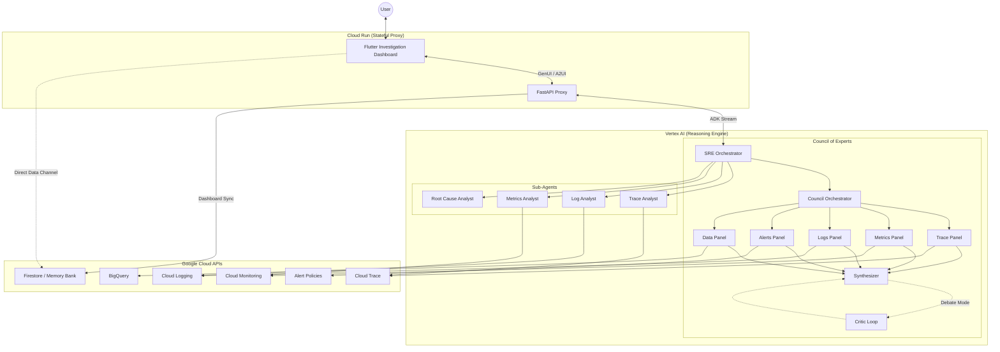

# 🤖 Auto SRE: The specialized AI Reliability Engine

<div align="center">
  
</div>

<!-- Project Status & License -->
<div align="center">
  
  
  
  
  
</div>

---

## 🚀 The Vision

**Auto SRE** is a diagnostic engine that operates your observability stack. Inspired by Google's SRE methodology, it automates the entire investigative lifecycle—from anomaly detection to root cause synthesis.

> [!WARNING]
> **Experimental**: This project is experimental and is not intended for production use (yet).

---

## 🏗️ Architecture: The "Council of Experts"

Auto SRE avoids the limitations of single-prompt agents by using a tiered orchestration pattern. A central **Orchestrator** coordinates a squad of specialists:

- **🕵️ The Orchestrator**: Strategist that decomposes incidents into verifiable hypotheses.
- **📊 Aggregation Specialist**: Scans fleet-wide metrics (Cloud Monitoring/BigQuery) for statistical anomalies.
- **🌊 Trace Analyst**: Performs deep-dive waterfall analysis on distributed traces to pinpoint latency spikes.
- **ログ Log Analyst**: Utilizes advanced clustering (Drain3) to find "needles in the haystack" across millions of log lines.
- **🧠 Root Cause Analyst**: Synthesizes multi-signal findings into a causal graph and remediation plan.

### The Reasoning Loop (OODA)

Every agent iterates through the **Observe-Orient-Decide-Act** cycle, ensuring every conclusion is backed by empirical data fetched from your GCP project.

### System Topology

The diagram below illustrates the decoupled architecture, featuring the **Dedicated Dashboard Data Channel** for real-time visualization.



---

## 🔍 How It Works: The Investigation Lifecycle

When you describe an incident or ask a diagnostic question, Auto SRE executes a structured investigation pipeline:

1. **Intake & Hypothesis Formation** — The Orchestrator parses your query, identifies the target GCP project, and decomposes the problem into one or more testable hypotheses (e.g., "latency spike caused by a failing downstream dependency").

2. **Parallel Signal Collection** — Specialist agents are dispatched concurrently to gather evidence across the three pillars of observability:
   - **Metrics**: Fleet-wide time-series data from Cloud Monitoring and BigQuery (OpenTelemetry-backed).
   - **Traces**: Distributed trace waterfalls from Cloud Trace, analyzed for critical-path bottlenecks.
   - **Logs**: High-volume log streams processed with Drain3 pattern clustering to surface anomalous entries.

3. **Cross-Signal Correlation** — Findings are stitched together using trace-metric exemplar links and log-trace correlation. This connects a latency spike in a metric to the exact trace span and log line that caused it.

4. **Root Cause Synthesis** — The Root Cause Analyst builds a causal graph from the correlated evidence and produces a structured report with severity assessment, impact scope, and actionable remediation steps.

5. **Interactive Visualization** — Throughout the investigation, results are streamed back to the dashboard as **Generative UI** widgets — waterfall diagrams, time-series charts, log pattern tables — rendered directly in the conversation thread.

### Tool Capabilities

Auto SRE's agents are equipped with a curated set of tools organized into four categories:

| Category          | Tools                                                                      | Purpose                             |
| ----------------- | -------------------------------------------------------------------------- | ----------------------------------- |
| **Observability** | `fetch_trace`, `list_log_entries`, `list_time_series`                      | Raw data retrieval from GCP APIs    |
| **Analysis**      | `analyze_critical_path`, `extract_log_patterns`, `detect_metric_anomalies` | Statistical and structural analysis |
| **Correlation**   | `correlate_metrics_with_traces_via_exemplars`, `correlate_logs_with_trace` | Cross-signal linking                |
| **Reporting**     | `generate_remediation_suggestions`, `synthesize_report`                    | Actionable output generation        |

All tools follow the `@adk_tool` decorator pattern and return structured `BaseToolResponse` JSON, ensuring consistent parsing and error handling across the system.

---

## 🔬 Key Features

- ✨ **GenUI (Generative UI)**: Context-aware charts, waterfalls, and log explorers rendered directly in the investigation thread. Tool outputs are mapped through a GenUI adapter to trigger the correct Flutter widget on the frontend.
- 📡 **Decoupled Dashboard**: A high-performance data channel (via Firestore) that updates investigation metrics in real-time, independent of the chat streaming protocol.
- 🔐 **End-User Credentials (EUC)**: Operates strictly within _your_ identity's permissions. OAuth2 tokens are encrypted (AES-256), stored in the session state, and propagated to every GCP API call — no service account fallback in production.
- 🛡️ **Safety Guardrails**: Every tool call is intercepted by a policy engine. Multi-tenant isolation is enforced at the context level, and project IDs are always derived from the user's session context.
- 🔭 **Native Telemetry**: Instrumented with the Google GenAI SDK for high-fidelity tracing of the agent's internal reasoning, with optional Cloud Trace export.

---

## ⚙️ Execution Modes

Auto SRE supports two execution modes to fit different stages of the development lifecycle:

| Mode        | Agent Runtime          | Storage       | Auth                  | Use Case                  |
| ----------- | ---------------------- | ------------- | --------------------- | ------------------------- |
| **Local**   | In-process (FastAPI)   | SQLite / JSON | ADC (`gcloud auth`)   | Development and debugging |
| **Managed** | Vertex AI Agent Engine | Firestore     | EUC via session proxy | Production deployment     |

In **local mode**, the agent logic runs directly inside the FastAPI process for fast iteration. In **managed mode**, the FastAPI backend acts as a stateful proxy — it authenticates the user, injects their credentials into the ADK session state, and forwards requests to the managed Vertex AI reasoning engine.

---

## 🛠️ Quick Start

### Prerequisites

- **Python 3.10+** with [`uv`](https://github.com/astral-sh/uv) for dependency management
- **Flutter** (stable channel) for the frontend
- **Google Cloud SDK** (`gcloud`) with a configured project
- A GCP project with Cloud Trace, Logging, and Monitoring APIs enabled

### 1. Local Development

```bash
# Clone and setup
git clone <YOUR_REPO_URL>
cd sre-agent
uv sync

# Configure environment
cp .env.example .env
gcloud auth application-default login

# Launch the full stack (backend + Flutter frontend)
uv run poe dev
```

This starts the FastAPI backend and the Flutter web frontend together. The agent runs in-process for fast iteration — no Vertex AI deployment required.

> [!TIP]
> To enable local Cloud Trace export, set `OTEL_TO_CLOUD=true` in your `.env` file.

### 2. Testing & Quality

```bash
uv run poe test         # Run pytest with 80% coverage gate
uv run poe lint-all     # Ruff + MyPy + codespell + deptry
```

### 3. Deployment

Deploy the agent to **Vertex AI Agent Engine** and the frontend to **Cloud Run**:

```bash
uv run poe deploy-all
```

---

## 🧩 Tech Stack

| Layer               | Technology                                                                              | Role                                                                 |
| ------------------- | --------------------------------------------------------------------------------------- | -------------------------------------------------------------------- |
| **Agent Framework** | [Google ADK](https://cloud.google.com/vertex-ai/docs/generative-ai/agent-developer-kit) | Agent orchestration, tool registration, session management           |
| **LLM**             | Gemini 2.5 Flash / Pro                                                                  | Reasoning engine (selectable via `get_model_name("fast"\|"deep")`)   |
| **Backend**         | FastAPI + Pydantic 2.x                                                                  | API proxy, auth middleware, session storage                          |
| **Frontend**        | Flutter Web (Material 3)                                                                | Investigation dashboard with GenUI widget rendering                  |
| **Observability**   | Cloud Trace, Logging, Monitoring, BigQuery                                              | Data sources for investigation                                       |
| **Storage**         | SQLite (local) / Firestore (cloud)                                                      | Session state, investigation memory bank                             |
| **Auth**            | Google SSO + OAuth2 EUC                                                                 | Identity propagation to all GCP API calls                            |
| **CI/Quality**      | Ruff, MyPy, codespell, deptry, pytest                                                   | Linting, type checking, spell checking, dependency analysis, testing |
| **Packaging**       | `uv` + `poe`                                                                            | Dependency management and task runner                                |

---

## 📚 Documentation Index

- 📖 **[Getting Started](docs/guides/getting_started.md)**: Configuration and environment setup.
- 🏗️ **[System Architecture](docs/architecture/system_overview.md)**: Deep dive into the "Council of Experts".
- 🔒 **[Security & Identity](docs/reference/security.md)**: OAuth2, OIDC, and EUC implementation details.
- 📊 **[Observability](docs/OBSERVABILITY.md)**: High-fidelity tracing and logging guide.
- 🎯 **[Evaluation Guide](docs/guides/evaluation.md)**: How we measure agent performance.

---

_Crafted with 💙 by the Auto SRE Engineering Team._

_Last verified: 2026-02-11_
