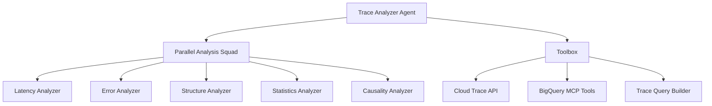

# Cloud Trace Analyzer Agent

A Google ADK-based agent that performs deep diff analysis on distributed traces from Cloud Trace. It compares baseline (normal) traces to abnormal traces to identify performance regressions, errors, and behavioral changes using a "squad" of specialized analysis sub-agents.

## Features

- **Parallel Analysis Squad**: Uses 5 specialized agents (Latency, Error, Structure, Statistics, and Causality) to analyze traces concurrently.
- **Hybrid BigQuery Integration**: Leverages BigQuery via MCP (Model Context Protocol) for statistical analysis over large datasets and long time ranges.
- **Automatic Trace Discovery**: Intelligently identifies representative baseline (P50) and anomaly (P95 or error) traces for comparison.
- **Advanced Trace Filtering**: Supports complex filters including service names, HTTP status codes, min/max latency, and custom attribute matching.
- **Root Cause Synthesis**: Automatically identifies the critical path and performs causal analysis to explain *why* a trace is slow or failing.
- **Cloud Console Integration**: Directly analyze traces by pasting their Google Cloud Console URL.

## Architecture

The agent is built using the Google Agent Development Kit (ADK) and follows a hierarchical orchestration pattern:



### Core Components
- **Root Agent**: Orchestrates the discovery and high-level analysis.
- **Specialist Squad**: Five parallel agents that dive deep into specific aspects of the trace diff.
- **Dynamic MCP Integration**: Uses `ApiRegistry` to lazily load BigQuery tools, ensuring cross-platform stability and direct access to enterprise data.

## Setup

### 1. Install Dependencies

The project uses `uv` for high-performance dependency management:

```bash
cd trace_analyzer
uv sync
```

### 2. Configure Environment

Copy the example environment file and configure your Google Cloud project:

```bash
cp .env.example .env
```

Key variables in `.env`:
```bash
# Required for Cloud Trace and BigQuery access
GOOGLE_CLOUD_PROJECT=your-gcp-project
GOOGLE_CLOUD_LOCATION=us-central1

# Agent Engine Configuration
GOOGLE_GENAI_USE_VERTEXAI=1
```

### 3. Ensure IAM Permissions

The authenticated user or service account requires:
- `roles/cloudtrace.user`
- `roles/bigquery.dataViewer`
- `roles/bitquery.jobUser`

## Usage

### Running the Agent

```bash
# Launch the interactive terminal UI
uv run adk run .

# Launch the web-based interface
uv run adk web
```

### Example Prompts

**Trend Analysis & Discovery:**
> "Find example traces in my project from the last 4 hours and show me what's different between a typical request and a slow one."

**Specific Investigation:**
> "Analyze this trace from the production console: https://console.cloud.google.com/traces/details/[TRACE_ID]?project=[PROJECT_ID]"

**Service-Specific Filtering:**
> "Find traces for the 'payment-processor' service with latency > 500ms and compare them to the baseline."

**BigQuery Powered Queries:**
> "Use BigQuery to find the most frequent error patterns in my traces over the last 24 hours."

## Project Structure

```
trace_analyzer/
├── trace_analyzer/
│   ├── agent.py          # Root orchestrator & MCP tool loading
│   ├── sub_agents/       # Specialized analysis agents (Latency, Error, etc.)
│   ├── tools/
│   │   ├── trace_client.py   # Cloud Trace API wrapper
│   │   ├── trace_filter.py   # Advanced TraceQueryBuilder
│   │   ├── trace_analysis.py # Core analysis logic
│   │   └── statistical_analysis.py # Statistical & Causal algorithms
│   └── prompt.py         # Advanced multi-turn prompting logic
├── tests/                # Comprehensive test suite
├── pyproject.toml        # uv-based build configuration
└── README.md
```

## Reliability & Performance

- **Lazy MCP Loading**: Implements `LazyMcpRegistryToolset` to prevent session conflicts in ASGI/uvicorn environments, ensuring stable deployment.
- **Observability**: Fully instrumented with OpenTelemetry for tracking tool execution and agent performance.
- **Truncation & Noise Reduction**: Advanced logging patterns ensure that large trace datasets don't overwhelm LLM context windows.

## License

Apache-2.0
