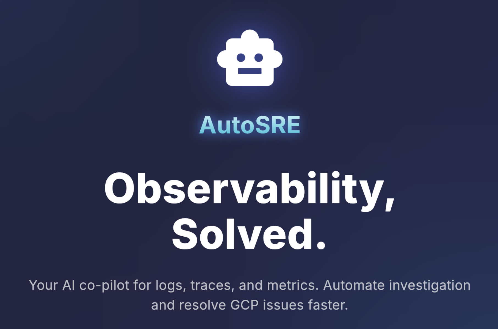
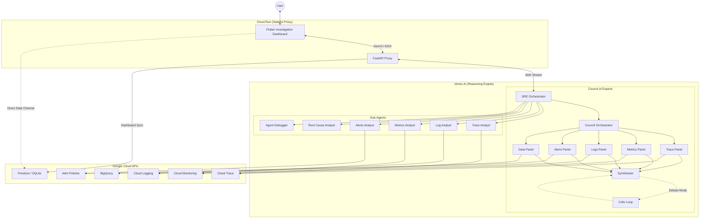

# Auto SRE: AI-Powered Site Reliability Engineering Agent

<div align="center">
  
</div>

<div align="center">
  
  
  
  
  
  
  
</div>

---

## The Vision

**Auto SRE** is an autonomous diagnostic engine that operates your Google Cloud observability stack. Inspired by Google's SRE methodology, it automates the entire investigative lifecycle -- from anomaly detection through root cause synthesis to remediation planning.

The agent coordinates a **Council of Experts**: specialized sub-agents for traces, logs, metrics, alerts, and data analysis that work in parallel, cross-examine each other's findings, and synthesize unified incident reports backed by empirical evidence from your GCP project.

> [!WARNING]
> **Experimental**: This project is under active development and is not intended for production use yet.

---

## Architecture: The Council of Experts

Auto SRE avoids the limitations of single-prompt agents by using a tiered orchestration pattern. A central **Orchestrator** coordinates a squad of specialists through three investigation modes:

### Investigation Modes

| Mode | Trigger | Behavior |
|------|---------|----------|
| **Fast** | Narrow-scope queries (single signal) | Single-panel dispatch to the most relevant specialist |
| **Standard** | Normal investigations | 5 parallel panels followed by Synthesizer merge |
| **Debate** | High-severity incidents | Panels followed by Critic LoopAgent with confidence gating |

### The Specialists

- **Orchestrator**: Strategist that decomposes incidents into verifiable hypotheses and selects the investigation mode.
- **Trace Panel/Analyst**: Deep-dive waterfall analysis on distributed traces to pinpoint latency spikes and critical path bottlenecks.
- **Metrics Panel/Analyst**: Fleet-wide time-series analysis from Cloud Monitoring and BigQuery for statistical anomaly detection.
- **Logs Panel/Analyst**: Advanced clustering (Drain3) to find anomalous patterns across millions of log lines.
- **Alerts Panel**: Correlates active alert policies with incident timelines.
- **Data Panel**: BigQuery-based cross-signal analysis for large-scale aggregation.
- **Root Cause Analyst**: Synthesizes multi-signal findings into a causal graph and remediation plan.
- **Critic** (Debate mode): Cross-examines panel findings, identifies contradictions, and drives iterative refinement.
- **Synthesizer**: Merges findings from all panels into a unified assessment with confidence scores.

### System Topology



### High-Level System Map

```
┌─────────────────────────────────────────────────────────────────────────────┐
│  FRONTEND (Flutter Web — Material 3 Deep Space Theme)                       │
│                                                                             │
│  ┌──────────────┐  ┌──────────────┐  ┌──────────────┐  ┌───────────────┐    │
│  │ Conversation │  │ Observability│  │ Agent Graph  │  │ Custom        │    │
│  │ Page (Chat + │  │ Explorer     │  │ Dashboard    │  │ Dashboards    │    │
│  │ GenUI)       │  │ (Traces/Logs │  │ (BQ Property │  │ (CRUD)        │    │
│  │              │  │  /Metrics/BQ)│  │  Graph Viz)  │  │               │    │
│  └──────┬───────┘  └──────┬───────┘  └──────┬───────┘  └───────────────┘    │
│         │                 │                 │                               │
│  ┌──────┴─────────────────┴─────────────────┴───────────────────────────┐   │
│  │  Services: Auth · API Client (Dio) · Session · Dashboard State       │   │
│  │            Explorer Query · Project · Version · Help                 │   │
│  └──────────────────────────┬───────────────────────────────────────────┘   │
└─────────────────────────────┼───────────────────────────────────────────────┘
                              │ HTTPS (NDJSON stream / REST)
┌─────────────────────────────┼───────────────────────────────────────────────┐
│  BACKEND (FastAPI + Google ADK)                                             │
│                              │                                              │
│  ┌───────────────────────────┴──────────────────────────────────────────┐   │
│  │  API Layer: Routers (agent, sessions, tools, health, system)         │   │
│  │             Middleware (auth, tracing, CORS)                         │   │
│  └───────────────────────────┬──────────────────────────────────────────┘   │
│                              │                                              │
│  ┌───────────────────────────┴──────────────────────────────────────────┐   │
│  │  Core Engine                                                         │   │
│  │  ┌─────────┐  ┌──────────┐  ┌────────────┐  ┌───────────────────┐    │   │
│  │  │ 3-Tier  │  │ Policy   │  │ Circuit    │  │ Context Compactor │    │   │
│  │  │ Router  │  │ Engine   │  │ Breaker    │  │ + Budget Enforcer │    │   │
│  │  └────┬────┘  └──────────┘  └────────────┘  └───────────────────┘    │   │
│  │       │                                                              │   │
│  │  ┌────┴──────────────────────────────────────────────────────────┐   │   │
│  │  │  Orchestrator (SRE Agent)                                     │   │   │
│  │  │  ┌─────────────────────────────────────────────────────────┐  │   │   │
│  │  │  │  Council of Experts (5 Parallel Panels)                 │  │   │   │
│  │  │  │  ┌───────┐ ┌─────────┐ ┌──────┐ ┌────────┐ ┌───────┐    │  │   │   │
│  │  │  │  │ Trace │ │ Metrics │ │ Logs │ │ Alerts │ │ Data  │    │  │   │   │
│  │  │  │  └───┬───┘ └────┬────┘ └──┬───┘ └───┬────┘ └───┬───┘    │  │   │   │
│  │  │  │      └──────────┴─────────┴─────────┴──────────┘        │  │   │   │
│  │  │  │               Synthesizer ←→ Critic (Debate)            │  │   │   │
│  │  │  └─────────────────────────────────────────────────────────┘  │   │   │
│  │  │  ┌─────────────────────────────────────────────────────────┐  │   │   │
│  │  │  │  Sub-Agents: Trace · Logs · Metrics · Alerts · RCA      │  │   │   │
│  │  │  └─────────────────────────────────────────────────────────┘  │   │   │
│  │  └───────────────────────────────────────────────────────────────┘   │   │
│  └──────────────────────────────────────────────────────────────────────┘   │
│                              │                                              │
│  ┌───────────────────────────┴──────────────────────────────────────────┐   │
│  │  Tools (108+): GCP Clients · Analysis · MCP · BigQuery · Sandbox     │   │
│  │                 Playbooks · GitHub · Research · Memory               │   │
│  └───────────────────────────┬──────────────────────────────────────────┘   │
└──────────────────────────────┼──────────────────────────────────────────────┘
                               │
┌──────────────────────────────┼──────────────────────────────────────────────┐
│  GOOGLE CLOUD PLATFORM                                                      │
│  ┌────────────┐ ┌──────────┐ ┌────────────┐ ┌──────────┐ ┌──────────────┐   │
│  │Cloud Trace │ │Cloud     │ │Cloud       │ │BigQuery  │ │Vertex AI     │   │
│  │            │ │Logging   │ │Monitoring  │ │(GRAPH_   │ │Agent Engine  │   │
│  │            │ │          │ │            │ │ TABLE)   │ │              │   │
│  └────────────┘ └──────────┘ └────────────┘ └──────────┘ └──────────────┘   │
│  ┌────────────┐ ┌──────────┐ ┌────────────┐ ┌──────────┐                    │
│  │Firestore / │ │Cloud Run │ │GKE         │ │Cloud SQL │                    │
│  │SQLite      │ │          │ │            │ │          │                    │
│  └────────────┘ └──────────┘ └────────────┘ └──────────┘                    │
└─────────────────────────────────────────────────────────────────────────────┘
```

---

## How It Works: The Investigation Lifecycle

When you describe an incident or ask a diagnostic question, Auto SRE executes a structured investigation pipeline:

1. **Intake and Hypothesis Formation** -- The Orchestrator parses your query, identifies the target GCP project, and decomposes the problem into testable hypotheses (e.g., "latency spike caused by a failing downstream dependency"). An intent classifier selects the appropriate investigation mode (Fast, Standard, or Debate).

2. **Parallel Signal Collection** -- Specialist panels are dispatched concurrently to gather evidence across all pillars of observability:
   - **Metrics**: Fleet-wide time-series data from Cloud Monitoring, PromQL queries, and BigQuery (OpenTelemetry-backed).
   - **Traces**: Distributed trace waterfalls from Cloud Trace, analyzed for critical-path bottlenecks, retry storms, cascading timeouts, and connection pool issues.
   - **Logs**: High-volume log streams processed with Drain3 pattern clustering to surface anomalous entries.
   - **Alerts**: Active alert policies correlated with incident timelines and SLO burn rates.
   - **Data**: BigQuery-based aggregations for fleet-wide statistical analysis.

3. **Cross-Signal Correlation** -- Findings are stitched together using trace-metric exemplar links, log-trace correlation, and change correlation (audit log analysis). This connects a latency spike in a metric to the exact trace span, log line, and recent deployment that caused it.

4. **Adversarial Refinement** (Debate mode) -- For high-severity incidents, a Critic agent cross-examines panel findings, identifies contradictions, and drives iterative refinement through a LoopAgent until confidence thresholds are met.

5. **Root Cause Synthesis** -- The Root Cause Analyst builds a causal graph from correlated evidence and produces a structured report with severity assessment, impact scope, SLO impact analysis, and actionable remediation steps including `gcloud` commands.

6. **Interactive Visualization** -- Throughout the investigation, results stream to the dashboard as **Generative UI** widgets: waterfall diagrams, time-series charts, log pattern tables, SLO burn rate cards, and postmortem reports rendered directly in the conversation thread.

---

## Key Features

- **Council of Experts Architecture**: Five parallel specialist panels with three investigation modes (Fast, Standard, Debate). Debate mode includes adversarial critic cross-examination with confidence gating.
- **108+ Investigation Tools**: Comprehensive tool suite spanning observability data retrieval, statistical analysis, cross-signal correlation, SLO burn rate analysis, change correlation, remediation planning, and postmortem generation.
- **Generative UI (GenUI)**: Context-aware charts, trace waterfalls (Syncfusion), log explorers, SLO burn rate cards, and postmortem cards rendered directly in the investigation thread.
- **Observability Explorer Dashboard**: Active GCP-style dashboard where users can directly query Cloud Trace, Logging, Monitoring, and BigQuery alongside agent-provided insights. Includes manual query bars, time range selectors, and auto-refresh.
- **Agent Graph Visualization**: Interactive multi-trace property graph dashboard built on BigQuery GRAPH_TABLE. Visualizes the full agent hierarchy (User -> Root Agent -> Sub-Agents -> Tools -> LLMs) with per-node token/cost/latency metrics, edge call counts, error rates, and sub-call distributions. Pre-aggregated hourly table ensures sub-second loading for time ranges up to 30 days.
- **Decoupled Dashboard Data Channel**: High-performance data channel (via Firestore/SQLite) that updates investigation metrics in real-time, independent of the chat streaming protocol.
- **End-User Credentials (EUC)**: Operates within your identity's permissions. OAuth2 tokens are encrypted (AES-256 Fernet), stored in session state, and propagated to every GCP API call. Strict enforcement mode blocks ADC fallback.
- **Safety Guardrails**: Policy engine intercepts every tool call. Multi-tenant isolation enforced at context level. Project IDs derived from user session context.
- **Circuit Breaker**: Three-state failure recovery (CLOSED/OPEN/HALF_OPEN) with per-tool configuration prevents cascading failures when GCP APIs are degraded.
- **Memory and Learning**: Investigation memory bank retains patterns from past incidents. The agent recommends investigation strategies based on similar historical cases and learns from successful resolutions.
- **SLO Burn Rate Analysis**: Multi-window alerting (1h/6h/24h/72h) following the Google SRE Workbook methodology with error budget projection and urgency classification.
- **Automated Postmortem Generation**: Google SRE-style blameless postmortems with severity assessment, TTD/TTM metrics, and auto-generated action items.
- **Operational Playbooks**: Pre-built runbooks for GKE, Cloud Run, Cloud SQL, Pub/Sub, GCE, BigQuery, and self-healing automation.
- **GitHub Integration**: Source code search, file reading, commit history, and automated pull request creation for remediation.
- **Online Research**: Google Custom Search and web page fetching for external documentation and known issue lookup.
- **Sandboxed Code Execution**: Large dataset processing in isolated sandboxes (Agent Engine or local) with pre-built templates for metrics, logs, traces, and time series.
- **Native Telemetry**: Instrumented with the Google GenAI SDK for high-fidelity tracing of internal agent reasoning, with optional Cloud Trace export and Langfuse integration.
- **Token Budget Enforcement**: Configurable per-request token budgets with model-specific cost tracking for Gemini 2.5 Flash/Pro.
- **Context Compaction**: Automatic context window management to keep investigations within LLM context limits.

---

## Tool Capabilities

Auto SRE's agents are equipped with 108+ tools organized across these categories:

| Category | Example Tools | Purpose |
|----------|--------------|---------|
| **Trace Retrieval** | `fetch_trace`, `list_traces`, `find_example_traces`, `get_trace_by_url` | Raw distributed trace data from Cloud Trace |
| **Trace Analysis** | `analyze_critical_path`, `build_call_graph`, `detect_retry_storm`, `detect_cascading_timeout` | Structural and statistical trace analysis |
| **Log Retrieval** | `list_log_entries`, `get_logs_for_trace`, `list_error_events` | Log data from Cloud Logging |
| **Log Analysis** | `extract_log_patterns`, `analyze_log_anomalies`, `compare_log_patterns` | Drain3-based clustering and anomaly detection |
| **Metrics** | `list_time_series`, `query_promql`, `detect_metric_anomalies`, `compare_metric_windows` | Time-series retrieval and anomaly detection |
| **SLO** | `get_slo_status`, `analyze_error_budget_burn`, `analyze_multi_window_burn_rate`, `predict_slo_violation` | SLO monitoring and burn rate analysis |
| **Alerts** | `list_alerts`, `list_alert_policies`, `get_alert` | Alert policy and incident retrieval |
| **Correlation** | `correlate_metrics_with_traces_via_exemplars`, `correlate_logs_with_trace`, `correlate_changes_with_incident` | Cross-signal linking and change correlation |
| **GKE** | `get_gke_cluster_health`, `get_pod_restart_events`, `analyze_hpa_events`, `get_container_oom_events` | Kubernetes-specific diagnostics |
| **Dependencies** | `build_service_dependency_graph`, `detect_circular_dependencies`, `analyze_upstream_downstream_impact` | Service topology analysis |
| **Remediation** | `generate_remediation_suggestions`, `get_gcloud_commands`, `generate_postmortem`, `estimate_remediation_risk` | Actionable output and postmortem generation |
| **BigQuery** | `mcp_execute_sql`, `analyze_aggregate_metrics`, `query_data_agent` | SQL-based fleet-wide analysis |
| **Memory** | `search_memory`, `add_finding_to_memory`, `get_recommended_investigation_strategy` | Investigation pattern retention and recall |
| **GitHub** | `github_search_code`, `github_read_file`, `github_create_pull_request` | Source code analysis and automated PRs |
| **Research** | `search_google`, `fetch_web_page` | Online documentation and known issue lookup |
| **Sandbox** | `execute_custom_analysis_in_sandbox`, `summarize_metric_descriptors_in_sandbox` | Large dataset processing in isolated environments |

All tools use the `@adk_tool` decorator and return structured `BaseToolResponse` JSON for consistent parsing and error handling.

---

## Execution Modes

Auto SRE supports two execution modes to fit different stages of the development lifecycle:

| Mode | Agent Runtime | Storage | Auth | Use Case |
|------|--------------|---------|------|----------|
| **Local** | In-process (FastAPI) | SQLite | ADC (`gcloud auth`) | Development and debugging |
| **Managed** | Vertex AI Agent Engine | Firestore | EUC via session proxy | Production deployment |

In **local mode** (`SRE_AGENT_ID` not set), the agent logic runs directly inside the FastAPI process for fast iteration. In **managed mode** (`SRE_AGENT_ID` set), the FastAPI backend acts as a stateful proxy: it authenticates the user, injects their credentials into the ADK session state, and forwards requests to the managed Vertex AI reasoning engine.

---

## Quick Start

### Prerequisites

- **Python 3.10+** (< 3.13) with [`uv`](https://github.com/astral-sh/uv) for dependency management
- **Flutter** (stable channel) for the frontend
- **Google Cloud SDK** (`gcloud`) with a configured project
- A GCP project with Cloud Trace, Logging, and Monitoring APIs enabled

### 1. Installation

```bash
# Clone and install dependencies
git clone https://github.com/srtux/sre-agent.git
cd sre-agent
uv sync

# Install Flutter dependencies
cd autosre && flutter pub get && cd ..

# Or use the combined sync command:
uv run poe sync
```

### 2. Configuration

```bash
# Copy the environment template
cp .env.example .env

# Authenticate with Google Cloud
gcloud auth application-default login

# Edit .env with your project settings (at minimum):
#   GOOGLE_CLOUD_PROJECT=<your-gcp-project-id>
#   GOOGLE_CLIENT_ID=<your-oauth-client-id>
#   SRE_AGENT_ENCRYPTION_KEY=<generate-with-fernet>
```

Generate an encryption key:

```bash
python -c "from cryptography.fernet import Fernet; print(Fernet.generate_key().decode())"
```

### 3. Running Locally

```bash
# Full stack: FastAPI backend + Flutter web frontend
uv run poe dev

# Backend API server only (FastAPI on port 8001)
uv run poe web

# Terminal agent (adk run, no UI)
uv run poe run
```

The full stack starts the FastAPI backend and the Flutter web frontend together. The agent runs in-process for fast iteration -- no Vertex AI deployment required.

> [!TIP]
> To enable local Cloud Trace export, set `OTEL_TO_CLOUD=true` in your `.env` file.

### 4. Testing and Quality

```bash
# Run backend tests with 80% coverage gate (parallel by default)
uv run poe test

# Run tests without coverage (fastest)
uv run poe test-fast

# Run Flutter frontend tests
uv run poe test-flutter

# Run all tests (backend + frontend)
uv run poe test-all

# Run all linters (Ruff + MyPy + codespell + deptry + Flutter analyze)
uv run poe lint-all

# Run agent evaluations (trajectory + rubric scoring)
uv run poe eval
```

### 5. Deployment

```bash
# Deploy backend to Vertex AI Agent Engine
uv run poe deploy

# Deploy frontend to Cloud Run
uv run poe deploy-web

# Deploy full stack (Agent Engine + Cloud Run)
uv run poe deploy-all

# Deploy full stack to GKE
uv run poe deploy-gke

# List deployed agents
uv run poe list

# Delete a deployed agent
uv run poe delete --resource_id <ID>
```

---

## Tech Stack

| Layer | Technology | Role |
|-------|-----------|------|
| **Agent Framework** | [Google ADK](https://google.github.io/adk-docs/) >= 1.23.0 | Agent orchestration, tool registration, session management |
| **LLM** | Gemini 2.5 Flash / Pro | Reasoning engine (selectable via `get_model_name("fast"\|"deep")`) |
| **Backend** | FastAPI + Pydantic 2 | API proxy, auth middleware, session storage |
| **Frontend** | Flutter Web (Material 3) | Modern Feature-First dashboard with GenUI widget rendering |
| **State Management** | Riverpod 3.0 | Reactive state with `@riverpod` code generation |
| **Observability** | Cloud Trace, Logging, Monitoring, BigQuery | Data sources for investigation |
| **Storage** | SQLite (local) / Firestore (cloud) | Session state, investigation memory |
| **Auth** | Google SSO + OAuth2 EUC | Identity propagation to all GCP API calls |
| **Charts** | Syncfusion Flutter Charts | Interactive metric charts and trace waterfalls |
| **Log Analysis** | Drain3 | Log pattern clustering and anomaly detection |
| **CI/CD** | Google Cloud Build (7-stage pipeline) | Automated deployment and evaluation |
| **Linting** | Ruff, MyPy, codespell, deptry, detect-secrets | Formatting, type checking, spelling, dependency and secret scanning |
| **Testing** | pytest 8+ (backend), flutter test (frontend), ADK eval | Unit, integration, e2e, and agent evaluation |
| **Packaging** | `uv` + `poethepoet` (22+ tasks) | Dependency management and task runner |


---

## Project Structure

### Backend (`sre_agent/`)

```
sre_agent/
├── agent.py              # Main orchestrator: 3-stage pipeline (Aggregate > Triage > Deep Dive)
├── auth.py               # Authentication, EUC, token validation, ContextVars
├── schema.py             # Pydantic models (all frozen=True, extra="forbid")
├── prompt.py             # Agent system instruction / personality
├── model_config.py       # Model configuration (get_model_name, context caching)
├── suggestions.py        # Follow-up suggestion generation
├── version.py            # Build version and metadata (git SHA, timestamp)
│
├── api/                  # FastAPI application layer
│   ├── app.py            #   Factory (create_app), Pydantic monkeypatch
│   ├── middleware.py      #   Auth + tracing + CORS middleware
│   ├── dependencies.py    #   Dependency injection (session, tool context)
│   ├── routers/           #   HTTP handlers: agent, sessions, tools, health, system,
│   │                      #     permissions, preferences, help
│   └── helpers/           #   Dashboard event streaming, memory events, tool events
│
├── core/                 # Agent execution engine
│   ├── runner.py          #   Agent execution logic
│   ├── runner_adapter.py  #   Runner adaptation layer
│   ├── policy_engine.py   #   Safety guardrails
│   ├── prompt_composer.py #   Dynamic prompt composition
│   ├── circuit_breaker.py #   Three-state failure recovery (CLOSED/OPEN/HALF_OPEN)
│   ├── model_callbacks.py #   Cost/token tracking, budget enforcement
│   ├── context_compactor.py # Context window management
│   ├── summarizer.py     #   Response summarization
│   ├── approval.py       #   Human approval workflow
│   ├── tool_callbacks.py  #   Tool output truncation and post-processing
│   ├── large_payload_handler.py # Large result set handling
│   ├── graph_service.py   #   Service dependency graph construction
│   └── router.py         #   Request routing logic
│
├── council/              # Parallel Council of Experts architecture
│   ├── orchestrator.py    #   CouncilOrchestrator (BaseAgent subclass)
│   ├── parallel_council.py#   Standard mode: ParallelAgent -> Synthesizer
│   ├── debate.py          #   Debate mode: LoopAgent with convergence tracking
│   ├── panels.py          #   5 specialist panel factories (trace, metrics, logs, alerts, data)
│   ├── synthesizer.py     #   Unified assessment from all panels
│   ├── critic.py          #   Cross-examination of panel findings
│   ├── intent_classifier.py # Rule-based investigation mode selection
│   ├── adaptive_classifier.py # Adaptive signal-type classification
│   ├── mode_router.py    #   @adk_tool wrapper for intent classification
│   ├── tool_registry.py   #   Single source of truth for domain tool sets
│   ├── schemas.py         #   InvestigationMode, PanelFinding, CriticReport, CouncilResult
│   └── prompts.py         #   Panel, critic, synthesizer prompts
│
├── sub_agents/           # Specialist sub-agents
│   ├── trace.py           #   Distributed trace analysis
│   ├── logs.py            #   Log pattern analysis (Drain3)
│   ├── metrics.py         #   Metrics anomaly detection
│   ├── alerts.py          #   Alert investigation
│   ├── root_cause.py     #   Multi-signal synthesis for RCA
│   └── agent_debugger.py #   Agent execution debugging and inspection
│
├── tools/                # Tool ecosystem (95 files, 108+ tool functions)
│   ├── common/            #   Shared utilities (@adk_tool, cache, telemetry, serialization)
│   ├── clients/           #   GCP API clients (singleton factory pattern)
│   │                      #     trace, logging, monitoring, alerts, slo, gke, gcp_projects,
│   │                      #     app_telemetry, apphub, asset_inventory, dependency_graph
│   ├── analysis/          #   Pure analysis modules
│   │   ├── trace/         #     Trace analysis, comparison, filters, patterns, statistics
│   │   ├── logs/          #     Pattern extraction, clustering
│   │   ├── metrics/       #     Anomaly detection, statistics
│   │   ├── slo/           #     SLO burn rate analysis (multi-window)
│   │   ├── correlation/   #     Cross-signal, critical path, dependencies, change correlation
│   │   ├── bigquery/      #     BigQuery-based OTel/log analysis
│   │   ├── agent_trace/   #     Agent self-analysis trace tools
│   │   └── remediation/   #     Remediation suggestions, postmortem generation
│   ├── mcp/               #   Model Context Protocol (BigQuery SQL, heavy queries, with fallback)
│   ├── bigquery/          #   BigQuery client, schemas, query builders, CA data agent
│   ├── sandbox/           #   Sandboxed code execution (large data processing)
│   ├── discovery/         #   GCP resource and telemetry source discovery
│   ├── github/            #   GitHub integration (read, search, PR creation)
│   ├── playbooks/         #   Runbook execution (GKE, Cloud Run, Cloud SQL, Pub/Sub, GCE,
│   │                      #     BigQuery, self-healing)
│   ├── proactive/         #   Proactive signal analysis and next-step suggestions
│   ├── exploration/       #   Project health check exploration
│   ├── synthetic/         #   Synthetic data generation for testing
│   ├── research.py        #   Online research (search_google, fetch_web_page)
│   ├── investigation.py   #   Investigation state management tools
│   ├── reporting.py       #   Report synthesis tools
│   ├── memory.py          #   Memory management tools
│   ├── config.py          #   Tool configuration registry
│   └── registry.py        #   Tool registration and discovery system
│
├── services/             # Business services
│   ├── session.py         #   Session CRUD (ADKSessionManager)
│   ├── storage.py         #   Persistence layer (Firestore/SQLite)
│   ├── agent_engine_client.py # Remote Agent Engine client (dual-mode)
│   └── memory_manager.py #   Memory service management
│
├── memory/               # Memory subsystem
│   ├── manager.py         #   Memory manager
│   ├── factory.py         #   Memory service factory
│   ├── local.py           #   Local memory implementation
│   ├── callbacks.py       #   Memory event callbacks
│   ├── sanitizer.py       #   Memory content sanitization
│   └── mistake_*.py       #   Mistake learning and advisory (learner, store, advisor)
│
├── models/               # Data models
│   └── investigation.py   #   InvestigationPhase, InvestigationState, findings, quality scoring
│
└── resources/            # GCP resources catalog
    └── gcp_metrics.py     #   Metrics by service reference data
```

### Frontend (`autosre/`)

```
autosre/lib/
├── main.dart             # App entry point
├── app.dart              # Root widget with Riverpod ProviderScope
├── features/             # Feature-First architectural layer
│   ├── agent_graph/      #   Multi-Trace Agent Graph (BQ Property Graph visualization)
│   │   ├── domain/       #     Freezed models (nodes, edges, payload)
│   │   ├── data/         #     Repository (BQ query via Dio, pre-aggregated hourly table)
│   │   ├── application/  #     Riverpod state management (AgentGraphNotifier)
│   │   └── presentation/ #     Graph page, interactive canvas, details panel
│   ├── logs/             #   Log Explorer feature (PlutoGrid, Riverpod)
│   ├── dashboards/       #   Custom Dashboards feature (CRUD, Notifiers)
│   ├── metrics/          #   Metrics Exploration feature (Syncfusion)
│   ├── traces/           #   Trace Analysis feature (Waterfall)
│   └── conversation/     #   Chat and reasoning interface
├── services/             # Core business infrastructure
│   ├── auth_service.dart  #   Authentication and EUC management
│   ├── api_client.dart    #   Dio client with interceptors
│   ├── project_service.dart # GCP project context
│   └── persistence/       #   Drift local storage for logs/metrics
├── widgets/              # Shared UI design system
│   ├── common/           #   GlassContainer, app icons, feedback
│   ├── layout/           #   resizable multi_split_view components
│   └── canvas/           #   high-density visualization canvases
├── theme/                # Deep Space Command Center design tokens
└── models/               # Shared cross-cutting domain models
```


### Tests (`tests/`)

```
tests/                     # 196 test files, 1989+ backend tests
├── conftest.py           # Shared fixtures (synthetic OTel data, mock clients)
├── fixtures/             # Synthetic OTel data generator
├── unit/                 # Unit tests (mirrors sre_agent/ structure)
├── integration/          # Integration tests (auth, pipeline, persistence, middleware)
├── e2e/                  # End-to-end tests
├── server/               # FastAPI server tests
└── api/                  # API endpoint tests
```

### Other Key Directories

```
eval/                      # Agent evaluation framework
├── *.test.json            #   9 eval scenarios (basic, error diagnosis, incidents,
│                          #     k8s debugging, metrics, multi-signal, SLO, failure modes,
│                          #     tool selection)
├── test_evaluate.py       #   ADK AgentEvaluator runner
└── conftest.py            #   Eval fixtures

deploy/                    # Deployment scripts
├── deploy.py              #   Agent Engine deployment
├── deploy_web.py          #   Cloud Run deployment
├── deploy_all.py          #   Full-stack deployment
├── deploy_gke.py          #   GKE deployment
├── Dockerfile.unified     #   Unified Docker image
├── k8s/                   #   Kubernetes manifests (deployment.yaml, service.yaml)
└── run_eval.py            #   CI/CD evaluation runner

docs/                      # Documentation
├── architecture/          #   System overview, backend, frontend, telemetry, decisions
├── guides/                #   Getting started, development, testing, deployment, evaluation
├── reference/             #   API, configuration, security, tools
├── concepts/              #   Conceptual documentation
├── help/                  #   In-app help content
└── images/                #   Screenshots and diagrams

scripts/                   # Development utilities
├── start_dev.py           #   Full-stack dev server launcher
├── setup_agent_graph_bq.sh #  BigQuery Agent Graph setup (MV, Property Graph, hourly table)
├── analyze_health.py      #   Health analysis script
└── migrate_default_sessions.py # Session migration utility

openspec/                  # OpenSpec specifications and change tracking
cloudbuild.yaml            # 7-stage CI/CD pipeline
```

---

## CI/CD Pipeline

Auto SRE uses a **7-stage Google Cloud Build pipeline** for automated deployment:

1. **Deploy Backend** -- Deploys or updates the agent on Vertex AI Agent Engine
2. **Fetch Resource ID** -- Looks up the stable Agent Engine resource name (parallel)
3. **Wait Gate** -- Synchronization barrier for parallel tracks
4. **Build Docker Image** -- Builds unified container (FastAPI + Flutter) with agent URL injected
5. **Push Image** -- Pushes to Google Container Registry
6. **Deploy Frontend** -- Deploys to Cloud Run with full environment configuration
7. **Run Evaluations** -- Post-deployment quality gate using the ADK eval framework

---

## Environment Variables

### Required

| Variable | Purpose | Default |
|----------|---------|---------|
| `GOOGLE_CLOUD_PROJECT` | GCP project ID | *required* |
| `GOOGLE_CLIENT_ID` | OAuth Client ID for Flutter sign-in | *required* |
| `SRE_AGENT_ENCRYPTION_KEY` | AES-256 Fernet key for token encryption | *required* |

### Execution Mode

| Variable | Purpose | Default |
|----------|---------|---------|
| `GOOGLE_CLOUD_LOCATION` | GCP region | `us-central1` |
| `SRE_AGENT_ID` | Agent Engine resource ID (enables remote mode) | *unset* = local |
| `STRICT_EUC_ENFORCEMENT` | Blocks ADC fallback for credentials | `false` |
| `SRE_AGENT_ENFORCE_POLICY` | Enable policy engine for tool calls | `true` |
| `ENABLE_AUTH` | Enable authentication (set `false` for local dev) | `true` |

### Council and Agent Behavior

| Variable | Purpose | Default |
|----------|---------|---------|
| `SRE_AGENT_COUNCIL_ORCHESTRATOR` | Enables Council of Experts architecture | *unset* |
| `SRE_AGENT_SLIM_TOOLS` | Reduces root agent to ~20 orchestration tools | `true` |
| `SRE_AGENT_TOKEN_BUDGET` | Max token budget per request | *unset* |
| `SRE_AGENT_CONTEXT_CACHING` | Enable Vertex AI context caching | `false` |

### Telemetry and Debugging

| Variable | Purpose | Default |
|----------|---------|---------|
| `LOG_LEVEL` | Logging level (DEBUG, INFO, WARNING, ERROR) | `INFO` |
| `OTEL_TO_CLOUD` | Export spans to Google Cloud Trace | `false` |
| `DISABLE_TELEMETRY` | Disable all telemetry (useful in tests) | `false` |
| `LANGFUSE_TRACING` | Enable Langfuse tracing integration | `false` |

### External Integrations

| Variable | Purpose | Default |
|----------|---------|---------|
| `GOOGLE_CUSTOM_SEARCH_API_KEY` | API key for Google Custom Search (research tools) | *unset* |
| `GOOGLE_CUSTOM_SEARCH_ENGINE_ID` | Programmable Search Engine ID | *unset* |
| `GITHUB_TOKEN` | GitHub PAT for source code access and PR creation | *unset* |
| `GITHUB_REPO` | GitHub repository (e.g., `srtux/sre-agent`) | *unset* |

### Sandbox Execution

| Variable | Purpose | Default |
|----------|---------|---------|
| `SRE_AGENT_LOCAL_EXECUTION` | Enable local Python sandbox execution | `false` |
| `SRE_AGENT_SANDBOX_ENABLED` | Explicit sandbox enable/disable | *auto-detected* |
| `SRE_AGENT_SANDBOX_TTL` | Sandbox TTL in seconds | `3600` |

### Storage and Server

| Variable | Purpose | Default |
|----------|---------|---------|
| `USE_DATABASE_SESSIONS` | Force SQLite session storage | `true` (local) |
| `USE_FIRESTORE` | Use Firestore for sessions | *auto-detected* |
| `PORT` | Backend server port | `8001` |
| `HOST` | Backend server bind address | `0.0.0.0` |

See `.env.example` for the complete template and `docs/reference/configuration.md` for full documentation.

---

## Commands Reference

```bash
# ----- Development -----
uv run poe dev             # Full stack (backend + Flutter frontend)
uv run poe web             # Backend server only (FastAPI on port 8001)
uv run poe run             # Terminal agent (adk run)
uv run poe sync            # Install/update all dependencies (uv + Flutter)

# ----- Quality -----
uv run poe lint            # Ruff format + lint + MyPy + codespell + deptry
uv run poe lint-all        # Backend + Flutter analyzers
uv run poe format          # Auto-format code (Ruff)
uv run poe test            # pytest with 80% coverage gate (parallel)
uv run poe test-fast       # pytest without coverage (fastest)
uv run poe test-flutter    # Flutter frontend tests
uv run poe test-all        # Backend + Flutter tests
uv run poe eval            # Agent evaluations (trajectory + rubrics)
uv run poe pre-commit      # Run all pre-commit hooks

# ----- Deployment -----
uv run poe deploy          # Backend to Vertex AI Agent Engine
uv run poe deploy-web      # Frontend to Cloud Run
uv run poe deploy-all      # Full stack (Agent Engine + Cloud Run)
uv run poe deploy-gke      # Full stack to GKE
uv run poe list            # List deployed agents
uv run poe delete          # Delete agent (--resource_id ID)
```

---

## Documentation Index

### Component Deep Dives (with Architecture & Data Flow Diagrams)

| Component | Description |
|-----------|-------------|
| [Backend Core](docs/components/backend-core/README.md) | API layer, core engine, auth, schemas, agent orchestrator |
| [Council of Experts](docs/components/council/README.md) | Parallel investigation: Fast/Standard/Debate modes |
| [Sub-Agents](docs/components/sub-agents/README.md) | Specialist agents for trace, logs, metrics, alerts, RCA |
| [Tools Ecosystem](docs/components/tools/README.md) | 108+ tools: GCP clients, analysis, MCP, sandbox, playbooks |
| [Services & Memory](docs/components/services-memory/README.md) | Session management, storage, memory, mistake learning |
| [Flutter Frontend](docs/components/flutter-frontend/README.md) | Material 3 dashboard, GenUI/A2UI, Observability Explorer |
| [AgentOps UI](docs/components/agent-ops-ui/README.md) | React dashboard: KPIs, topology, trajectory, evals |
| [Evaluation Framework](docs/components/evaluation/README.md) | Trajectory matching, rubric scoring, online eval |
| [Deployment](docs/components/deployment/README.md) | CI/CD, Docker, Kubernetes, Cloud Run, Agent Engine |
| [Testing](docs/components/testing/README.md) | 2429+ backend tests, 129+ Flutter tests, fixtures |

### Roadmap & Planning

| Phase | Status | Description |
|-------|--------|-------------|
| [Phase 1-3](docs/roadmap/phase-3-observability.md) | Completed | Foundation through Observability |
| [Phase 4](docs/roadmap/phase-4-modern.md) | In Progress | Modern Agentics |
| [Phase 5-6](docs/roadmap/phase-5-proactive.md) | Planned | Proactive SRE & Enterprise |
| [Full Roadmap](docs/roadmap/README.md) | -- | Complete phase index with Gantt chart |

### Guides & Reference

| Document | Description |
|----------|-------------|
| [Docs Index](docs/README.md) | Complete documentation index with all sections |
| [Getting Started](docs/guides/getting_started.md) | Configuration and environment setup |
| [Development Guide](docs/guides/development.md) | Development workflow and coding standards |
| [System Architecture](docs/architecture/system_overview.md) | High-level system topology |
| [Testing Guide](docs/testing/testing.md) | Testing standards and conventions |
| [Evaluation Guide](docs/EVALUATIONS.md) | Agent performance measurement |
| [Deployment Guide](docs/guides/deployment.md) | Deployment procedures and options |
| [Security and Identity](docs/reference/security.md) | OAuth2, OIDC, and EUC implementation |
| [Configuration Reference](docs/reference/configuration.md) | All environment variables and settings |
| [API Reference](docs/reference/api.md) | REST API endpoint documentation |
| [Tool Reference](docs/reference/tools.md) | Complete tool catalog |
| [AGENTS.md](AGENTS.md) | Single Source of Truth for coding patterns |
| [Project Plan](docs/PROJECT_PLAN.md) | Living roadmap and completed milestones |

---

## Contributing

### Quick Rules

1. **Read before modifying** -- Never propose changes to unread code.
2. **Test first** -- Create/update tests before implementing logic.
3. **Lint always** -- `uv run poe lint-all` must be clean.
4. **Explicit types** -- Mandatory type hints, no implicit `Any`.
5. **Coverage** -- 80% minimum gate; 100% target on new tools and core logic.
6. **Schemas** -- Pydantic `frozen=True, extra="forbid"` on all models.
7. **Async** -- All external I/O (GCP, DB, LLM) must be `async/await`.
8. **Tool pattern** -- Use `@adk_tool` decorator, return `BaseToolResponse` JSON.

### Adding a New Tool

1. Create function in `sre_agent/tools/` (appropriate subdirectory)
2. Add `@adk_tool` decorator and docstring
3. Add to `__all__` in `sre_agent/tools/__init__.py`
4. Add to `base_tools` list in `sre_agent/agent.py`
5. Add to `TOOL_NAME_MAP` in `sre_agent/agent.py`
6. Add `ToolConfig` entry in `sre_agent/tools/config.py`
7. If used by council panels: add to relevant tool set in `council/tool_registry.py`
8. Add test in `tests/` (mirror source path)
9. Run `uv run poe lint && uv run poe test`

See [AGENTS.md](AGENTS.md) for the complete coding standard.

---

## License

Apache-2.0. See [LICENSE](LICENSE) for details.

---

_Last verified: 2026-02-21
