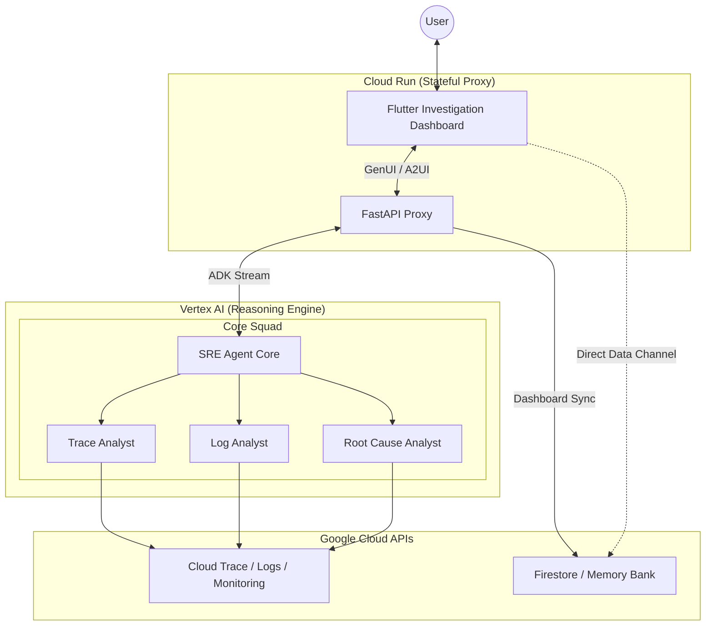

# 🤖 Auto SRE: The specialized AI Reliability Engine

<!-- Project Status & License -->
<div align="center">
  
  
  
  
  
</div>

<div align="center">
  
</div>

---

## 🚀 The Vision
**Auto SRE** is not just another chatbot. It is a high-fidelity diagnostic engine that actively operates your observability stack. Inspired by Google's SRE methodology, it automates the entire investigative lifecycle—from anomaly detection to root cause synthesis.

> [!IMPORTANT]
> **Vibe Coding Excellence**: This project follows a strict "Vibe Coding" methodology, prioritizing code quality, high test coverage, and premium UI aesthetics.

---

## 🏗️ Architecture: The "Council of Experts"

Auto SRE avoids the limitations of single-prompt agents by using a tiered orchestration pattern. A central **Orchestrator** coordinates a squad of specialists:

-   **🕵️ The Orchestrator**: Strategist that decomposes incidents into verifiable hypotheses.
-   **📊 Aggregation Specialist**: Scans fleet-wide metrics (Cloud Monitoring/BigQuery) for statistical anomalies.
-   **🌊 Trace Analyst**: Performs deep-dive waterfall analysis on distributed traces to pinpoint latency spikes.
-   **ログ Log Analyst**: Utilizes advanced clustering (Drain3) to find "needles in the haystack" across millions of log lines.
-   **🧠 Root Cause Analyst**: Synthesizes multi-signal findings into a causal graph and remediation plan.

### The Reasoning Loop (OODA)
Every agent iterates through the **Observe-Orient-Decide-Act** cycle, ensuring every conclusion is backed by empirical data fetched from your GCP project.

### System Topology
The diagram below illustrates the decoupled architecture, featuring the **Dedicated Dashboard Data Channel** for real-time visualization.



---

## 🔬 Key Features

-   ✨ **GenUI (Generative UI)**: Context-aware charts, waterfalls, and log explorers rendered directly in the investigation thread.
-   📡 **Decoupled Dashboard**: A high-performance data channel that updates investigation metrics in real-time, independent of the chat protocol.
-   🔐 **End-User Credentials (EUC)**: Operates strictly within *your* identity's permissions using OAuth2 propagation.
-   🛡️ **Safety Guardrails**: Every tool call is intercepted by a policy engine. Multi-tenant isolation is enforced at the context level.
-   🔭 **Native Telemetry**: Instrumented with the Google GenAI SDK for high-fidelity tracing of the agent's internal reasoning.

---

## 🛠️ Quick Start

### 1. Local Development
```bash
# Clone and setup
git clone https://github.com/your-org/sre-agent.git
cd sre-agent
uv sync

# Configure environment
cp .env.example .env
gcloud auth application-default login

# Launch the engine
uv run poe dev
```
> [!TIP]
> To enable local Cloud Trace export alongside LangSmith, set `OTEL_TO_CLOUD=true`.

### 2. Deployment
Deploy to **Vertex AI Agent Engine** and **Cloud Run** in minutes:
```bash
uv run poe deploy-all
```

---

## 📚 Documentation Index

-   📖 **[Getting Started](docs/guides/getting_started.md)**: Configuration and environment setup.
-   🏗️ **[System Architecture](docs/architecture/system_overview.md)**: Deep dive into the "Council of Experts".
-   🔒 **[Security & Identity](docs/reference/security.md)**: OAuth2, OIDC, and EUC implementation details.
-   📊 **[Observability](docs/OBSERVABILITY.md)**: High-fidelity tracing and logging guide.
-   🎯 **[Evaluation Guide](docs/guides/evaluation.md)**: How we measure agent performance.

---
*Crafted with 💙 by the Auto SRE Engineering Team.*
