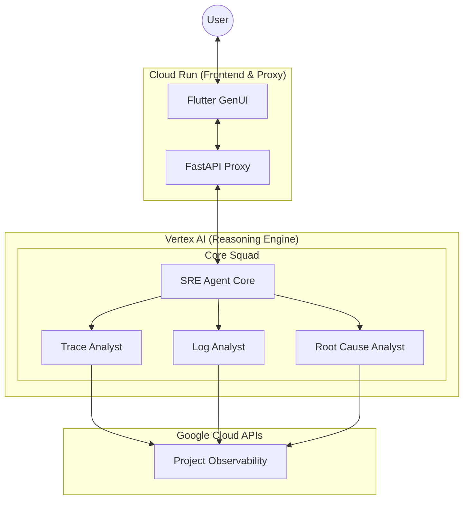

# Auto SRE

<!-- Project Status & License -->
[]()
[](https://opensource.org/licenses/Apache-2.0)

<!-- Tech Stack -->
[]()
[]()
[]()

<!-- Code Quality & Testing -->
[](https://github.com/astral-sh/ruff)
[](https://mypy-lang.org/)
[](docs/guides/testing.md)
[](docs/guides/evaluation.md)
[](https://github.com/pre-commit/pre-commit)

<div align="center">
  
</div>

---

## 🤖 What is Auto SRE?

**Auto SRE** is a specialized AI reliability engine that automates the investigative lifecycle of production incidents. Inspired by Google's SRE practices, it doesn't just provide a chat interface—it actively operates your observability stack to find root causes.

> [!CAUTION]
> **Experimental Status**: This project is in active development. We recommend using it for diagnostic assistance in sandboxed or development environments first.

---

## 🏗️ How It Works: The "Core Squad" Architecture

Auto SRE avoids the "single prompt" limitation by using a **Council of Experts** pattern. When you ask a question, a central Orchestrator coordinates a pipeline of specialized sub-agents:

1.  **The Orchestrator**: Decomposes your request and assigns tasks to specialists.
2.  **Aggregation Specialist**: Scans fleet-wide metrics (BigQuery/Cloud Monitoring) to identify statistical outliers.
3.  **Trace Analyst**: Performs deep-dive waterfall analysis on distributed traces to find latency bottlenecks.
4.  **Log Analyst**: Uses advanced clustering (Drain3) to find anomalous patterns across millions of log lines.
5.  **Root Cause Analyst**: Synthesizes all findings into a causal graph and proposes remediation.

### The Reasoning Loop (OODA)
Each specialist follows the **Observe-Orient-Decide-Act** cycle, using specialized tools to verify hypotheses before reaching a conclusion.

### Physical Topology
The diagram below illustrates how these components are distributed across the Google Cloud platform in production mode:




---

## 🚀 Quick Start

### 1. Local Development
Ideal for testing tools and iterating on agent logic.

```bash
# Clone and install
git clone https://github.com/your-org/sre-agent.git
cd sre-agent
uv sync

# Configure
cp .env.example .env  # Add your GOOGLE_CLOUD_PROJECT
gcloud auth application-default login

# Launch
uv run poe dev
```
*   **Backend**: http://localhost:8001 | **Frontend**: http://localhost:3000

### 2. Production (Google Cloud)
Deploy the reasoning logic to **Vertex AI Agent Engine** for a managed, scalable experience. The **FastAPI Backend** is deployed to **Cloud Run**, acting as a stateful proxy that serves the Flutter UI and secures user sessions.

```bash
# Set required secrets
echo -n "YOUR_API_KEY" | gcloud secrets create gemini-api-key --data-file=-

# Deploy Backend & Frontend
export GOOGLE_CLOUD_PROJECT=your-project
export GOOGLE_CLOUD_LOCATION=us-central1
export GOOGLE_CLOUD_STORAGE_BUCKET=your-staging-bucket

uv run poe deploy-all
```
*The deployment script handles IAM roles, Secret Manager integration, and Cloud Run provisioning.*

---

## 🔬 Key Features

-   🌐 **GenUI (Generative UI)**: Interactive charts, trace waterfalls, and log viewers rendered directly in the chat.
-   🔒 **Stateful Harness**: Zero-downtime restarts with state reconstruction from persistent event logs.
-   🛡️ **Safety Policy Engine**: Every tool call is intercepted and validated. Write operations require human approval.
-   🔑 **End-User Credentials (EUC)**: Operates with *your* identity, ensuring strict access control to project data.

---

## 🛠️ Tech Stack

-   **Intelligence**: Gemini 2.5 Flash via Vertex AI ADK.
-   **Engine**: Python 3.10+, FastAPI (Asynchronous Proxy).
-   **Dashboard**: Flutter Web (Material 3 + Deep Space Glasmorphism).
-   **Observability**: Cloud Trace, Cloud Logging, Cloud Monitoring, BigQuery.

---

## 📚 Documentation Index

*   **[Getting Started](docs/guides/getting_started.md)**: Detailed configuration and setup.
*   **[System Architecture](docs/architecture/system_overview.md)**: Deep dive into the data flow and mode switching.
*   **[Security & Identity](docs/reference/security.md)**: How we handle OAuth and EUC.
*   **[Tools Reference](docs/reference/tools.md)**: Catalog of all analysis capabilities.
*   **[Development Guide](docs/guides/development.md)**: Standards for "Vibe Coding" and agentic development.

---
*Developed and maintained by the Auto SRE Team.*
