# Auto SRE

[]()
[](https://opensource.org/licenses/Apache-2.0)
[]()
[]()
[]()
[]()
[](https://github.com/astral-sh/ruff)
[](https://github.com/pre-commit/pre-commit)
[](https://mypy-lang.org/)
[](tests/README.md)

<div align="center">
  
</div>


**Auto SRE is an experimental SRE Agent for Google Cloud.** It analyzes telemetry data from Google Cloud Observability: **traces**, **logs**, **metrics**.

## Architecture

The agent is built using the Google Agent Development Kit (ADK). It uses a **"Core Squad"** orchestration pattern where the main **SRE Agent** coordinates specialized analysis.

**Key Features:**
- **Trace-Centric Root Cause Analysis**: Prioritizes BigQuery for fleet-wide analysis.
- **Autonomous Investigation Pipeline**: Sequential workflow from signal detection to root cause synthesis.
- **Root Cause Analyst**: Synthesizes causality, impact, and triggers (deployments).
- **Trace Analyst**: Consolidated expert for Latency, Errors, Structure, and Resiliency.
- **Friendly Expert Persona**: Combines deep technical expertise with a fun, approachable response style. 🕵️‍♂️✨
- **Mission Control Dashboard**: A "Deep Space" themed Flutter GenUI with glassmorphic visuals and real-time canvas visualizations.
- **Project ID Enforcement**: Global context awareness ensuring the correct GCP project is always targeted.
- **Investigation Persistence**: Automatic sync and storage of investigation sessions with Firestore support.
- **Multi-Session History**: View, load, and manage previous investigations through the Mission Control history panel.

### System Architecture

```mermaid
graph TD
    %% Styling
    classDef agent fill:#e1f5fe,stroke:#01579b,stroke-width:2px;
    classDef subagent fill:#e0f2f1,stroke:#00695c,stroke-width:2px;
    classDef llm fill:#f3e5f5,stroke:#4a148c,stroke-width:2px;
    classDef tool fill:#fff3e0,stroke:#e65100,stroke-width:1px;
    classDef user fill:#fff,stroke:#333,stroke-width:2px;
    classDef orchestration fill:#fff9c4,stroke:#fbc02d,stroke-width:2px,stroke-dasharray: 5 5;

    %% User Layer
    User((User)) --> SRE_Agent

    %% Main Agent Layer
    subgraph "Orchestration Layer"
        SRE_Agent[SRE Agent]:::main
        subgraph "Reasoning Core"
            LLM["Gemini 2.5 Flash"]:::external
            SRE_Agent <--> LLM
        end
    end

    %% Orchestration Tools (The bridge to sub-agents)
    subgraph "Orchestration Tools"
        RunAgg[run_aggregate_analysis]:::orchestration
        RunTriage[run_triage_analysis]:::orchestration
        RunDeep[run_deep_dive_analysis]:::orchestration
        RunLog[run_log_pattern_analysis]:::orchestration
    end

    SRE_Agent --> RunAgg
    SRE_Agent --> RunTriage
    SRE_Agent --> RunDeep
    SRE_Agent --> RunLog

    %% Sub-Agents (Core Squad)
    subgraph "Core Squad"
        direction TB

        subgraph "Stage 0: Analysis"
            Aggregate["Aggregate Analyzer<br/>(BigQuery Ninja)"]:::subagent
            Alert["Alert Analyst<br/>(First Responder)"]:::subagent
        end

        subgraph "Stage 1: Triage"
            TraceAnalyst["Trace Analyst<br/>(Latency, Errors, Resiliency)"]:::subagent
            LogAnalyst["Log Analyst<br/>(Log Whisperer)"]:::subagent
        end

        subgraph "Stage 2: Deep Dive"
            RootCause["Root Cause Analyst<br/>(Causality, Impact, Changes)"]:::subagent
        end

        subgraph "Specialists"
            Metrics["Metrics Analyzer<br/>(Metrics Maestro)"]:::subagent
        end
    end

    %% Orchestration Flow
    RunAgg --> Aggregate
    RunTriage --> TraceAnalyst & LogAnalyst
    RunDeep --> RootCause
    RunLog --> LogAnalyst
    SRE_Agent --> Alert
    SRE_Agent -- "Direct Delegation" --> Metrics

    %% Tools Layer
    subgraph "Tooling Ecosystem"
        direction TB

        subgraph "GCP Observability APIs"
            TraceAPI[Cloud Trace API]:::tool
            LogAPI[Cloud Logging API]:::tool
            MonitorAPI[Cloud Monitoring API]:::tool
            AlertAPI[Cloud Alerts API]:::tool
        end

        subgraph "Analysis Engines"
            BQEngine[BigQuery Analysis]:::tool
            Drain3[Drain3 Pattern Engine]:::tool
            StatsEngine[Statistical Engine]:::tool
            MegaTool[Trace Mega-Tool]:::tool
        end

        subgraph "Model Context Protocol (MCP)"
            MCP_BQ[MCP BigQuery]:::tool
        end
    end

    %% Tool Usage Connections
    Aggregate --> BQEngine & TraceAPI
    Alert --> AlertAPI & MonitorAPI
    TraceAnalyst --> MegaTool & TraceAPI & StatsEngine
    RootCause --> TraceAPI & LogAPI & MonitorAPI & StatsEngine
    LogAnalyst --> Drain3 & LogAPI & BQEngine
    Metrics --> MonitorAPI & StatsEngine

    %% Main Agent Direct Tool Access
    SRE_Agent --> TraceAPI & LogAPI & MonitorAPI & AlertAPI
    SRE_Agent --> MCP_BQ
```


<details>
<summary>Mermaid Diagram Source</summary>



</details>

## Multi-Stage Trace Analysis Pipeline

```
┌─────────────────────────────────────────────────────────────────┐
│  Stage 0: Analysis (BigQuery)                                   │
│  • Analyze thousands of traces                                  │
│  • Identify patterns, trends, problem services                  │
│  • Select exemplar traces (baseline + outliers)                 │
└─────────────────────────────────────────────────────────────────┘
                            ↓
┌─────────────────────────────────────────────────────────────────┐
│  Stage 1: Triage (Trace Analyst)                                │
│  • Comprehensive Trace Analysis (Mega-Tool)                     │
│  • Latency (Critical Path, Bottlenecks)                         │
│  • Errors (Forensics)                                           │
│  • Structure (Topology Changes)                                 │
│  • Resiliency (Retry Storms, Cascading Timeouts)                │
└─────────────────────────────────────────────────────────────────┘
                            ↓
┌─────────────────────────────────────────────────────────────────┐
│  Stage 2: Deep Dive (Root Cause Analyst)                        │
│  • Causality (Correlation across signals)                       │
│  • Impact (Blast Radius)                                        │
│  • Triggers (Deployment & Config Change Correlation)            │
└─────────────────────────────────────────────────────────────────┘
```

## Project Structure

```
sre_agent/
├── sre_agent/            # Main package
│   ├── agent.py          # SRE Agent & Orchestrator Tools
│   ├── sub_agents/       # Core Squad
│   │   ├── trace.py      # Consolidated Trace Analyst
│   │   ├── root_cause.py # Consolidated Root Cause Analyst
│   │   ├── logs.py       # Log Analyst
│   │   └── metrics.py    # Metrics Analyst
│   ├── tools/            # Modular tools for GCP & Analysis
│   │   ├── analysis/     # Analysis Logic
│   │   │   ├── trace_comprehensive.py # Mega-Tool for Traces
│   │   │   ├── trace/    # Trace logic (duration, errors, structure)
```

## Quick Start

### Prerequisites

*   Python 3.10+
*   Google Cloud SDK configured
*   Access to a GCP project with Cloud Trace data

### Installation

```bash
# Install dependencies using uv
uv sync

# Copy and configure environment
cp .env.example .env
# Edit .env with your GCP project settings
```

### Environment Configuration

```bash
# Required: GCP project with telemetry data
GOOGLE_CLOUD_PROJECT=your-gcp-project

# Optional: Override trace project if different
TRACE_PROJECT_ID=your-trace-project

# Optional: Vertex AI settings
GOOGLE_GENAI_USE_VERTEXAI=1
GOOGLE_CLOUD_LOCATION=us-central1
```

### Running the Agent

```bash
# Run the full stack (Backend + Frontend) [Recommended]
uv run poe dev
```

### Deployment

#### 1. Unified Full Stack Deployment (Recommended)
The easiest way to deploy the entire system:
```bash
uv run poe deploy-all
```

## Available Tools

### BigQuery Analysis Tools
| Tool | Description |
|------|-------------|
| `analyze_aggregate_metrics` | Service-level health metrics at scale using BigQuery |
| `find_exemplar_traces` | Find baseline and outlier traces for investigation |
| `compare_time_periods` | Detect performance regressions between two windows |
| `detect_trend_changes` | Identify exact time when metrics started degrading |
| `correlate_logs_with_trace` | SQL-based correlation between spans and logs |
| `mcp_execute_sql` | **MCP**: Execute raw SQL against BigQuery |

### Trace Analysis Tools
| Tool | Description |
|------|-------------|
| `analyze_trace_comprehensive` | **Mega-Tool**: Combined validation, duration, errors, and critical path analysis |
| `fetch_trace` | Get full trace by ID |
| `list_traces` | List traces with advanced filtering |
| `compare_span_timings` | Compare two traces for timing slowdowns |
| `analyze_critical_path`| Identify the sequence of spans determining total duration |
| `find_bottleneck_services`| Identify services appearing most frequently on critical paths |
| `detect_all_sre_patterns` | Detect retry storms, cascading timeouts, etc. |

### Cloud Logging Tools
| Tool | Description |
|------|-------------|
| `list_log_entries` | Query logs via direct API |
| `get_logs_for_trace` | Get logs correlated with a trace |
| `extract_log_patterns` | Compress logs into patterns using Drain3 |
| `mcp_list_log_entries` | **MCP**: High-performance log retrieval |

### Cloud Monitoring Tools
| Tool | Description |
|------|-------------|
| `list_time_series` | Query metrics via direct API |
| `query_promql` | Execute PromQL queries via direct API |
| `detect_metric_anomalies` | Identify sudden spikes or drops in metrics |
| `mcp_list_timeseries` | **MCP**: Flexible multi-project metrics retrieval |
| `mcp_query_range` | **MCP**: PromQL-compatible range queries |

### Discovery & Reporting Tools
| Tool | Description |
|------|-------------|
| `discover_telemetry_sources`| Auto-discover OTEL tables in BigQuery |
| `synthesize_report` | Generate professional SRE incident summaries |
| `get_current_time` | Reference for temporal investigation |

## GCP Observability SRE Agent

An Agentic AI system for analyzing Google Cloud Observability data (Traces, Logs, Metrics) to identify root causes of production issues.

**Architecture**: Refactored to use the modern "Core Squad" orchestration pattern. Powered by **Gemini 2.5 Flash** for high-speed, cost-effective analysis.

### The Core Squad
| Sub-Agent | Stage | Role |
|-----------|-------|------|
| `aggregate_analyzer` | 0 | **Data Analyst** - Analyzes BigQuery data to find trends and select exemplars. |
| `trace_analyst` | 1 | **Trace Analyst** - Consolidated expert for Latency, Errors, Structure, and Resiliency. |
| `root_cause_analyst` | 2 | **Investigator** - Synthesizes causality, impact, and correlates with changes. |
| `log_analyst`| 1 | **Log Analyst** - Uses BigQuery SQL Regex and Drain3 to cluster logs. |
| `metrics_analyzer`| 1 | **Metrics Expert** - Analyzes time-series data and detects anomalies. |
| `alert_analyst`| 0 | **First Responder** - Triages active alerts and policies. |

## Development

### Running Tests

```bash
uv run poe test
```

### Code Quality

 ```bash
 # Run pre-commit checks (ruff, codespell, etc.)
 uv run poe pre-commit

 # Manual lint and format
 uv run ruff check sre_agent/
 ```

## License

Apache-2.0
