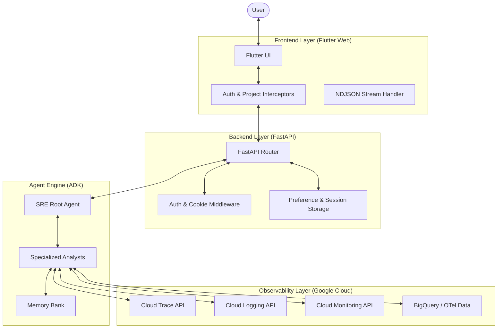

# System Architecture

This document provides a high-level overview of the SRE Agent system architecture, documenting the interaction between the frontend, backend, agent engine, and observability backend.

## Overview

The SRE Agent is a specialized AI-powered diagnostic tool designed to analyze Google Cloud Observability data (Traces, Logs, Metrics) to identify root causes of production issues.

The system is built on a modular architecture that supports both local development and remote managed execution.

---

## High-Level Components

The system consists of four primary layers:

---

## Data Flow & Execution Modes

The SRE Agent supports two distinct execution modes, determined by the `SRE_AGENT_ID` environment variable.

### 1. Local Development Mode
In local mode, the Agent runs directly within the FastAPI process. This is optimized for fast iteration and local testing.
- **Agent Execution**: Synchronous/Asynchronous calls within the same container.
- **Credentials**: Passed via `ContextVars` (Thread/Task local).
- **Storage**: Local SQLite or JSON files.

### 2. Managed Production Mode
In production, the FastAPI backend acts as a **Stateful Proxy** for the Agent Engine.
- **Agent Execution**: Deployed to Vertex AI Agent Engine (Reasoning Engine).
- **Credentials**: Propagated via **Session State**. The proxy injects the user's OAuth token into the ADK Session before querying.
- **Storage**: Managed Firestore and Vertex AI long-term memory.

---

## Core Operational Patterns

### Hybrid Authentication
The system combines Google SSO for identity with Backend Session Cookies for persistence. This dual-layer approach allows for seamless browser refreshes without repeated login prompts while ensuring strict EUC (End User Credentials) enforcement for GCP API calls.

### ReAct Reasoning Loop
The Agent follows the **Reasoning + Acting (ReAct)** pattern. It decomposes complex user requests into discrete diagnostic steps:
1.  **Thought**: Analyze current state and hypothesize.
2.  **Action**: Call a specialized tool (e.g., fetch logs or analyze critical path).
3.  **Observation**: Evaluate the tool output against the hypothesis.
4.  **Repeat**: Refine the search until a root cause is identified.

### GenUI (Generative UI)
The backend does not just return text; it emits specialized **UI Events**. These events are parsed by the Flutter frontend to render interactive widgets (charts, waterfall traces, log viewers) directly within the chat stream, providing a rich, diagnostic experience.

---

## Key Documentation
- [BACKEND.md](./BACKEND.md): API, Middleware, and Services deep-dive.
- [AGENT_ENGINE.md](./AGENT_ENGINE.md): Orchestration and reasoning logic.
- [TOOLS_GUIDE.md](./TOOLS_GUIDE.md): Catalog of analysis capabilities.
- [FRONTEND.md](./FRONTEND.md): Flutter UI and GenUI implementation.
- [AUTHENTICATION.md](./AUTHENTICATION.md): IAM and Session security.
- [TECHNICAL_DECISIONS.md](./TECHNICAL_DECISIONS.md): Records of dependency constraints and implementation rationale.
