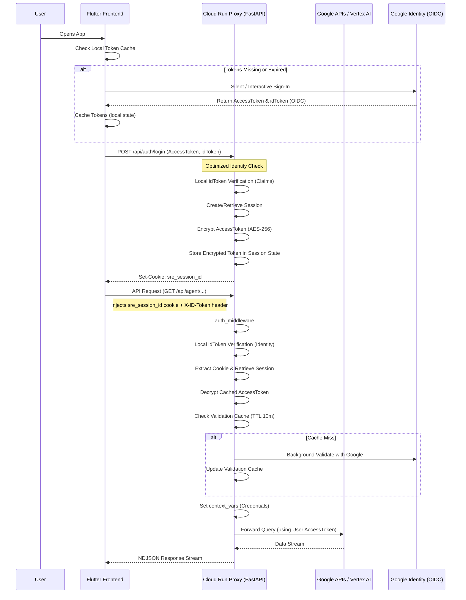

# Authentication System Design

This document provides a comprehensive overview of the authentication and session management system implemented in the SRE Agent, covering both backend and frontend components.

## Overview

The SRE Agent uses a **Hybrid Authentication Strategy** that combines Google OAuth2 Access Tokens with stateful Backend Sessions. This approach ensures:
1. **Security**: Short-lived Google tokens are used for actual GCP API interactions.
2. **Persistence**: Backend session cookies maintain user identity and conversation state across browser refreshes, eliminating frequent SSO prompts.
3. **Seamless UX**: Local credential caching on the frontend minimizes interactive login flows.

## Local Development Bypass

For local testing, authentication can be disabled by setting `ENABLE_AUTH=false`. In this mode:
- **Backend**: The `auth_middleware` injects a dummy "dev" identity (`dev@local.test`) if no valid credentials are provided.
- **Frontend**: The app skips the Google Sign-In flow and assumes a "Local Dev" user state.
- **Security Check**: This mode is strictly for development and should never be enabled in production environments exposed to the internet.

---

## System Architecture

The following diagram illustrates the interaction between the Flutter Frontend, the FastAPI Backend, and Google's Identity services.

---

## Backend Implementation

### 1. Session Storage
Backend sessions are managed using the ADK `SessionService`.
- **Local Dev**: Uses `DatabaseSessionService` (SQLite) to persist sessions.
- **Agent Engine**: Uses `VertexAiSessionService` for cloud-native persistence.
    - **Note**: Uses a fixed `app_name="sre_agent"` to ensure consistency between the Cloud Run proxy and the Agent Engine backend (which lacks `SRE_AGENT_ID`).
- **Session State**: Stores the **encrypted** user's `access_token`, `user_email`, and `project_id`.
- **Encryption**: Tokens are encrypted at rest using AES-256 (Fernet).

### 2. API Endpoints (`sre_agent/api/routers/system.py`)
- `POST /api/auth/login`:
    - Exchanges a Google Access Token for a session.
    - Sets an HTTP-only, secure cookie named `sre_session_id`.
- `POST /api/auth/logout`:
    - Deletes the session cookie to terminate the browser session.

### 3. Middleware Security (`sre_agent/api/middleware.py`)
The `auth_middleware` acts as the primary gatekeeper:
- **Header Auth**: Supports standard `Authorization: Bearer <token>` + `X-ID-Token`.
- **Identity (OIDC)**: Uses the `id_token` for fast, local identity verification (signature checking) without network latency.
- **Cookie Auth**: Supports `sre_session_id` for browser sessions.
- **Token Decryption**: Decrypts the session's `access_token` on-the-fly for request injection.
- **Validation Caching**: Implements a 10-minute TTL cache for Google token validation results to eliminate repeated API overhead.
- **Identity Propagation**: Sets `Credentials` and `current_user_id` ContextVars, which tools use to perform authorized actions.

---

## Frontend Implementation

### 1. Authentication Service (`autosre/lib/services/auth_service.dart`)
The `AuthService` manages the user lifecycle:
- **Google Sign-In**: Wraps the `google_sign_in` library.
- **Credential Caching**: Stores the `accessToken` and `expiryTime` in memory.
- **Backend Sync**: Proactively calls `/api/auth/login` whenever a new token is obtained to ensure the backend session stays in sync with the frontend credentials.

### 2. HTTP Interceptor (`autosre/lib/services/api_client.dart`)
The `ProjectInterceptorClient` ensures every request is properly decorated:
- **Authorization Header**: Injected from the local cache.
- **X-GCP-Project-ID**: Injected based on the user's selection.
- **X-User-ID**: Injected as an identity "hint" to help the backend middleware perform robust session lookups when only cookies are present.
- **withCredentials**: Specifically enabled for Web platforms to allow cross-origin cookie propagation.

### 3. Cross-Platform Handling
To maintain compatibility between Flutter Web (production) and VM (unit tests):
- Uses `kIsWeb` constant.
- Dynamically sets `withCredentials` on `http.Client()` to avoid hard dependencies on `dart:html` or `browser_client.dart`, which would break non-web environments.

---

## Security Considerations

- **Secure Cookies**: Cookies are configured with `httponly=True` (preventing JS access) and `samesite='lax'` (protecting against CSRF while allowing seamless navigation).
- **Encryption at Rest**: All access tokens stored in the session database are encrypted with AES-256. The `SRE_AGENT_ENCRYPTION_KEY` environment variable must be set in production.
- **Local OIDC Validation**: Using `id_token` for local verification ensures identity is proven by Google's cryptography without relying on shared secrets or repeated network lookups.
- **Background Validation**: Access tokens are periodically re-validated with Google (using a 10-minute cache) to ensure they haven't been revoked.
- **Scope Enforcement**: The system strictly enforces the `https://www.googleapis.com/auth/cloud-platform` scope; sessions created with insufficient scopes will be rejected.

---

## Troubleshooting

- **401 Unauthorized**: Check if the browser is blocking third-party cookies or if the Google Access Token has expired.
- **Missing Projects**: Ensure the token was generated with the `cloud-platform` scope.
- **CORS Issues**: In development, ensure `SECURE_COOKIES=false` is set if running on `http://localhost`.
