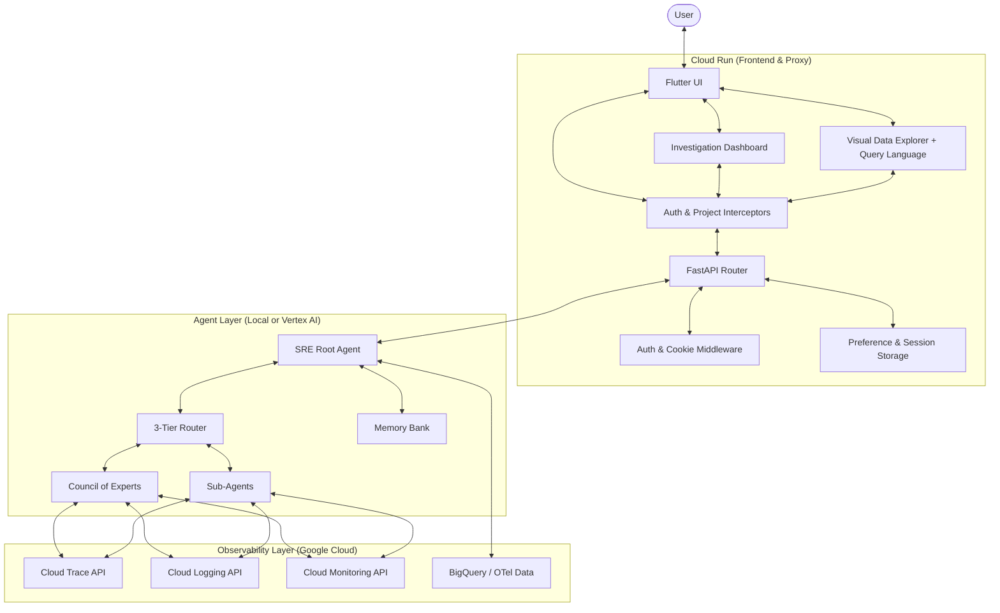

# System Architecture

This document provides a high-level overview of the SRE Agent system architecture, documenting the interaction between the frontend, backend, agent engine, and observability backend.

## Overview

The SRE Agent is a specialized AI-powered diagnostic tool designed to analyze Google Cloud Observability data (Traces, Logs, Metrics) to identify root causes of production issues.

The system is built on a modular architecture that supports both local development and remote managed execution. It uses a **"Council of Experts"** pattern -- specialized sub-agents for traces, logs, metrics, alerts, and root cause analysis -- with a **3-tier request router** that directs queries to the optimal handling strategy (direct tool call, specialist sub-agent delegation, or parallel council investigation).

---

## High-Level Components

The system consists of four primary layers:

### Conceptual Topology

---

## Data Flow & Execution Modes

The SRE Agent supports two distinct execution modes, determined by the `SRE_AGENT_ID` environment variable.

### 1. Local Development Mode
In local mode, the Agent runs directly within the FastAPI process. This is optimized for fast iteration and local testing.
- **Agent Execution**: Asynchronous calls within the same container.
- **Credentials**: Passed via `ContextVars` (Thread/Task local).
- **Storage**: Local SQLite or JSON files.
- **Model**: Gemini 2.5 Flash/Pro (same as production).

### 2. Managed Production Mode
In production, the FastAPI backend acts as a **Stateful Proxy** for the Agent Engine.
- **Agent Execution**: Deployed to Vertex AI Agent Engine (Reasoning Engine).
- **Credentials**: Propagated via **Session State**. The proxy injects the user's OAuth token into the ADK Session before querying.
- **Storage**: Managed Firestore and Vertex AI long-term memory.
- **Model**: Gemini 2.5 Flash/Pro (GA models required by Agent Engine).

**Note**: LLM credential injection is disabled. Vertex AI Gemini API rejects Google Sign-In (Web Client) access tokens with `401 ACCESS_TOKEN_TYPE_UNSUPPORTED`. Gemini executes using the Service Account (ADC), while tools use End-User Credentials (EUC) via `get_credentials_from_tool_context()`.

---

## Core Operational Patterns

### 3-Tier Request Router
Every user query is first classified by the **request router** (`core/router.py`) into one of three handling tiers:

| Tier | When | Behavior |
|:-----|:-----|:---------|
| **DIRECT** | Simple data retrieval (logs, metrics, traces) | Calls individual tools directly without sub-agent overhead |
| **SUB_AGENT** | Focused analysis (anomaly detection, pattern analysis) | Delegates to a specialist sub-agent (trace_analyst, log_analyst, etc.) |
| **COUNCIL** | Complex multi-signal investigation (root cause, incidents) | Starts a council meeting with the appropriate mode (fast/standard/debate) |

### Council of Experts (3 modes)
When the router selects the COUNCIL tier, the investigation is further classified into one of three modes:

| Mode | Trigger | Behavior |
|:-----|:--------|:---------|
| **Fast** | Narrow-scope queries | Single best-fit panel dispatch |
| **Standard** | Normal investigations | 5 parallel panels (Trace, Metrics, Logs, Alerts, Data) then Synthesizer merge |
| **Debate** | High-severity incidents | Panels then Critic LoopAgent with confidence gating (max 3 rounds) |

The Council also supports an **adaptive classifier** (`SRE_AGENT_ADAPTIVE_CLASSIFIER=true`) that uses LLM augmentation with session history, alert severity, and token budget context for more nuanced routing decisions.

### Hybrid Authentication
The system combines Google SSO (via Google Sign-In) for identity with Backend Session Cookies for persistence. This dual-layer approach allows for seamless browser refreshes without repeated login prompts while ensuring strict EUC (End User Credentials) enforcement for GCP API calls.

### ReAct Reasoning Loop
The Agent follows the **Reasoning + Acting (ReAct)** pattern. It decomposes complex user requests into discrete diagnostic steps:
1.  **Thought**: Analyze current state and hypothesize.
2.  **Action**: Call a specialized tool (e.g., fetch logs or analyze critical path).
3.  **Observation**: Evaluate the tool output against the hypothesis.
4.  **Repeat**: Refine the search until a root cause is identified.

### GenUI (Generative UI)
The backend does not just return text; it emits specialized **UI Events**. These events are parsed by the Flutter frontend to render interactive widgets (charts, waterfall traces, log viewers) directly within the chat stream, providing a rich, diagnostic experience.

### Dashboard Data Channel
Backend emits `{"type": "dashboard", ...}` events via `api/helpers/tool_events.py`. The frontend subscribes via `dashboardStream`, decoupled from the chat-based A2UI protocol. The dashboard also supports a **Visual Data Explorer** with structured query endpoints and natural language query translation.

---

## Key Documentation
- [Project Structure](project_structure.md): Detailed directory tree and module descriptions.
- [Backend](backend.md): API, Middleware, and Services deep-dive.
- [Agents & Tools](AGENTS_AND_TOOLS.md): Complete agent hierarchy, tool inventory, and assignment matrix.
- [Agent Orchestration](../concepts/agent_orchestration.md): Orchestration and reasoning logic.
- [Tools Catalog](../reference/tools.md): Catalog of analysis capabilities.
- [Frontend](frontend.md): Flutter UI, GenUI, and Dashboard implementation.
- [Authentication](authentication.md): IAM and Session security.
- [Telemetry](telemetry.md): Observability and tracing architecture.
- [Technical Decisions](decisions.md): Records of dependency constraints and implementation rationale.
- [Multi-Agent Observability](../concepts/multi_agent_observability.md): Agent Graph, AgentOps Dashboard, and self-analysis tools.
- [AgentOps Dashboard](../guides/agent_ops_dashboard.md): Fleet-wide agent performance monitoring.

---
*Last verified: 2026-02-21 -- Auto SRE Team*
