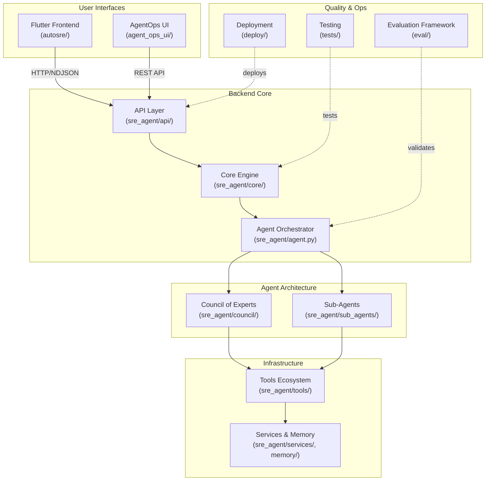
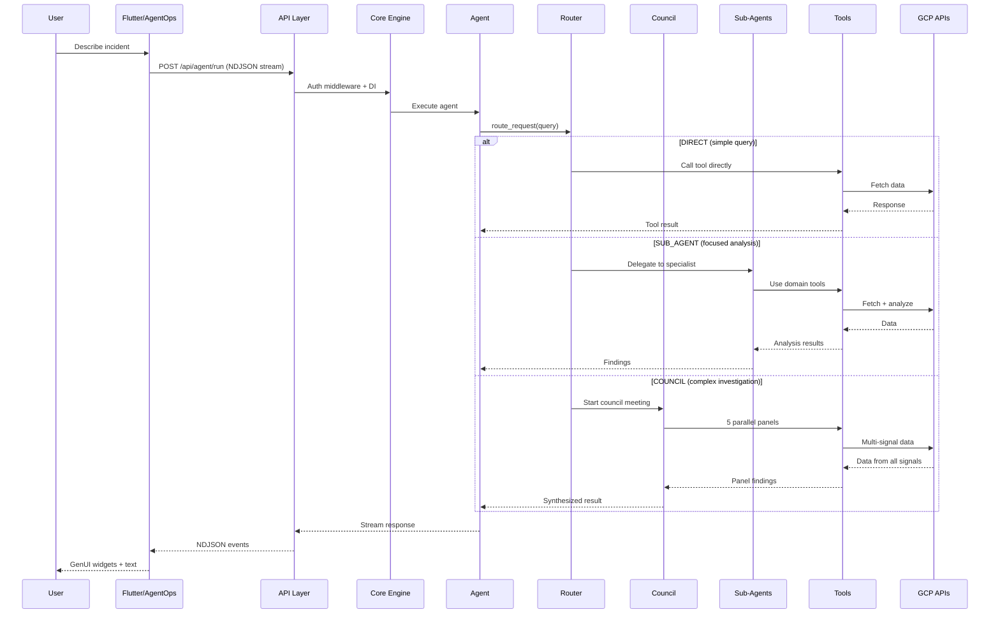

# Auto SRE Component Documentation

This directory contains detailed documentation for each major component of the Auto SRE system. Each component has its own README with architecture diagrams, data flow diagrams, and a component-specific roadmap.

> **For AI Agents**: Use this index to find the right component doc for your task. Each component README includes a "For AI Agents" section with modification guidance.

---

## Component Index

| Component | Directory | Description | Source Code |
|-----------|-----------|-------------|-------------|
| [Backend Core](backend-core/README.md) | `sre_agent/` | FastAPI API layer, core execution engine, auth, schemas, agent orchestrator | `sre_agent/{api,core,auth,schema,agent,prompt,model_config}.py` |
| [Council of Experts](council/README.md) | `sre_agent/council/` | Parallel multi-agent investigation with 3 modes (Fast/Standard/Debate) | `sre_agent/council/` |
| [Sub-Agents](sub-agents/README.md) | `sre_agent/sub_agents/` | Specialist agents for trace, logs, metrics, alerts, and root cause analysis | `sre_agent/sub_agents/` |
| [Tools Ecosystem](tools/README.md) | `sre_agent/tools/` | 118+ investigation tools: GCP clients, analysis, MCP, sandbox, playbooks | `sre_agent/tools/` |
| [Services & Memory](services-memory/README.md) | `sre_agent/{services,memory}/` | Session management, storage, memory subsystem, dual-mode execution | `sre_agent/{services,memory}/` |
| [Flutter Frontend](flutter-frontend/README.md) | `autosre/` | Material 3 web dashboard with GenUI, Observability Explorer, Agent Graph | `autosre/lib/` |
| [AgentOps UI](agent-ops-ui/README.md) | `agent_ops_ui/` | React operational dashboard: KPIs, topology, trajectory, evals | `agent_ops_ui/src/` |
| [Evaluation Framework](evaluation/README.md) | `eval/` | Agent quality: trajectory matching, rubric scoring, online eval service | `eval/`, `sre_agent/{api/routers/evals,services/eval_worker}.py` |
| [Deployment](deployment/README.md) | `deploy/` | CI/CD pipeline, Docker, Kubernetes, Cloud Run, Agent Engine | `deploy/`, `cloudbuild.yaml`, `scripts/` |
| [Testing](testing/README.md) | `tests/` | 2429+ backend tests, 129+ Flutter tests, fixtures, mock patterns | `tests/`, `autosre/test/` |

---

## System Architecture Overview

---

## How Components Interact

### Request Flow (Simplified)

---

## Reading Order

For a complete understanding of the system, read components in this order:

1. **[Backend Core](backend-core/README.md)** -- Start here to understand the foundation
2. **[Council of Experts](council/README.md)** -- The core investigation architecture
3. **[Sub-Agents](sub-agents/README.md)** -- Specialist agent design
4. **[Tools Ecosystem](tools/README.md)** -- The 108+ tool catalog
5. **[Services & Memory](services-memory/README.md)** -- State management and persistence
6. **[Flutter Frontend](flutter-frontend/README.md)** -- The primary user interface
7. **[AgentOps UI](agent-ops-ui/README.md)** -- Operational monitoring dashboard
8. **[Evaluation Framework](evaluation/README.md)** -- Quality assurance
9. **[Deployment](deployment/README.md)** -- Getting to production
10. **[Testing](testing/README.md)** -- Quality gates and test infrastructure

---

## Cross-Cutting Concerns

These topics span multiple components:

| Concern | Components Involved | Key Docs |
|---------|-------------------|----------|
| **Authentication (EUC)** | API Layer, Services, Tools | [Backend Core](backend-core/README.md), [Security](../reference/security.md) |
| **Dual-Mode Execution** | API Layer, Services, Agent | [Backend Core](backend-core/README.md), [Services](services-memory/README.md) |
| **GenUI/A2UI Protocol** | API Layer, Flutter Frontend | [Flutter Frontend](flutter-frontend/README.md), [Backend Core](backend-core/README.md) |
| **Circuit Breaker** | Core Engine, Tools | [Backend Core](backend-core/README.md), [Tools](tools/README.md) |
| **Telemetry** | All components | [Observability](../OBSERVABILITY.md) |
| **Feature Flags** | Council, Core Engine | [Council](council/README.md), [Configuration](../reference/configuration.md) |

---

## Component Roadmap Summary

See each component's README for detailed roadmaps. For the project-wide roadmap, see [Roadmap Index](../roadmap/README.md).

| Phase | Status | Focus Areas |
|-------|--------|-------------|
| Phase 1: Foundation | Completed | Modularization, ReAct, tool taxonomy |
| Phase 2: Memory & State | Completed | Memory integration, investigation state machine |
| Phase 2.5: SRE Reliability | Completed | Circuit breaker, SLO analysis, postmortem |
| Phase 2.75: Council | Completed | Parallel panels, debate, intent classification |
| Phase 3: Observability | Completed | Explorer dashboard, eval framework, sandbox, self-healing |
| Phase 4: Modern Agentics | In Progress | Streaming reasoning, CI evals, observability-on-self |
| Phase 5: Proactive SRE | Planned | Anomaly detection, knowledge graph, self-assessment |
| Phase 6: Enterprise | Planned | Multi-team, multi-cloud, canary deployments |

---

*Last updated: 2026-02-23*
