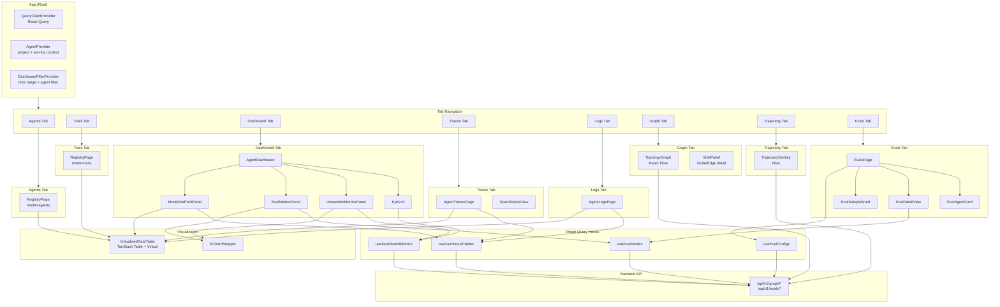
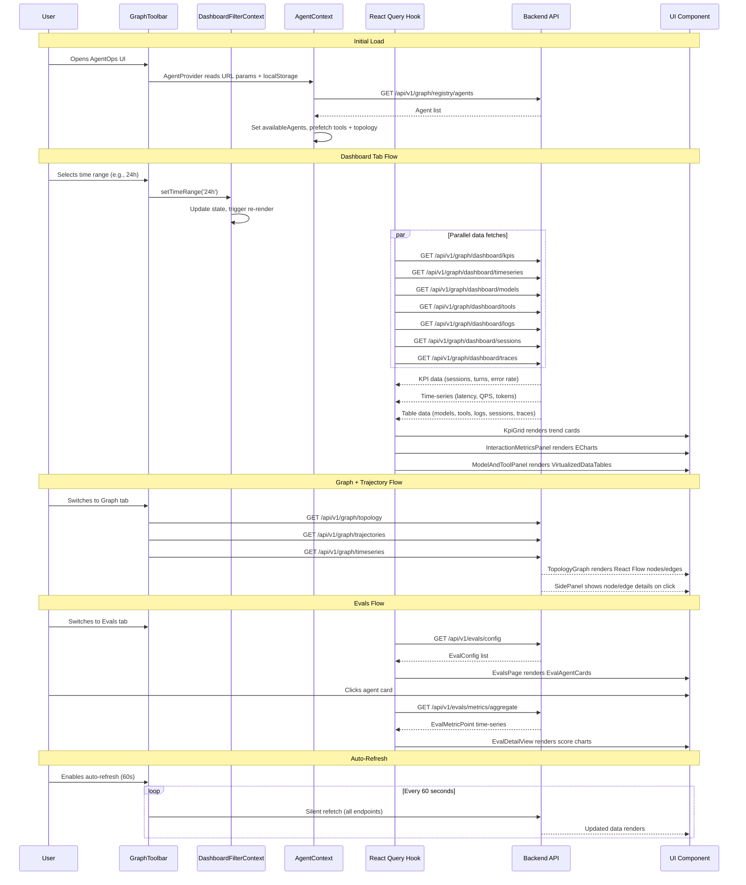

# AgentOps UI (`agent_ops_ui/`)

> React-based operational dashboard for monitoring, debugging, and evaluating AI agent deployments at scale.

## Overview

The AgentOps UI is a single-page React application that provides operational visibility into AI agent behavior. It is designed for platform engineers and SRE teams who need to understand agent performance, debug execution paths, monitor quality through evaluations, and analyze agent topology and trajectory patterns.

The dashboard queries BigQuery-based telemetry data through the FastAPI backend, presenting it through interactive tables, charts, topology graphs, Sankey diagrams, and evaluation scorecards. It supports URL deep-linking, guest/demo mode, auto-refresh, and time range filtering across all views.

**Key capabilities:**
- Agent and tool registry browsing with execution statistics
- KPI dashboard with latency, QPS, token usage, and error rate charts
- Agent topology graph (React Flow) showing inter-agent call patterns
- Trajectory Sankey diagram (Nivo) showing execution flow paths
- Agent trace explorer with span-level drill-down
- Agent log stream with severity filtering
- Evaluation configuration management (CRUD) and quality score tracking
- Virtualized data tables for 1000+ row datasets

## Architecture Diagram



## Data Flow Diagram



## Tab / Page Descriptions

### Agents Tab
The **RegistryPage** in `mode="agents"` displays all discovered agent services with execution statistics. Data comes from BigQuery telemetry aggregated over the selected time window (default 720 hours / 30 days). Each agent card shows total sessions, turns, token usage, error rate, and latency percentiles. Clicking an agent navigates to the Dashboard tab filtered to that agent.

### Tools Tab
The **RegistryPage** in `mode="tools"` lists all tool invocations across agents. Shows execution count, error rate, average and P95 latency. Supports card and table view modes (persisted to localStorage).

### Dashboard Tab
The **AgentDashboard** is a 4-row grid layout:
1. **KpiGrid** -- Four KPI cards with trend indicators (total sessions, avg turns, root invocations, error rate)
2. **InteractionMetricsPanel** -- Three ECharts time-series: P50/P95 latency, QPS with error rate overlay, input/output token usage
3. **EvalMetricsPanel** -- AI quality evaluation scores over time (when evals are configured)
4. **ModelAndToolPanel** -- Side-by-side virtualized tables for model call statistics and tool performance

### Traces Tab
The **AgentTracesPage** displays agent traces in a virtualized table with sub-tabs for traces, sessions, and logs. Clicking a trace row opens the **SpanDetailsView** which shows span attributes, status, exceptions, and evaluation events. Supports trace ID deep-linking via URL.

### Logs Tab
The **AgentLogsPage** shows agent execution logs in a virtualized table. Supports severity filtering (INFO, WARNING, ERROR, DEBUG) via the `GraphToolbar` filter controls.

### Graph Tab
The **TopologyGraph** uses React Flow to render an interactive node-edge graph of agent topology. Nodes represent agents, tools, and models; edges represent call relationships with execution statistics. Sparkline overlays show time-series trends when available. Clicking a node or edge opens the **SidePanel** with detailed metrics and recent payloads.

### Trajectory Tab
The **TrajectorySankey** uses Nivo's Sankey chart to visualize execution flow paths. Each band represents a trajectory through the agent system. Supports error-only filtering and loop detection for identifying infinite agent loops.

### Evals Tab
The **EvalsPage** manages agent evaluation configurations and displays quality metrics:
- **EvalAgentCard** -- Summary card per agent showing enabled metrics, sampling rate, and last evaluation timestamp
- **EvalDetailView** -- Time-series charts of evaluation scores per metric for a selected agent
- **EvalSetupWizard** -- Configuration form for creating/editing eval configs (agent name, metrics, sampling rate, enabled toggle)

## Data Fetching Architecture

All API communication uses **React Query** (TanStack Query) for caching, deduplication, and background refetching.

### React Query Configuration
```typescript
const queryClient = new QueryClient({
  defaultOptions: {
    queries: {
      staleTime: 30_000,        // 30 seconds before refetch
      refetchOnWindowFocus: false, // No refetch on tab switch
    },
  },
})
```

### Custom Hooks

| Hook | Endpoint(s) | Returns | Cache Key |
|------|------------|---------|-----------|
| `useDashboardMetrics` | `/dashboard/kpis`, `/dashboard/timeseries` | `KpiMetrics`, `LatencyPoint[]`, `QpsPoint[]`, `TokenPoint[]` | `['dashboard-metrics', projectId, serviceName, hours]` |
| `useDashboardTables` | `/dashboard/models`, `/dashboard/tools`, `/dashboard/logs`, `/dashboard/sessions`, `/dashboard/traces` | `ModelCallRow[]`, `ToolCallRow[]`, `AgentLogRow[]`, `AgentSessionRow[]`, `AgentTraceRow[]` | `['dashboard-tables', projectId, serviceName, hours]` |
| `useEvalConfigs` | `/evals/config` | `EvalConfig[]` | `['eval-configs']` |
| `useEvalMetrics` | `/evals/metrics/aggregate` | `EvalMetricPoint[]` | `['eval-metrics', projectId, serviceName, hours]` |

### Context Providers

**AgentContext** (`AgentProvider`):
- Provides `projectId`, `serviceName`, `availableAgents`, and view mode state
- Reads `projectId` from URL params or localStorage
- Prefetches tools and topology data on mount for faster tab switching
- Persists service name and registry view mode to localStorage

**DashboardFilterContext** (`DashboardFilterProvider`):
- Provides `timeRange`, `selectedAgents`, `groupByAgent` filter state
- Actions: `setTimeRange`, `toggleAgent`, `setGroupByAgent`, `resetFilters`
- Default time range: `24h`

### Guest / Demo Mode
When `?guest_mode=true` is in the URL, the app auto-sets a demo service name and the backend returns synthetic demo data. This enables a zero-configuration demo experience.

## Visualization Components

### TopologyGraph (React Flow)
Interactive directed graph where:
- **Nodes** represent agents, tools, and LLM models with execution counts and error indicators
- **Edges** represent call relationships with call count, average duration, and error count labels
- **Sparklines** overlay time-series data on nodes when available
- Supports zoom, pan, fit-to-view, and node/edge click selection

### TrajectorySankey (Nivo)
Sankey flow diagram where:
- Each horizontal band represents a unique execution trajectory
- Band width is proportional to execution count
- Color coding indicates error vs. success paths
- `errorsOnly` filter highlights error trajectories
- Loop detection identifies and annotates cyclic agent patterns

### EChartWrapper
Generic ECharts wrapper component used by the dashboard panels. Supports line charts, area charts, and bar charts with the dark theme color scheme (`#0F172A` background).

### VirtualizedDataTable (TanStack Table + Tanstack Virtual)
High-performance table component for rendering 1000+ row datasets:
- Column sorting (click headers)
- Row virtualization (only renders visible rows)
- Custom cell renderers per column type
- Used by ModelAndToolPanel, AgentTracesPage, AgentLogsPage, and RegistryPage

## Evals System

The evaluation system enables continuous quality monitoring of agent responses.

### Configuration Model
```typescript
interface EvalConfig {
  agent_name: string            // Agent service name
  is_enabled: boolean           // Whether evals are active
  sampling_rate: number         // 0.0 - 1.0, fraction of requests to evaluate
  metrics: string[]             // e.g., ["coherence", "groundedness", "safety"]
  last_eval_timestamp: string | null
}
```

### CRUD Operations
| Operation | Hook | Endpoint | Method |
|-----------|------|----------|--------|
| List configs | `useEvalConfigs` | `/api/v1/evals/config` | GET |
| Create/Update | `useUpsertEvalConfig` | `/api/v1/evals/config/:agentName` | POST |
| Delete | `useDeleteEvalConfig` | `/api/v1/evals/config/:agentName` | DELETE |

All mutations automatically invalidate the `['eval-configs']` query key to trigger a refetch.

### Metrics Visualization
The `EvalMetricsPanel` (on the Dashboard tab) and `EvalDetailView` (on the Evals tab) both use `useEvalMetrics` to fetch time-bucketed evaluation scores. Each metric is displayed as a time-series line chart with color coding per metric name.

### Workflow
1. Navigate to the **Evals** tab
2. Click "Add Agent" to open the `EvalSetupWizard`
3. Select an agent, choose metrics (coherence, groundedness, safety, etc.), set sampling rate
4. Save configuration -- evaluations begin on the next agent request
5. View aggregated scores over time in the `EvalDetailView`

## Tech Stack

| Technology | Version | Purpose |
|-----------|---------|---------|
| React | 18+ | UI framework |
| TypeScript | 5+ | Type safety |
| TanStack Query | 5+ | Server state management, caching |
| TanStack Table | 8+ | Table state management |
| TanStack Virtual | 3+ | Row virtualization |
| React Flow | 11+ | Graph/topology visualization |
| Nivo | 0.84+ | Sankey diagram |
| ECharts | 5+ | Time-series charts |
| Axios | 1+ | HTTP client |
| Lucide React | -- | Icon library |

## Directory Structure

```
agent_ops_ui/src/
+-- App.tsx                            # Root: QueryClient, AgentProvider, DashboardFilterProvider, tab nav
+-- main.tsx                           # Entry point
+-- types.ts                           # Shared TypeScript types (Topology, Sankey, Registry, Evals, Logs)
+-- hooks/
|   +-- useDashboardMetrics.ts         # KPI + time-series data hook
|   +-- useDashboardTables.ts          # Model/tool/log/session/trace table data hook
|   +-- useEvalConfigs.ts              # Eval config CRUD hooks (query + mutations)
|   +-- useEvalMetrics.ts              # Eval metrics aggregate hook
+-- contexts/
|   +-- AgentContext.tsx               # Project + service name + agent list context
|   +-- DashboardFilterContext.tsx      # Time range + agent filter + group-by context
+-- components/
|   +-- tables/
|   |   +-- VirtualizedDataTable.tsx   # TanStack Table + Virtual sortable table
|   +-- charts/
|   |   +-- EChartWrapper.tsx          # ECharts wrapper
|   +-- dashboard/
|   |   +-- AgentDashboard.tsx         # 4-row dashboard grid (KPIs, charts, evals, tables)
|   |   +-- DashboardToolbar.tsx       # Filter controls
|   |   +-- panels/
|   |       +-- KpiGrid.tsx            # 4 KPI cards with trends
|   |       +-- InteractionMetricsPanel.tsx  # Latency, QPS, token charts
|   |       +-- EvalMetricsPanel.tsx   # Eval quality score charts
|   |       +-- ModelAndToolPanel.tsx   # Model + tool stat tables
|   +-- evals/
|   |   +-- EvalsPage.tsx              # Eval config list + detail routing
|   |   +-- EvalAgentCard.tsx          # Per-agent eval summary card
|   |   +-- EvalDetailView.tsx         # Metric time-series detail view
|   |   +-- EvalSetupWizard.tsx        # Create/edit eval config form
|   +-- traces/
|   |   +-- AgentTracesPage.tsx        # Trace/session/log explorer
|   |   +-- SpanDetailsView.tsx        # Span-level detail panel
|   +-- logs/
|   |   +-- AgentLogsPage.tsx          # Agent log stream table
|   +-- TopologyGraph.tsx              # React Flow topology visualization
|   +-- TrajectorySankey.tsx           # Nivo Sankey trajectory diagram
|   +-- SidePanel.tsx                  # Node/edge drill-down panel
|   +-- GraphToolbar.tsx               # Project, time, service, severity controls
|   +-- Onboarding.tsx                 # First-run setup wizard (dataset config)
|   +-- RegistryPage.tsx               # Agent/tool registry browser
+-- utils/                             # Sankey/topology layout helpers
```

## Component Roadmap

| Component | Status | Description |
|-----------|--------|-------------|
| Agent Registry | Stable | Agent/tool discovery with card and table views |
| KPI Dashboard | Stable | Sessions, turns, error rate, invocations with trends |
| Interaction Metrics | Stable | P50/P95 latency, QPS, token usage ECharts |
| Model & Tool Tables | Stable | Virtualized tables with sorting |
| Topology Graph | Stable | React Flow with sparkline overlays |
| Trajectory Sankey | Stable | Nivo Sankey with loop detection |
| Side Panel | Stable | Node/edge detail drill-down with payloads |
| Agent Traces | Stable | Trace/session/log explorer with span details |
| Agent Logs | Stable | Severity-filtered log stream |
| Evals Configuration | Stable | CRUD for per-agent eval configs |
| Evals Metrics | Stable | Time-series quality score charts |
| URL Deep-Linking | Stable | project_id, tab, node, time_range, trace_id in URL |
| Auto-Refresh | Stable | Configurable 30s/60s/300s silent refetch |
| Guest/Demo Mode | Stable | Zero-config demo with synthetic data |
| Alerting Rules | Planned | Threshold-based alerts on KPI degradation |
| Cost Analytics | Planned | Per-agent/per-tool cost breakdown and budgeting |
| Comparison View | Planned | Side-by-side agent version comparison |
| Export / Sharing | Planned | Dashboard snapshot export (PDF, PNG, JSON) |

## For AI Agents

When working on the AgentOps UI, keep these patterns in mind:

1. **Data fetching** -- Always use React Query hooks. Create new hooks in `src/hooks/` following the `useDashboardMetrics` pattern: define TypeScript interfaces, create a `fetch*` function using axios, export a `use*` hook that reads context from `useAgentContext()` and `useDashboardFilters()`.

2. **Context layering** -- The provider hierarchy is: `QueryClientProvider` -> `AgentProvider` -> `DashboardFilterProvider` -> `AppContent`. Hooks that need project/service context must be called inside `AppContent` or its descendants.

3. **Tab routing** -- Tabs are defined by the `Tab` union type in `types.ts`. To add a new tab: add the literal to the `Tab` type, add a button in the tab bar in `App.tsx`, add the conditional render in `AppContent`, and handle the tab in `buildSearchParams()` for URL deep-linking.

4. **Component patterns** -- Dashboard panels receive `hours` as a prop and call their own hooks internally. Tables use `VirtualizedDataTable` with column definitions. Charts use `EChartWrapper` with option configs.

5. **Eval mutations** -- The `useUpsertEvalConfig` and `useDeleteEvalConfig` hooks automatically invalidate the config query cache. After mutation, the UI re-renders with fresh data.

6. **URL state** -- All major state (project ID, time range, selected tab, selected node) is synced to URL params via `buildSearchParams()` and `window.history.replaceState()`. This enables deep-linking and sharing.

7. **Guest mode** -- Check `isGuestMode()` (reads `?guest_mode=true` from URL) before features that require real authentication. The backend returns demo data in guest mode.

8. **Styling** -- Inline styles use the Slate-based dark theme palette (`#0F172A` background, `#1E293B` cards, `#F0F4F8` text, `#06B6D4` accents). Font is Outfit. No CSS frameworks -- all styles are inline `React.CSSProperties` objects.

9. **Type safety** -- All API responses have TypeScript interfaces in `types.ts`. Hook return types must match these interfaces exactly. Avoid `any` -- use proper typing.

10. **Testing** -- Tests use Vitest. Hook tests mock axios responses. Component tests use React Testing Library with `QueryClientProvider` and context providers. Run tests with:
    ```bash
    cd agent_ops_ui && npm test          # Run all tests
    cd agent_ops_ui && npm run lint      # ESLint
    ```
