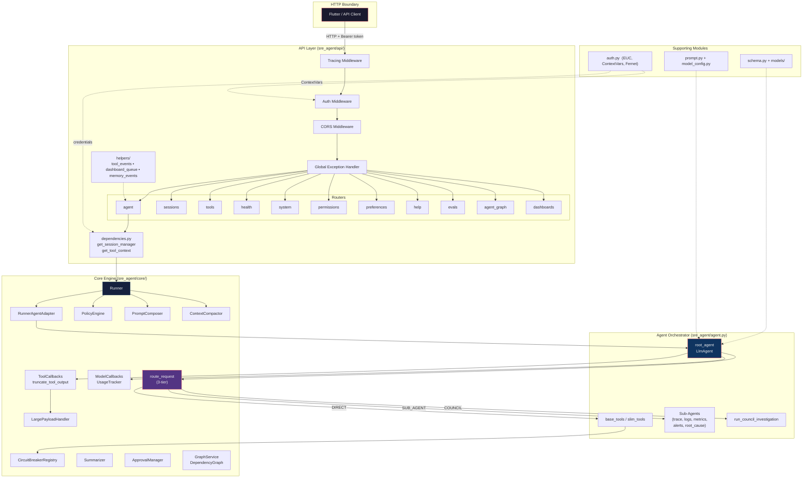
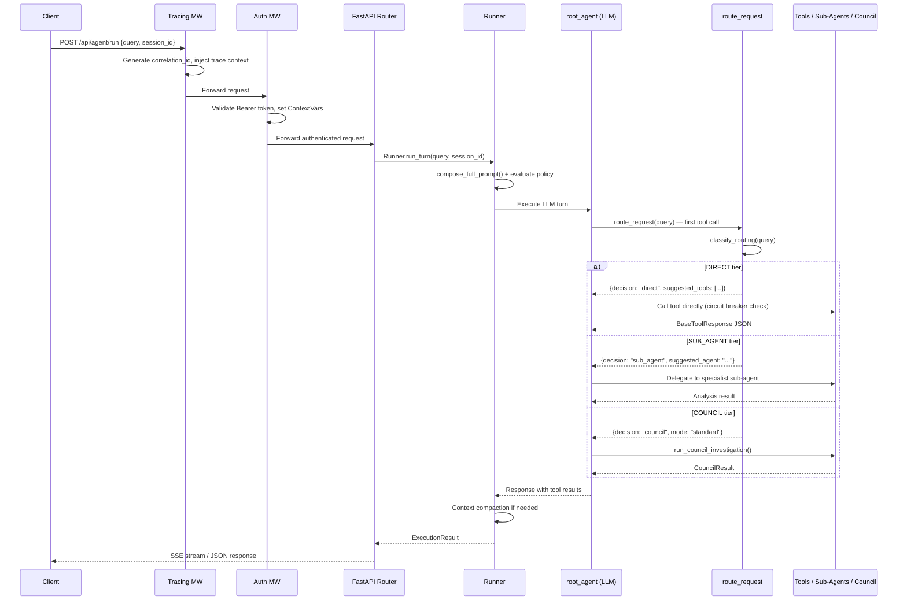

# Backend Core

> The Backend Core is the central nervous system of Auto SRE. It encompasses the FastAPI application layer, the agent execution engine, authentication, request routing, and all supporting infrastructure that turns an HTTP request into an AI-driven SRE investigation.

**Scope**: `sre_agent/api/`, `sre_agent/core/`, `sre_agent/agent.py`, `sre_agent/auth.py`, `sre_agent/schema.py`, `sre_agent/models/`, `sre_agent/prompt.py`, `sre_agent/model_config.py`, `sre_agent/version.py`

---

## Table of Contents

- [Architecture Diagram](#architecture-diagram)
- [Data Flow Diagram](#data-flow-diagram)
- [Sub-Components](#sub-components)
  - [API Layer](#api-layer)
  - [Core Engine](#core-engine)
  - [Agent Orchestrator](#agent-orchestrator)
  - [Authentication](#authentication)
  - [Models and Schemas](#models-and-schemas)
  - [Prompt System](#prompt-system)
  - [Model Configuration](#model-configuration)
  - [Version](#version)
- [Key Patterns](#key-patterns)
- [Configuration Reference](#configuration-reference)
- [Component Roadmap](#component-roadmap)
- [For AI Agents](#for-ai-agents)
- [Cross-References](#cross-references)

---

## Architecture Diagram



---

## Data Flow Diagram



---

## Sub-Components

### API Layer

**Location**: `sre_agent/api/`

The API layer is a FastAPI application built with the factory pattern. It handles HTTP concerns -- routing, authentication, CORS, error handling -- and delegates all business logic to the core engine and agent orchestrator.

#### Key Files

| File | Purpose |
|------|---------|
| `app.py` | `create_app()` factory. Initializes telemetry, applies Pydantic monkeypatches for ADK 1.23.0 + Pydantic 2.12+ compatibility (**do not remove until ADK updates**), mounts all routers, and serves static files. |
| `middleware.py` | `configure_middleware()` registers (in execution order): `tracing_middleware` (correlation IDs), `auth_middleware` (token validation, ContextVars), `configure_cors`, `global_exception_handler`. |
| `dependencies.py` | DI functions: `get_session_manager()` (ADK session singleton), `get_tool_context()` (credentials-aware tool context). |

#### Routers

| Router | Prefix | Responsibility |
|--------|--------|---------------|
| `agent.py` | `/api/agent` | Agent execution (run, stream) |
| `sessions.py` | `/api/sessions` | Session CRUD |
| `tools.py` | `/api/tools` | Manual tool execution, telemetry queries |
| `health.py` | `/api/health` | Health/readiness probes |
| `system.py` | `/api/system` | System info, version |
| `permissions.py` | `/api/permissions` | IAM permission checks |
| `preferences.py` | `/api/preferences` | User preferences |
| `help.py` | `/api/help` | Help content |
| `evals.py` | `/api/evals` | Evaluation configs and results |
| `dashboards.py` | `/api/dashboards` | Custom dashboard CRUD |
| `agent_graph.py` | `/api/agent-graph` | Agent topology graph data |
| `agent_graph_setup.py` | `/api/agent-graph/setup` | BigQuery table setup |

#### Helpers

| Helper | Purpose |
|--------|---------|
| `tool_events.py` | Emits `{"type": "dashboard", ...}` events into the SSE stream, decoupled from chat protocol. |
| `dashboard_queue.py` | Async queue (`init_dashboard_queue`, `queue_tool_result`, `drain_dashboard_queue`) for batching dashboard events during parallel tool execution. |
| `memory_events.py` | `MemoryEventBus` singleton with typed events (failure learning, success findings, pattern learned/applied, memory search, tool tracking). |

---

### Core Engine

**Location**: `sre_agent/core/`

The core engine contains the execution runtime, safety guardrails, context management, and callback infrastructure that powers every agent turn.

#### Runner (`runner.py`) and Adapter (`runner_adapter.py`)

The `Runner` class is the central execution loop, managing prompt composition, policy evaluation, LLM execution, tool interception, and approval workflows. `RunnerConfig` controls behavior: `enforce_policy` (default true), `enable_compaction`, `max_turns` (50), `execution_timeout` (300s). Key methods: `run_turn()`, `_run_with_policy()`, `_intercept_tool_calls()`, `process_approval()`. `create_runner()` is the factory function.

`RunnerAgentAdapter` wraps `Runner` to present an ADK-compatible `run_async()` interface.

#### 3-Tier Request Router (`router.py`)

The `route_request` function is an `@adk_tool` that the root agent calls as its **first action** on every user turn. It classifies the query into one of four tiers:

| Tier | When Triggered | Behavior |
|------|---------------|----------|
| **GREETING** | Conversational messages | Respond directly, no tools |
| **DIRECT** | Simple data retrieval (fetch logs, metrics, traces) | Call suggested tools directly, no sub-agent overhead |
| **SUB_AGENT** | Focused single-signal analysis | Delegate to a specialist sub-agent |
| **COUNCIL** | Complex multi-signal investigation, incidents, RCA | Launch council with appropriate mode (fast/standard/debate) |

Classification is performed by `classify_routing()` from `council/intent_classifier.py`, which uses keyword-based signal detection and query complexity scoring.

#### Policy Engine (`policy_engine.py`)

Evaluates tool calls against safety policies before execution. Each tool has a `ToolPolicy` (access level: `READ_ONLY`/`WRITE`/`ADMIN`, category, approval requirement). `PolicyEngine.evaluate()` returns `ALLOW`, `DENY`, or `REQUIRE_APPROVAL`. Thread-safe singleton via `get_policy_engine()`.

#### Circuit Breaker (`circuit_breaker.py`)

Implements the classic three-state circuit breaker pattern to prevent cascading failures when GCP APIs are degraded.

| State | Behavior |
|-------|----------|
| `CLOSED` | Normal operation. Failures are counted. |
| `OPEN` | All calls are blocked with `CircuitBreakerOpenError`. Transitions to `HALF_OPEN` after a configurable timeout. |
| `HALF_OPEN` | A single probe call is allowed. Success returns to `CLOSED`; failure returns to `OPEN`. |

`CircuitBreakerRegistry` is a thread-safe singleton (via `threading.Lock`) with per-tool configuration (`CircuitBreakerConfig`: `failure_threshold`, `recovery_timeout`, `half_open_max_calls`). Integrated into the `@adk_tool` decorator for automatic protection. Controlled via `SRE_AGENT_CIRCUIT_BREAKER` env var.

#### Model Callbacks (`model_callbacks.py`)

Hooks into the LLM call lifecycle for cost tracking and budget enforcement.

- **`before_model_callback`**: Checks if the token budget (`SRE_AGENT_TOKEN_BUDGET`) is exceeded. If so, injects a budget-exceeded message and halts the turn.
- **`after_model_callback`**: Records input/output tokens, duration, and estimated USD cost. Uses model-specific pricing for Gemini 2.5 Flash/Pro.
- **`UsageTracker`**: Thread-safe singleton accumulator. Provides `total_tokens`, `total_cost_usd`, `is_over_budget()`, and `get_summary()`.

#### Context Compactor (`context_compactor.py`)

Prevents token overflow in long sessions. `ContextCompactor.should_compact()` checks if context exceeds `CompactionConfig.max_tokens`; `_compact_context()` summarizes older events while preserving recent ones. Uses `chars_per_token` (default 4) for estimation. Singleton via `get_context_compactor()`.

#### Prompt Composer (`prompt_composer.py`)

Builds three-tier prompts: `compose_system_role()` (personality from `SRE_AGENT_PROMPT`), `compose_developer_role()` (domain context, session summary, tool guidance), `compose_user_role()` (user message with recent events). `create_tool_guidance()` generates dynamic hints based on investigation state.

#### Summarizer (`summarizer.py`)

Domain-aware compression of tool outputs for context compaction. Specialized `_summarize_*` methods for traces, logs, metrics, PromQL results, and time series.

#### Approval Manager (`approval.py`)

HITL foundation. `ApprovalManager` singleton tracks per-session approval requests with statuses: `PENDING`, `APPROVED`, `DENIED`, `EXPIRED`. Methods: `create_request()`, `process_decision()`, `get_pending_requests()`, `cleanup_expired()`.

#### Tool Callbacks and Large Payload Handler

- **`tool_callbacks.py`**: `truncate_tool_output_callback` truncates outputs exceeding 100K characters.
- **`large_payload_handler.py`**: Intercepts oversized outputs (>50 items or >100K chars, configurable) and routes to sandbox processing via 3 tiers: tool-specific template, generic template, or LLM code generation prompt.

#### Graph Service (`graph_service.py`)

Builds service dependency graphs from trace spans for RCA. `DependencyGraph` uses adjacency lists with typed nodes (`ServiceType`: COMPUTE, DATABASE, CACHE, etc.) and edges (`EdgeType`: CALLS, READS_FROM, WRITES_TO, etc.). `GraphService.get_blast_radius()` produces a `BlastRadiusReport` for impact analysis.

---

### Agent Orchestrator

**Location**: `sre_agent/agent.py`

The orchestrator is the top-level module that wires together the LLM agent, its tools, sub-agents, and MCP toolsets.

#### Key Concepts

| Concept | Description |
|---------|-------------|
| `root_agent` | The main `LlmAgent` instance. Uses `get_model_name("fast")` (Gemini 2.5 Flash). Configured with `before_model_callback`, `after_model_callback`, and `after_tool_callback`. |
| `base_tools` | Full list of all registered tool functions (~50 tools). |
| `slim_tools` | Reduced set of ~20 orchestration tools used when `SRE_AGENT_SLIM_TOOLS=true` (default). Council panels retain full domain-specific tool sets. |
| `TOOL_NAME_MAP` | `dict[str, str]` mapping tool function names to human-readable display names for the UI. |
| `create_configured_agent()` | Factory function that builds the root agent with all tools, sub-agents, callbacks, and MCP toolsets. |
| `get_agent_with_mcp_tools()` | Async factory that initializes MCP toolsets (BigQuery, Logging, Monitoring) before creating the agent. |

#### 3-Stage Pipeline Functions

Three `@adk_tool` functions that the agent can call to run structured investigation phases:

1. **`run_aggregate_analysis()`**: Phase 1 -- broad signal collection across traces, metrics, logs, and alerts.
2. **`run_triage_analysis()`**: Phase 2 -- prioritize and classify findings from aggregation.
3. **`run_deep_dive_analysis()`**: Phase 3 -- focused investigation on the highest-priority signal.

#### Council Integration

- `run_council_investigation()`: `@adk_tool` that launches a council investigation with a specified mode (fast/standard/debate).
- `_parse_panel_finding()` / `_extract_council_result()`: Parse structured findings from council panel outputs.

#### Dual-Mode Execution

| Mode | Condition | Behavior |
|------|-----------|----------|
| **Local** | `SRE_AGENT_ID` not set | Agent runs in-process inside the FastAPI server |
| **Remote** | `SRE_AGENT_ID` is set | Requests are forwarded to a deployed Vertex AI Agent Engine instance via `AgentEngineClient` |

---

### Authentication

**Location**: `sre_agent/auth.py`

Handles OAuth2 token validation, End-User Credentials (EUC) propagation, and session-level credential management.

Uses Python `contextvars` to propagate per-request state: `_credentials_context`, `_project_id_context`, `_user_id_context`, `_correlation_id_context`, `_trace_id_context`, `_guest_mode_context`.

Key types: `ContextAwareCredentials` (custom `google.auth.credentials.Credentials` subclass reading from ContextVars), `TokenInfo` (cached token metadata with TTL). Token encryption via AES-256 Fernet (`SRE_AGENT_ENCRYPTION_KEY`). Credentials are set in middleware, read in tools via `get_credentials_from_tool_context()`, and persisted in sessions via `get_credentials_from_session()`.

---

### Models and Schemas

**Location**: `sre_agent/schema.py`, `sre_agent/models/`

#### Core Schema (`schema.py`)

All Pydantic models follow the strict pattern:

```python
class MyModel(BaseModel):
    model_config = ConfigDict(frozen=True, extra="forbid")
```

Key models: `BaseToolResponse` (standard tool return: status/result/error/metadata), `ToolStatus` (SUCCESS/ERROR/PARTIAL), `InvestigationPhase` (INITIATED through COMPLETE), `Severity`, `Confidence`, and domain-specific report models (`TraceSummary`, `LatencyAnalysisReport`, `CausalAnalysisReport`, `AgentRunSummary`, etc.).

#### Investigation Models (`models/investigation.py`)

`InvestigationState` is a mutable state machine tracking findings, timeline, phase transitions, affected services, and quality score (0-100). Key methods: `add_finding()`, `transition_phase()`, `calculate_score()`. `PHASE_INSTRUCTIONS` provides phase-specific LLM guidance.

#### Dashboard Models (`models/dashboard.py`)

Comprehensive Pydantic models for custom dashboards: `Dashboard`, `Panel`, `PanelQuery`, `GridPosition`, `DashboardVariable`, `DashboardFilter`, etc. All `frozen=True, extra="forbid"`.

---

### Prompt System (`prompt.py`)

System instruction constants: `SRE_AGENT_PROMPT` (main persona/capabilities/constraints), `STRICT_ENGLISH_INSTRUCTION`, `PROJECT_CONTEXT_INSTRUCTION`, `REACT_PATTERN_INSTRUCTION` (Thought-Action-Observation loop), `GREETING_PROMPT`, `CROSS_SIGNAL_CORRELATOR_PROMPT`.

---

### Model Configuration (`model_config.py`)

`get_model_name("fast")` returns `gemini-2.5-flash`; `get_model_name("deep")` returns `gemini-2.5-pro`. Same models for local and Agent Engine modes. `is_context_caching_enabled()` checks `SRE_AGENT_CONTEXT_CACHING`; `get_context_cache_config()` returns TTL (default 3600s). Context caching reduces input token costs by up to 75%.

---

### Version (`version.py`)

`VERSION` (from `pyproject.toml`), `GIT_SHA` (short commit hash), `BUILD_TIMESTAMP` (ISO 8601). `get_version_info()` returns all metadata for the `/api/system/version` endpoint.

---

## Key Patterns

### Pydantic Frozen Schemas

Every data model **must** use `model_config = ConfigDict(frozen=True, extra="forbid")`. `frozen=True` makes instances immutable and hashable; `extra="forbid"` rejects unexpected fields, preventing silent hallucination acceptance from LLM outputs.

### Async/Await Requirements

All external I/O (GCP APIs, DB, LLM) **must** be async. Every `@adk_tool` function is `async def`. Forgetting `await` produces `RuntimeWarning: coroutine was never awaited`.

### EUC Credential Propagation

End-User Credentials flow: (1) Frontend sends `Authorization: Bearer <token>` + `X-GCP-Project-ID` headers, (2) `auth_middleware` validates and sets ContextVars, (3) tools read via `get_credentials_from_tool_context()`, (4) client factories use `ContextAwareCredentials` to make GCP calls as the user. `STRICT_EUC_ENFORCEMENT=true` blocks ADC fallback.

### Dual-Mode Execution

- **Local mode** (`SRE_AGENT_ID` unset): Agent runs in-process via `create_configured_agent()`.
- **Remote mode** (`SRE_AGENT_ID` set): Requests proxied to Vertex AI Agent Engine via `AgentEngineClient`.

### Singleton Patterns

All core services use thread-safe singleton accessors with double-checked locking (`threading.Lock`). Used by: `PolicyEngine`, `PromptComposer`, `CircuitBreakerRegistry`, `UsageTracker`, `ContextCompactor`, `ApprovalManager`, `GraphService`, `Summarizer`.

---

## Configuration Reference

| Environment Variable | Default | Description |
|---------------------|---------|-------------|
| `GOOGLE_CLOUD_PROJECT` | *required* | GCP project ID |
| `GOOGLE_CLOUD_LOCATION` | `us-central1` | GCP region |
| `SRE_AGENT_ID` | *unset* | Enables remote mode (Agent Engine) |
| `SRE_AGENT_ENFORCE_POLICY` | `true` | Enable policy engine enforcement |
| `SRE_AGENT_TOKEN_BUDGET` | *unset* | Max token budget per request |
| `SRE_AGENT_CIRCUIT_BREAKER` | `true` | Enable circuit breaker on tools |
| `SRE_AGENT_ENCRYPTION_KEY` | *unset* | AES-256 Fernet key for token encryption |
| `SRE_AGENT_SLIM_TOOLS` | `true` | Reduce root agent to ~20 tools |
| `SRE_AGENT_CONTEXT_CACHING` | `false` | Enable Vertex AI context caching |
| `SRE_AGENT_LARGE_PAYLOAD_HANDLER` | *unset* | Enable large payload auto-sandbox |
| `SRE_AGENT_DEPLOYMENT_MODE` | `false` | Suppress init side-effects in deploy/test |
| `STRICT_EUC_ENFORCEMENT` | `false` | Block ADC fallback |
| `SRE_AGENT_ADAPTIVE_CLASSIFIER` | *unset* | LLM-augmented intent classification |
| `LOG_LEVEL` | `INFO` | Logging level |

See `.env.example` and `docs/reference/configuration.md` for the complete list.

---

## Component Roadmap

| Task | Phase | Status |
|------|-------|--------|
| Modular API architecture (factory, routers) | 1 | Done |
| EUC credential propagation (ContextVars) | 1 | Done |
| Investigation state machine (phase tracking) | 2 | Done |
| Circuit breaker (three-state, per-tool) | 2.5 | Done |
| Model callbacks (cost/token tracking, budgets) | 3.0 | Done |
| Thread safety audit (double-checked locking) | 3.6 | Done |
| 3-tier request router (DIRECT/SUB_AGENT/COUNCIL) | 3.9 | Done |
| Large payload handler (auto-sandbox) | 3.12 | Done |
| Context caching OPT-10 (prompt prefix caching) | 3.13 | Done |
| Service dependency graph (blast radius) | 3.14 | Done |
| Human approval workflow foundation | 3.16 | Done |
| Confirmation Bridge HITL 2.0 (HIGH-impact interceptor) | 4 | Planned |
| Zero-Trust Identity Propagation | 4 | Planned |
| Observability-on-Self (trace ID deep links) | 4 | Planned |
| Dynamic tool descriptions / few-shot RAG | 4 | Planned |
| API rate limiting, CORS tightening | Backlog | Planned |
| Token estimation consistency, session TTL cleanup | Backlog | Planned |
| Proactive anomaly detection, knowledge graph | 5 | Future |
| Cost attribution, multi-cloud, canary deploys | 5-6 | Future |

---

## For AI Agents

This section provides guidance for AI coding agents modifying the Backend Core.

### Before Making Changes

1. **Read the target file** before modifying it. Never propose changes to unread code.
2. **Read `AGENTS.md`** for the canonical coding patterns. It is the single source of truth.
3. **Check `CLAUDE.md`** for the quick rules (type hints, async, frozen schemas, test-first).

### Common Modification Scenarios

**Adding a new API endpoint**: Add route in `sre_agent/api/routers/`, create Pydantic request model with `frozen=True, extra="forbid"`, use DI from `dependencies.py`, add mirrored tests.

**Modifying the Runner**: Read `runner.py` fully first. Be aware of `_active_executions` dict and thread safety. New callbacks must be registered in `agent.py` (`create_configured_agent()`). Test both local and remote modes.

**Adding middleware**: Add to `middleware.py`, register in `configure_middleware()`. Order matters: last added = first executed. Tracing middleware must remain outermost.

**Changing routing logic**: `route_request` in `core/router.py` is the entry point. Classification lives in `council/intent_classifier.py` (`classify_routing()`). Adaptive variant in `council/adaptive_classifier.py` (feature-flagged). New tiers need handlers in `agent.py`.

### Testing Requirements

- 80% minimum coverage, 100% target on new code.
- All tests must mock external APIs (GCP, LLM). Never call real services.
- Set `SRE_AGENT_DEPLOYMENT_MODE=true` in tests to suppress agent init side effects.
- Test file path must mirror source: `sre_agent/core/runner.py` -> `tests/unit/sre_agent/core/test_runner.py`.
- Run `uv run poe lint && uv run poe test` before considering any change complete.

### Pitfalls

- **Stale session closure**: Always refresh session from DB inside async generators after `await` calls.
- **Missing `await`**: All tool functions are async. Forgetting `await` silently drops results.
- **Pydantic `extra="forbid"` missing**: Allows the LLM to inject arbitrary fields into responses.
- **Singleton thread safety**: Always use double-checked locking with `threading.Lock`.
- **Circuit breaker tripping**: If a tool repeatedly fails, the breaker opens. Check tool health before debugging.

---

## Cross-References

| Document | Relevance |
|----------|-----------|
| [AGENTS.md](../../../AGENTS.md) | Single source of truth for all coding patterns |
| [CLAUDE.md](../../../CLAUDE.md) | Quick rules and command reference |
| [docs/PROJECT_PLAN.md](../../PROJECT_PLAN.md) | Full roadmap and milestone history |
| [docs/components/council/](../council/) | Council of Experts architecture (parallel panels, debate, synthesis) |
| [docs/components/tools/](../tools/) | Tool ecosystem (95 Python files, `@adk_tool`, client factories) |
| [docs/components/sub-agents/](../sub-agents/) | Specialist sub-agents (trace, logs, metrics, alerts, root cause) |
| [docs/components/services-memory/](../services-memory/) | Session persistence, memory subsystem |
| [docs/components/flutter-frontend/](../flutter-frontend/) | Flutter Web frontend |
| [docs/components/evaluation/](../evaluation/) | ADK evaluation framework |

---

*Last updated: 2026-02-23*
