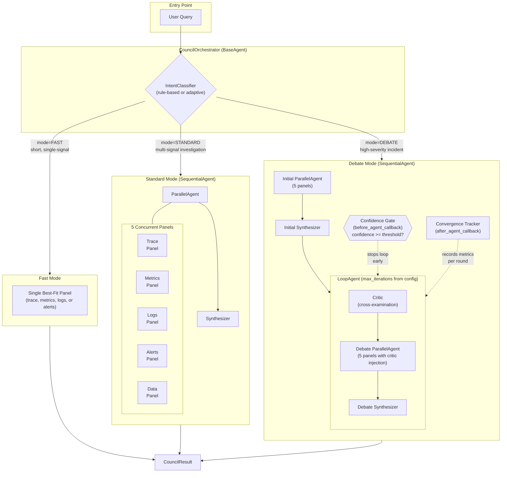
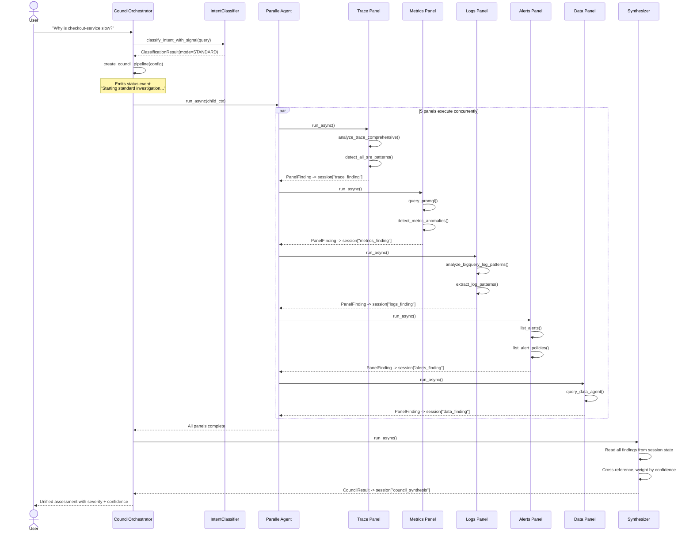

# Council of Experts

> **Source**: [`sre_agent/council/`](../../../sre_agent/council/)
> **Feature Flag**: `SRE_AGENT_COUNCIL_ORCHESTRATOR=true`
> **Status**: Production-ready (Standard + Debate modes)

## Overview

The Council of Experts is a parallel multi-agent architecture for complex SRE
investigations. Instead of routing every query through a single monolithic agent,
the council dispatches specialist **panels** that analyze different telemetry
signals concurrently, then merges their findings into a unified assessment.

The architecture is inspired by medical diagnostic boards: each specialist
examines the patient from their domain expertise, a critic cross-examines
their conclusions for contradictions, and a synthesizer produces the final
diagnosis.

**Key design goals:**

- **Parallel execution** -- 5 panels run concurrently via ADK `ParallelAgent`,
  reducing wall-clock time from 5x sequential to ~1x.
- **Structured output** -- Every panel produces a `PanelFinding` with severity,
  confidence, evidence, and recommended actions (validated by Pydantic schema).
- **Iterative refinement** -- Debate mode enables critic-driven loops where
  panels re-investigate only the gaps and contradictions the critic identified.
- **Graceful degradation** -- Timeout enforcement (default 120s) returns partial
  results if any panel hangs.

## Architecture Diagram



## Data Flow Diagram -- Standard Investigation



## Investigation Modes

### Fast Mode (~5s)

**Trigger**: Short queries (<100 chars) matching fast-mode keywords (e.g.,
"show", "list", "get", "status", "check"), or queries targeting a single
signal type.

**Behavior**: Routes to the single best-fit panel based on `SignalType`
detection. No parallel execution, no synthesis overhead.

| Signal Type | Panel Selected       | Example Query                    |
|-------------|----------------------|----------------------------------|
| `TRACE`     | `create_trace_panel` | "show me the latest traces"      |
| `METRICS`   | `create_metrics_panel` | "check CPU metrics for service X" |
| `LOGS`      | `create_logs_panel`  | "any error logs recently?"       |
| `ALERTS`    | `create_alerts_panel`| "list active alerts"             |

### Standard Mode (~30s)

**Trigger**: Default for most queries. Multi-signal queries, general
investigation requests, or anything that does not match fast/debate patterns.

**Behavior**: ADK `ParallelAgent` runs all 5 panels concurrently. Each writes
its `PanelFinding` to session state via `output_key`. After all panels complete,
a `Synthesizer` (Gemini "deep" model) reads all findings and produces a unified
`CouncilResult`.

**Pipeline structure** (`SequentialAgent`):
1. `ParallelAgent` -- 5 panels (trace, metrics, logs, alerts, data)
2. `Synthesizer` -- merges findings into `council_synthesis`

### Debate Mode (~60s+)

**Trigger**: High-severity keywords ("root cause", "incident", "postmortem",
"debate"), or explicit debate requests. Also triggered by the adaptive
classifier when alert severity is critical.

**Behavior**: After an initial Standard-mode analysis, a `LoopAgent` iterates
through critic-driven refinement rounds until either:
- **Confidence threshold** is met (default 0.85), checked by the
  `confidence_gate` callback before each iteration.
- **Max iterations** are reached (default 3, configurable up to 10).

**Pipeline structure** (`SequentialAgent`):
1. Initial `ParallelAgent` -- 5 panels (first pass)
2. Initial `Synthesizer` -- baseline synthesis
3. `LoopAgent` (debate loop):
   a. `Critic` -- cross-examines findings, identifies gaps/contradictions
   b. `ParallelAgent` -- 5 panels with critic-context injection callbacks
   c. `Synthesizer` -- re-evaluates with updated findings

**Critic feedback injection**: Each panel in the debate loop has a
`before_agent_callback` that reads the `critic_report` from session state
and prepends a structured context block listing the specific gaps and
contradictions the critic identified. This makes debate rounds 3-5x cheaper
because panels only re-query flagged signals rather than re-fetching everything.

## Panel Architecture

Each panel is an ADK `LlmAgent` with:
- **Domain-specific tools** from `council/tool_registry.py`
- **`output_key`** for writing structured findings to session state
- **`output_schema`** set to `PanelFinding` for validated JSON output
- **`after_agent_callback`** that writes a completion marker to
  `_panel_completions` in session state for progressive UI updates
- **Model callbacks** (`before_model_callback`, `after_model_callback`) for
  cost/token tracking

### Trace Panel (`trace_panel`)

**Role**: Distributed tracing specialist.

**Analyzes**: Latency bottlenecks, errors, structural anomalies, resiliency
anti-patterns (retry storms, cascading timeouts, connection pool exhaustion).

**Key tools** (28 total from `TRACE_PANEL_TOOLS`):
`analyze_trace_comprehensive`, `compare_span_timings`, `analyze_critical_path`,
`detect_all_sre_patterns`, `detect_retry_storm`, `find_exemplar_traces`,
`build_service_dependency_graph`

### Metrics Panel (`metrics_panel`)

**Role**: Time-series and SLO specialist.

**Analyzes**: Metric anomalies, SLO violations, statistical outliers,
metric-to-trace correlation via exemplars.

**Key tools** (13 total from `METRICS_PANEL_TOOLS`):
`list_time_series`, `query_promql`, `detect_metric_anomalies`,
`compare_metric_windows`, `correlate_metrics_with_traces_via_exemplars`,
`mcp_query_range`

### Logs Panel (`logs_panel`)

**Role**: Log analysis specialist.

**Analyzes**: Error patterns, new signatures, emerging anomalies using Drain3
clustering and BigQuery log analysis at scale.

**Key tools** (9 total from `LOGS_PANEL_TOOLS`):
`list_log_entries`, `analyze_bigquery_log_patterns`, `extract_log_patterns`,
`compare_time_periods`, `discover_telemetry_sources`

### Alerts Panel (`alerts_panel`)

**Role**: Alerting and incident specialist.

**Analyzes**: Active alerts, alert policies, incident signals. Proposes
remediation actions for well-known failure modes (OOM, disk full, etc.).

**Key tools** (11 total from `ALERTS_PANEL_TOOLS`):
`list_alerts`, `list_alert_policies`, `get_alert`,
`generate_remediation_suggestions`, `estimate_remediation_risk`,
`get_gcloud_commands`

### Data Panel (`data_panel`)

**Role**: BigQuery analytics specialist.

**Analyzes**: Full telemetry dataset via Conversational Analytics Data Agent.
Finds statistical patterns and trends that other panels miss because they
work with sampled API data.

**Key tools** (6 total from `DATA_PANEL_TOOLS`):
`query_data_agent`, `gcp_execute_sql`, `discover_telemetry_sources`

## Adaptive Classification (Council 2.0)

**Feature flag**: `SRE_AGENT_ADAPTIVE_CLASSIFIER=true`

When enabled, the `adaptive_classify()` function augments the rule-based
`IntentClassifier` with an LLM-based classification step. The LLM receives:

- The user query
- **Session history**: last 5 investigation queries
- **Alert severity**: current alert severity level (if triggered by an alert)
- **Token budget**: remaining token budget for the session
- **Previous modes**: investigation modes used in prior turns

The LLM returns an `AdaptiveClassificationResult` with:
- `mode`: FAST, STANDARD, or DEBATE
- `signal_type`: best-fit signal type for panel routing
- `confidence`: classifier confidence (0.0-1.0)
- `reasoning`: explanation of the mode selection
- `classifier_used`: "llm_augmented", "rule_based", or "fallback"

**Fallback guarantee**: If the LLM call fails for any reason (timeout, parsing
error, API error), the system silently falls back to the deterministic
rule-based classifier with `classifier_used="fallback"`. This ensures the
council never fails at the classification stage.

## Convergence Tracking in Debate Mode

The debate loop tracks convergence metrics per round via an
`after_agent_callback` (`_build_convergence_tracker`). Each round record
is appended to the `debate_convergence_history` key in session state.

**Round record fields**:

| Field                    | Type    | Description                                         |
|--------------------------|---------|-----------------------------------------------------|
| `round`                  | `int`   | 1-indexed round number                              |
| `confidence`             | `float` | Current overall confidence after synthesis           |
| `confidence_delta`       | `float` | Change from previous round (positive = improving)    |
| `critic_gaps`            | `int`   | Number of gaps the critic identified                 |
| `critic_contradictions`  | `int`   | Number of contradictions between panels              |
| `round_duration_ms`      | `float` | Wall-clock time for this round in milliseconds       |
| `threshold`              | `float` | Target confidence threshold from config              |
| `converged`              | `bool`  | Whether confidence met or exceeded threshold         |

**Example convergence history**:
```json
[
  {"round": 1, "confidence": 0.65, "confidence_delta": 0.65, "critic_gaps": 3, "critic_contradictions": 2, "round_duration_ms": 12340, "threshold": 0.85, "converged": false},
  {"round": 2, "confidence": 0.78, "confidence_delta": 0.13, "critic_gaps": 1, "critic_contradictions": 1, "round_duration_ms": 8210, "threshold": 0.85, "converged": false},
  {"round": 3, "confidence": 0.88, "confidence_delta": 0.10, "critic_gaps": 0, "critic_contradictions": 0, "round_duration_ms": 6540, "threshold": 0.85, "converged": true}
]
```

## Data Schemas

### PanelFinding

```python
class PanelFinding(BaseModel):
    model_config = ConfigDict(frozen=True, extra="forbid")
    panel: str            # "trace", "metrics", "logs", "alerts", "data"
    summary: str          # Concise finding
    severity: PanelSeverity  # critical | warning | info | healthy
    confidence: float     # 0.0 - 1.0
    evidence: list[str]   # Trace IDs, metric values, log entries
    recommended_actions: list[str]  # Remediation steps
```

### CriticReport

```python
class CriticReport(BaseModel):
    model_config = ConfigDict(frozen=True, extra="forbid")
    agreements: list[str]       # Points where panels agree
    contradictions: list[str]   # Conflicting findings
    gaps: list[str]             # Missing analysis
    revised_confidence: float   # 0.0 - 1.0
```

### CouncilResult

```python
class CouncilResult(BaseModel):
    model_config = ConfigDict(frozen=True, extra="forbid")
    mode: InvestigationMode
    panels: list[PanelFinding]
    critic_report: CriticReport | None  # None for FAST/STANDARD
    synthesis: str                      # Unified narrative
    overall_severity: PanelSeverity
    overall_confidence: float           # 0.0 - 1.0
    rounds: int                         # 1 for non-debate modes
```

### CouncilConfig

```python
class CouncilConfig(BaseModel):
    model_config = ConfigDict(frozen=True, extra="forbid")
    mode: InvestigationMode = InvestigationMode.STANDARD
    max_debate_rounds: int = 3       # 1-10
    confidence_threshold: float = 0.85  # 0.0-1.0
    timeout_seconds: int = 120       # 10-600
```

## Session State Keys

| Key                         | Writer          | Reader(s)                   | Type     |
|-----------------------------|-----------------|------------------------------|----------|
| `trace_finding`             | Trace panel     | Critic, Synthesizer          | JSON str |
| `metrics_finding`           | Metrics panel   | Critic, Synthesizer          | JSON str |
| `logs_finding`              | Logs panel      | Critic, Synthesizer          | JSON str |
| `alerts_finding`            | Alerts panel    | Critic, Synthesizer          | JSON str |
| `data_finding`              | Data panel      | Critic, Synthesizer          | JSON str |
| `critic_report`             | Critic          | Debate panels, Synthesizer   | JSON str |
| `council_synthesis`         | Synthesizer     | Confidence gate, API layer   | JSON str |
| `_panel_completions`        | Panel callbacks | Dashboard API                | dict     |
| `debate_convergence_history`| Convergence tracker | API layer, debugging     | list     |

## Component Roadmap

| Component                     | Status         | Notes                                              |
|-------------------------------|----------------|----------------------------------------------------|
| CouncilOrchestrator           | Completed      | Custom BaseAgent with mode routing                 |
| Standard pipeline             | Completed      | ParallelAgent + Synthesizer                        |
| Debate pipeline               | Completed      | LoopAgent with confidence gating + convergence     |
| Fast mode                     | Completed      | Single-panel dispatch by signal type               |
| 5 specialist panels           | Completed      | Trace, Metrics, Logs, Alerts, Data                 |
| Synthesizer                   | Completed      | Cross-referencing rules (OPT-9)                    |
| Critic                        | Completed      | Cross-examination with structured output           |
| Debate round injection        | Completed      | Critic gaps/contradictions injected into panels    |
| Convergence tracking          | Completed      | Per-round metrics in session state                 |
| Panel completion callbacks    | Completed      | Progressive UI updates via `_panel_completions`    |
| Rule-based IntentClassifier   | Completed      | Keyword + pattern matching                         |
| Adaptive Classifier (2.0)     | Completed      | LLM-augmented with fallback                        |
| Tool Registry (OPT-4)         | Completed      | Single source of truth for all tool sets           |
| Timeout enforcement           | Completed      | Deadline-based with partial result delivery        |
| Council activity graph events | Completed      | Dashboard visualization of panel execution         |
| Dynamic panel selection       | Future         | Skip panels when signal type is clearly irrelevant |
| Panel-to-panel communication  | Future         | Direct evidence sharing between panels             |
| Weighted panel confidence     | Future         | Domain-specific confidence calibration             |
| Streaming panel results       | Future         | Real-time updates as each panel finishes           |

## File Reference

| File                     | Purpose                                                     |
|--------------------------|-------------------------------------------------------------|
| `orchestrator.py`        | `CouncilOrchestrator` -- BaseAgent that routes to pipelines |
| `parallel_council.py`    | Standard pipeline factory (`create_council_pipeline`)       |
| `debate.py`              | Debate pipeline, confidence gate, convergence tracker       |
| `panels.py`              | 5 panel factory functions with completion callbacks         |
| `synthesizer.py`         | Synthesizer factory (`create_synthesizer`)                  |
| `critic.py`              | Critic factory (`create_critic`)                            |
| `intent_classifier.py`   | Rule-based classifier, signal detection, routing            |
| `adaptive_classifier.py` | LLM-augmented classifier (Council 2.0)                     |
| `mode_router.py`         | `@adk_tool` wrapper for `classify_investigation_mode`       |
| `tool_registry.py`       | Single source of truth for panel + sub-agent tool sets      |
| `schemas.py`             | Pydantic models: enums, findings, reports, configs          |
| `prompts.py`             | Panel, critic, synthesizer prompt templates                 |
| `state.py`               | Session state key constants                                 |

## For AI Agents

When modifying council components, follow these rules:

1. **Tool sets are defined in `tool_registry.py` only.** Both panels
   (`council/panels.py`) and sub-agents (`sub_agents/*.py`) import from the
   registry. Never duplicate tool lists in panel or sub-agent files.

2. **All schemas use `frozen=True, extra="forbid"`.** If you add a field to
   `PanelFinding`, `CriticReport`, or `CouncilResult`, existing serialized
   data in session state will fail validation. Update all producers and
   consumers together.

3. **Panel `output_key` values must match the state keys** the critic and
   synthesizer read. These are defined as constants in `state.py`. If you
   rename a state key, update: panels.py, critic.py (prompt), synthesizer.py
   (prompt), debate.py (convergence tracker), and any API handlers.

4. **The synthesizer uses `get_model_name("deep")`** because it performs
   multi-signal cross-referencing. Panels and the critic use
   `get_model_name("fast")` for lower latency.

5. **Debate mode callbacks are order-sensitive.** The `before_agent_callback`
   (confidence gate) runs before each loop iteration, and the
   `after_agent_callback` (convergence tracker) runs after. Do not swap or
   remove either without understanding the convergence flow.

6. **The adaptive classifier always has a fallback path.** Any exception in
   `_classify_with_llm` triggers silent fallback to rule-based classification.
   Never remove the try/except in `adaptive_classify()`.

7. **Timeout enforcement uses `time.monotonic()`** for Python 3.10
   compatibility (not `asyncio.timeout` which requires 3.11+). The deadline
   is checked after each yielded event.

8. **Tests are in `tests/unit/sre_agent/council/`** and
   `tests/integration/`. Run `uv run poe test` to validate. Council tests
   mock all LLM calls and GCP API clients.
