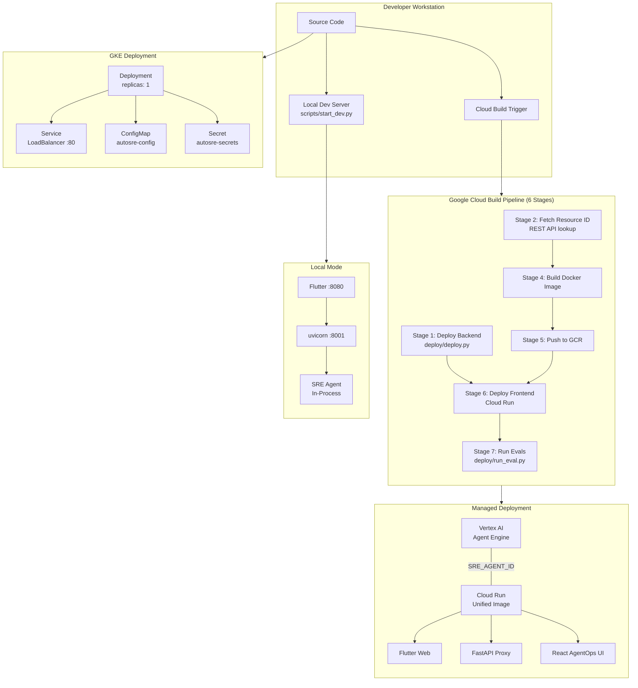
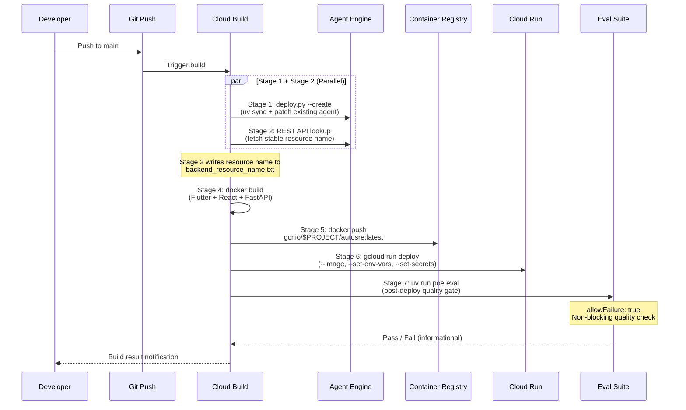
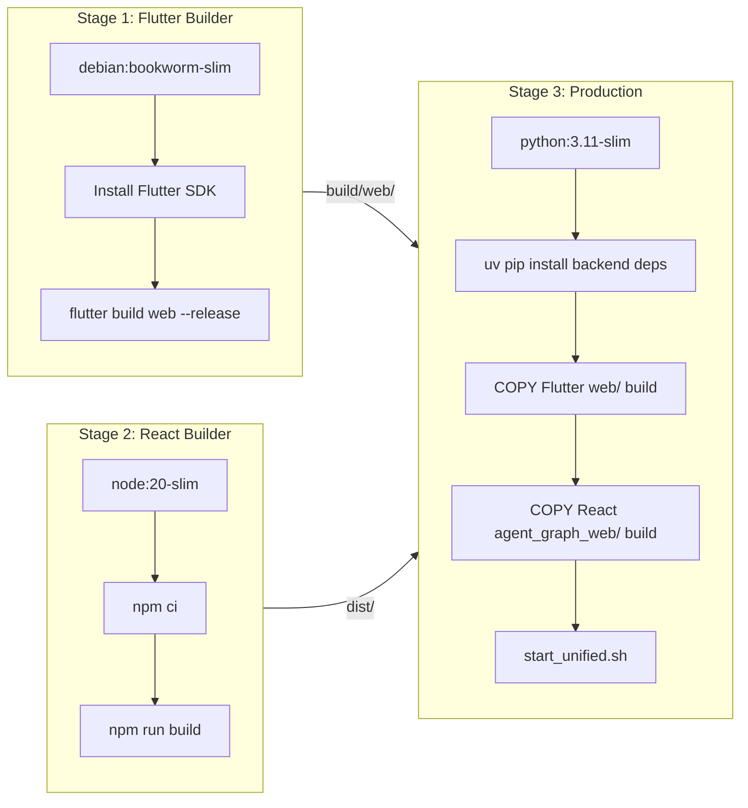

# Deployment Infrastructure

> Component documentation for the Auto SRE deployment system (`deploy/`, `cloudbuild.yaml`, `scripts/`).

## Overview

The deployment infrastructure supports three execution modes, each serving a different stage of the development lifecycle:

| Mode | Backend | Frontend | When to Use |
|------|---------|----------|-------------|
| **Local** | In-process FastAPI | `flutter run -d chrome` | Development and debugging |
| **Managed** | Vertex AI Agent Engine | Cloud Run (unified Docker image) | Production (GCP-managed) |
| **GKE** | Unified Docker pod | Unified Docker pod | Self-hosted Kubernetes |

The system is designed around a **stable Agent ID** pattern: once deployed, the backend Agent Engine resource name is reused across updates, ensuring session continuity and allowing the frontend to be deployed in parallel with backend patches.

## Architecture



## CI/CD Pipeline Data Flow



## Deployment Scripts

### `deploy/deploy.py` -- Agent Engine Backend

Deploys the SRE Agent to Vertex AI Agent Engine (Reasoning Engine). Key behaviors:

- **Wraps agent in Runner**: `create_runner(root_agent)` then `RunnerAgentAdapter` for stateless remote execution
- **Smart update**: Searches for existing agent by `resource_id` flag or `display_name`, patches if found, creates new if not
- **Dependency management**: Reads `pyproject.toml`, merges with pinned deployment versions, excludes web-only packages (FastAPI, uvicorn)
- **Environment propagation**: Copies feature flags and secrets from local env to Agent Engine runtime
- **Concurrent update handling**: Retries up to 12 times (12 min) on `InvalidArgument` errors from concurrent updates
- **Agent Identity**: Optional `--use_agent_identity` flag for v1beta1 API with `IdentityType.AGENT_IDENTITY`

```bash
# Deploy (create or update)
uv run poe deploy
# Equivalent to:
python deploy/deploy.py --create

# With Agent Identity
python deploy/deploy.py --create --use_agent_identity

# Force new agent (skip update)
python deploy/deploy.py --create --force_new

# List deployed agents
uv run poe list

# Delete an agent
uv run poe delete --resource_id <ID>
```

### `deploy/deploy_web.py` -- Cloud Run Frontend

Deploys the unified Docker image to Cloud Run. Key behaviors:

- **IAM auto-grant**: Runs `deploy/grant_permissions.py` before deploy (non-blocking on failure)
- **Secret Manager integration**: Mounts `gemini-api-key`, `google-client-id`, `sre-agent-encryption-key` as env vars
- **Configurable authentication**: `--allow-unauthenticated` for public access, default is authenticated
- **Resource allocation**: 16 GiB memory, 4 vCPUs, 300s timeout

```bash
uv run poe deploy-web
# Equivalent to:
python deploy/deploy_web.py --agent-url <URL> --agent-id <ID>
```

### `deploy/deploy_all.py` -- Full-Stack Orchestrator

Orchestrates backend + frontend deployment with intelligent parallelism:

- **Parallel mode** (existing agent found): Backend patch and frontend deploy run concurrently via `threading.Thread`
- **Sequential mode** (new agent): Backend deploys first, frontend uses the returned resource name

```bash
uv run poe deploy-all
# Equivalent to:
python deploy/deploy_all.py [--allow-unauthenticated]
```

### `deploy/deploy_gke.py` -- Kubernetes Deployment

Deploys to an existing GKE cluster:

1. Fetches cluster credentials via `gcloud container clusters get-credentials`
2. Creates/updates ConfigMap (`autosre-config`) and Secret (`autosre-secrets`)
3. Substitutes `PROJECT_ID` in `deployment.yaml` and applies manifests

```bash
uv run poe deploy-gke
# Equivalent to:
python deploy/deploy_gke.py --cluster <NAME> --zone <ZONE>
```

### `deploy/run_eval.py` -- CI/CD Eval Runner

Runs the evaluation suite with project ID substitution and optional Vertex AI sync. See the [Evaluation Framework](../evaluation/README.md) documentation for details.

## Docker Image Architecture

The `deploy/Dockerfile.unified` builds a **three-stage image** combining all frontends and the backend:



The final image serves:
- **Port 8080**: FastAPI backend (serves Flutter web at `/`, React UI at `/agent-graph/`, API at `/api/`)
- Backend and both frontends run in a single container via `start_unified.sh`

## Kubernetes Manifests

### `deploy/k8s/deployment.yaml`

- Single replica deployment with `gcr.io/PROJECT_ID/autosre:latest`
- Container port 8080
- Environment from ConfigMap (`autosre-config`): `project_id`, `agent_id`
- Secrets from Secret (`autosre-secrets`): `gemini_api_key`, `encryption_key`, `google_client_id`

### `deploy/k8s/service.yaml`

- LoadBalancer service mapping port 80 to container port 8080

## Environment Configuration

### Local Mode

| Variable | Value | Source |
|----------|-------|--------|
| `SRE_AGENT_ID` | *unset* | Triggers in-process agent |
| `GOOGLE_CLOUD_PROJECT` | Your project | `.env` file |
| `GOOGLE_GENAI_USE_VERTEXAI` | `1` | `.env` file |

Start with `uv run poe dev` (runs `scripts/start_dev.py` which launches backend on :8001 and Flutter on :8080).

### Managed Mode (Agent Engine + Cloud Run)

| Variable | Value | Source |
|----------|-------|--------|
| `SRE_AGENT_ID` | `projects/.../reasoningEngines/...` | Deployment output |
| `SRE_AGENT_URL` | Agent Engine query endpoint | Constructed from resource name |
| `GOOGLE_API_KEY` | API key | Secret Manager |
| `SRE_AGENT_ENCRYPTION_KEY` | AES-256 Fernet key | Secret Manager |
| `GOOGLE_CLIENT_ID` | OAuth client ID | Secret Manager |
| `STRICT_EUC_ENFORCEMENT` | `true` | Cloud Run env var |
| `RUNNING_IN_AGENT_ENGINE` | `true` | Agent Engine env var |

### GKE Mode

| Variable | Value | Source |
|----------|-------|--------|
| `GCP_PROJECT_ID` | Your project | ConfigMap |
| `SRE_AGENT_ID` | Agent Engine resource name | ConfigMap |
| `GEMINI_API_KEY` | API key | Kubernetes Secret |
| `SRE_AGENT_ENCRYPTION_KEY` | Fernet key | Kubernetes Secret |
| `GOOGLE_CLIENT_ID` | OAuth client ID | Kubernetes Secret |

## Utility Scripts

| Script | Purpose |
|--------|---------|
| `scripts/start_dev.py` | Full-stack dev server (backend + Flutter + file watcher) |
| `scripts/start_unified.sh` | Docker entrypoint: starts uvicorn on port 8080 |
| `scripts/setup_agent_graph_bq.sh` | BigQuery Agent Graph table/view setup |
| `scripts/analyze_health.py` | Health analysis of deployed agent |
| `scripts/migrate_default_sessions.py` | Session migration utility |
| `deploy/grant_permissions.py` | IAM permission auto-granting for Cloud Run |
| `deploy/verify_agent_identity.py` | Verify Agent Identity configuration |
| `deploy/setup_ca_agent.py` | Conversational Agent setup |
| `deploy/get_id.py` | Retrieve deployed agent resource ID |

## Key Files

| File | Purpose |
|------|---------|
| `deploy/deploy.py` | Agent Engine deployment (create/update/delete/list) |
| `deploy/deploy_web.py` | Cloud Run deployment with Secret Manager integration |
| `deploy/deploy_all.py` | Full-stack orchestrator with parallel/sequential modes |
| `deploy/deploy_gke.py` | GKE deployment with ConfigMap and Secret management |
| `deploy/run_eval.py` | CI/CD evaluation runner with Vertex AI sync |
| `deploy/Dockerfile.unified` | Three-stage Docker build (Flutter + React + Python) |
| `deploy/k8s/deployment.yaml` | Kubernetes Deployment manifest |
| `deploy/k8s/service.yaml` | Kubernetes Service manifest (LoadBalancer) |
| `cloudbuild.yaml` | 6-stage Google Cloud Build pipeline |
| `scripts/start_dev.py` | Local development server launcher |

## Component Roadmap

| Item | Status | Description |
|------|--------|-------------|
| Agent Engine deployment | Done | Create/update/delete with retry logic |
| Cloud Run deployment | Done | Unified image with Secret Manager |
| GKE deployment | Done | Manifests with ConfigMap/Secret |
| Cloud Build CI/CD | Done | 6-stage pipeline with parallel tracks |
| Agent Identity support | Done | v1beta1 API with `--use_agent_identity` |
| Parallel full-stack deploy | Done | Concurrent backend patch + frontend deploy |
| Post-deploy eval gate | Done | Stage 7 eval suite (non-blocking) |
| Canary deployments | Planned | Gradual rollout with traffic splitting |
| Blue/green deployments | Planned | Zero-downtime switching |
| Auto-scaling policies | Planned | CPU/request-based HPA for GKE |
| Multi-region deployment | Planned | Cross-region Agent Engine + Cloud Run |
| Terraform IaC | Planned | Infrastructure as code for all resources |

## For AI Agents

When working with the deployment infrastructure:

- **Deployment mode guard**: Always set `SRE_AGENT_DEPLOYMENT_MODE=true` in env when importing agent code in deployment scripts. This prevents agent initialization side-effects (telemetry setup, client creation) during the pickle/upload phase.
- **Dependency management**: The `get_requirements()` function in `deploy.py` reads from `pyproject.toml` and merges with pinned deployment versions. If adding a new dependency, ensure it is in `pyproject.toml` and does not conflict with the pinned versions in `required_for_deploy`.
- **Cloud Build secrets**: Secrets are mounted via `availableSecrets.secretManager` in `cloudbuild.yaml`. To add a new secret, create it in Secret Manager, add the `versionName` entry, and reference it via `secretEnv`.
- **Dockerfile changes**: The unified Dockerfile has three stages. Python deps are installed via `uv pip install --system`. Flutter and React builds happen in separate builder stages. The final image uses `python:3.11-slim`.
- **Resource name persistence**: The `backend_resource_name.txt` file is used to pass the Agent Engine resource name between Cloud Build steps. This is a plain text file written in Stage 2 and read in Stages 4 and 6.
- **Local mode detection**: The presence or absence of `SRE_AGENT_ID` env var controls local vs. remote mode. When unset, FastAPI runs the agent in-process. When set, it proxies to Agent Engine.
- **Concurrent update errors**: The Vertex AI Agent Engine returns `InvalidArgument` (400) when a concurrent update is in progress. The deploy script retries every 60 seconds for up to 12 minutes.
- **Test environment**: Deployment tests are in `tests/unit/deploy/` and mock all GCP API calls. They verify the deploy scripts' logic without actually deploying.
