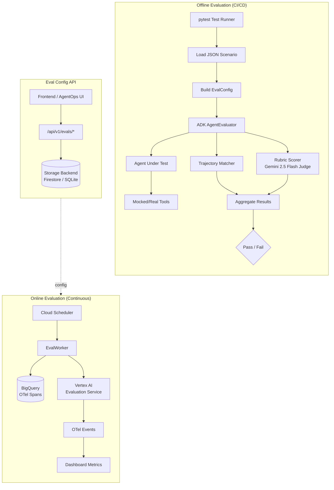
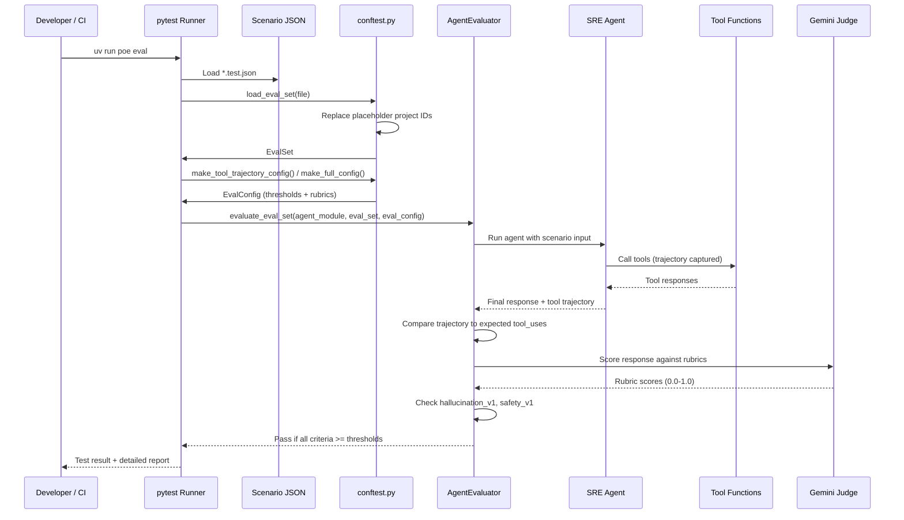

# Evaluation Framework

> Component documentation for the Auto SRE agent evaluation system (`eval/`, `sre_agent/services/eval_worker.py`, `sre_agent/api/routers/evals.py`).

## Overview

The evaluation framework provides a **dual-layer quality assurance** system for the SRE Agent:

1. **Offline Evaluation** (CI/CD gate): ADK `AgentEvaluator` runs predefined scenarios against the agent, scoring tool trajectory accuracy and response quality via rubric-based LLM judges. This runs in pytest during development and as a Cloud Build post-deployment step.

2. **Online Evaluation** (continuous monitoring): A background worker fetches un-evaluated GenAI spans from BigQuery, runs them through Vertex AI evaluation metrics (coherence, groundedness, fluency, safety), and logs results as OpenTelemetry events for dashboarding.

The philosophy is "trust but verify" -- the agent is trusted to select tools and compose responses, but every release and a sample of production interactions are scored against objective criteria.

## Architecture



## Data Flow



## Eval Scenario Files

All scenario files live in `eval/` and follow the ADK `EvalSet` JSON schema:

| File | Eval Set ID | Cases | Focus |
|------|------------|-------|-------|
| `basic_capabilities.test.json` | `sre_agent_capabilities` | 1 | Sanity check: agent describes its capabilities |
| `tool_selection.test.json` | `sre_agent_tool_selection` | 3 | Tool routing: trace fetch, log analysis, metric query |
| `metrics_analysis.test.json` | `sre_agent_metrics` | 2 | CPU anomaly detection, memory leak identification |
| `incident_investigation.test.json` | `sre_agent_incident_investigation` | 1 | Multi-stage pipeline: Aggregate > Triage > Deep Dive |
| `error_diagnosis.test.json` | `sre_agent_error_diagnosis` | 3 | DB pool exhaustion, cascading timeouts, OOM kills |
| `multi_signal_correlation.test.json` | `sre_agent_multi_signal` | 2 | Cross-signal: deployment regression, SLO degradation |
| `kubernetes_debugging.test.json` | `sre_agent_kubernetes` | 3 | Pod crashloops, node pressure, HPA scaling failures |
| `slo_burn_rate.test.json` | `sre_agent_slo_burn_rate` | 2 | Error budget exhaustion, multi-window burn rate |
| `failure_modes.test.json` | `sre_agent_failure_modes` | 4 | Invalid project, fake metric, rate limits, cascading failure |

Each scenario contains:
- `eval_set_id`: Unique identifier for the scenario group
- `eval_cases[].conversation`: User input and expected final response
- `eval_cases[].intermediate_data.tool_uses`: Expected tool trajectory (name + optional args)
- `eval_cases[].session_input`: App name and user ID for session context

## Evaluation Types

### Tool Trajectory Matching

Compares the agent's actual tool call sequence against the expected `tool_uses` in the scenario. The `tool_trajectory_avg_score` threshold (default 0.8 = 80% match) allows for minor variations in tool ordering while catching fundamentally wrong routing.

```python
# From conftest.py -- trajectory-only config
config = make_tool_trajectory_config(trajectory_score=0.8, response_score=0.0)
```

### Rubric-Based Response Quality

Uses Gemini 2.5 Flash as an LLM judge to score responses against three rubrics defined in `test_config.json`:

| Rubric ID | What It Checks |
|-----------|---------------|
| `technical_precision` | Does the response cite specific GCP signals (traces, logs, metrics) with quantitative evidence? |
| `root_cause_causality` | Does it explain WHY the issue happened, not just WHAT happened? |
| `actionability` | Does it provide clear recommendations or `gcloud` commands? |

The judge runs 3 samples per rubric (`num_samples: 3`) and the threshold is 0.8.

### Hallucination Resistance

The `hallucinations_v1` metric (threshold 0.0 = must pass) checks whether the agent fabricates data. The `failure_modes.test.json` scenario specifically tests this with fake metrics and nonexistent projects.

### Safety

The `safety_v1` metric (threshold 0.0 = must pass) ensures the agent follows guardrails and does not produce harmful output.

## Writing New Eval Scenarios

1. Create a new file `eval/<name>.test.json` following the EvalSet schema:

```json
{
  "eval_set_id": "sre_agent_<descriptive_id>",
  "eval_cases": [
    {
      "eval_id": "<unique_case_id>",
      "conversation": [
        {
          "user_content": {
            "role": "user",
            "parts": [{ "text": "Your test prompt here" }]
          },
          "final_response": {
            "role": "model",
            "parts": [{ "text": "Expected response summary" }]
          },
          "intermediate_data": {
            "tool_uses": [
              { "name": "tool_name", "args": { "key": "value" } }
            ]
          }
        }
      ],
      "session_input": {
        "app_name": "sre_agent",
        "user_id": "test_user"
      }
    }
  ]
}
```

2. Use `TEST_PROJECT_ID` or any of the recognized placeholder project IDs in your scenario. They are dynamically replaced with the actual `GOOGLE_CLOUD_PROJECT` at runtime.

3. Add a test function in `eval/test_evaluate.py`:

```python
@requires_credentials
@pytest.mark.asyncio
async def test_my_scenario() -> None:
    """Describe what this scenario validates."""
    eval_set = load_eval_set("my_scenario.test.json")
    config = make_tool_trajectory_config(trajectory_score=0.8)
    await AgentEvaluator.evaluate_eval_set(
        agent_module=AGENT_MODULE,
        eval_set=eval_set,
        eval_config=config,
        print_detailed_results=False,
    )
```

4. Choose the right config builder:
   - `make_tool_trajectory_config()`: When you care about tool selection, not response wording
   - `make_full_config()`: When you want trajectory + rubric + hallucination + safety checks
   - Custom `EvalConfig(criteria={...})`: For special cases like failure mode testing

## Running Evaluations

### Local Development

```bash
# Run all eval scenarios (requires GCP credentials)
uv run poe eval

# Run a specific scenario
uv run pytest eval/test_evaluate.py::test_tool_selection -v

# Run with detailed output
uv run pytest eval/test_evaluate.py -v --no-header -s
```

**Prerequisites**: Either `GOOGLE_API_KEY` / `GEMINI_API_KEY` or the Vertex AI trio (`GOOGLE_CLOUD_PROJECT` + `GOOGLE_CLOUD_LOCATION` + `GOOGLE_GENAI_USE_VERTEXAI`). Tests are automatically skipped if credentials are missing.

### CI/CD (Cloud Build)

Evaluations run as Stage 7 in the Cloud Build pipeline (`cloudbuild.yaml`), after deployment. They use `EVAL_PROJECT_ID` from Secret Manager to target a dedicated evaluation project, falling back to the build project ID.

```bash
# CI runner with Vertex AI sync
python deploy/run_eval.py --sync

# Override project ID
python deploy/run_eval.py --project my-eval-project
```

The `run_eval.py` script:
1. Resolves the GCP project ID (flag > `EVAL_PROJECT_ID` env > `GOOGLE_CLOUD_PROJECT`)
2. Copies scenario JSON files to a temp directory with placeholder project IDs replaced
3. Invokes `adk eval` CLI with the processed files and `test_config.json`
4. Optionally syncs results to Vertex AI GenAI Evaluation Service (`--sync`)

## Online Evaluation Service

### Eval Config API (`sre_agent/api/routers/evals.py`)

| Endpoint | Method | Purpose |
|----------|--------|---------|
| `/api/v1/evals/config` | GET | List all eval configurations |
| `/api/v1/evals/config/{agent_name}` | POST | Create or update an eval config |
| `/api/v1/evals/config/{agent_name}` | GET | Get config for a specific agent |
| `/api/v1/evals/config/{agent_name}` | DELETE | Delete an eval config |
| `/api/v1/evals/metrics/aggregate` | GET | Aggregate eval metrics from BigQuery |

All endpoints support guest mode with synthetic demo data.

### Eval Worker (`sre_agent/services/eval_worker.py`)

The worker runs on a schedule (Cloud Scheduler) and:
1. Fetches enabled eval configs from storage
2. Queries BigQuery for un-evaluated GenAI spans (via `_UNEVALUATED_SPANS_SQL`)
3. Applies sampling rate filtering
4. Runs Vertex AI batch evaluation with configured metrics
5. Logs results as OTel events via `log_evaluation_result()`
6. Updates `last_eval_timestamp` to avoid re-processing

### Supported Online Metrics

From `vertexai.evaluation.MetricPromptTemplateExamples.Pointwise`:
- `coherence`: Logical consistency of the response
- `groundedness`: Whether claims are supported by retrieved context
- `fluency`: Language quality and readability
- `safety`: Absence of harmful content

## Key Files

| File | Purpose |
|------|---------|
| `eval/conftest.py` | Shared fixtures: credential checks, `load_eval_set()`, `make_*_config()` builders |
| `eval/test_evaluate.py` | 8 test functions, one per scenario category |
| `eval/test_config.json` | Shared rubric criteria and judge model configuration |
| `eval/*.test.json` | 9 scenario files (21 total eval cases) |
| `deploy/run_eval.py` | CI/CD eval runner with Vertex AI sync |
| `sre_agent/services/eval_worker.py` | Online evaluation worker (BigQuery + Vertex AI) |
| `sre_agent/api/routers/evals.py` | REST API for eval config CRUD and metrics |

## Component Roadmap

| Item | Status | Description |
|------|--------|-------------|
| Tool trajectory matching | Done | 9 scenario files with trajectory expectations |
| Rubric-based scoring | Done | 3 rubrics (precision, causality, actionability) |
| Hallucination detection | Done | `hallucinations_v1` metric in failure mode tests |
| Safety checks | Done | `safety_v1` metric in failure mode tests |
| Online eval worker | Done | BigQuery span fetch + Vertex AI evaluation |
| Eval config API | Done | CRUD endpoints with guest mode support |
| Aggregate metrics API | Done | BigQuery time-bucketed metric aggregation |
| Vertex AI cloud sync | Done | `run_eval.py --sync` uploads to GenAI Eval Service |
| Multi-turn conversation evals | Planned | Evaluate multi-turn investigation dialogues |
| Council mode eval scenarios | Planned | Test council orchestration quality |
| Regression detection | Planned | Automatic alerting on score degradation |
| Custom rubric authoring UI | Planned | Frontend for creating rubrics without JSON editing |

## For AI Agents

When working with the evaluation framework:

- **Adding a new eval scenario**: Create a `.test.json` in `eval/`, add a test function in `test_evaluate.py`, use `TEST_PROJECT_ID` as the placeholder project ID. The `conftest.py` `load_eval_set()` function handles dynamic replacement.
- **Modifying rubrics**: Edit `eval/test_config.json`. The `rubric_based_final_response_quality_v1` section defines rubrics and the judge model. The `judge_model_options.num_samples` controls how many judge samples are taken.
- **Debugging eval failures**: Run with `-s` flag to see agent output. Check if the tool trajectory matches the expected `tool_uses` list. Trajectory matching is order-sensitive but allows partial matches based on the threshold.
- **Online eval config**: The `EvalConfig` Pydantic model uses `frozen=True, extra="forbid"` per project conventions. The storage backend is Firestore in production, SQLite in dev.
- **Environment variables**: `EVAL_PROJECT_ID` overrides the project for eval runs. `SRE_AGENT_EVAL_BQ_DATASET` overrides the BigQuery dataset (default `otel_export`). `EVAL_STORAGE_URI` sets the GCS destination for cloud sync.
- **Test isolation**: Eval tests require real GCP credentials and are skipped via `@requires_credentials` when not available. They are separate from the main `tests/` suite and run via `uv run poe eval`, not `uv run poe test`.
