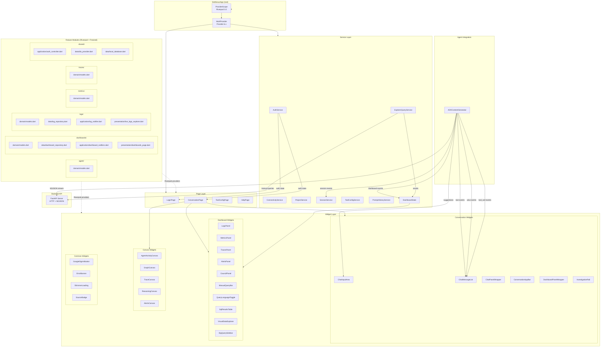
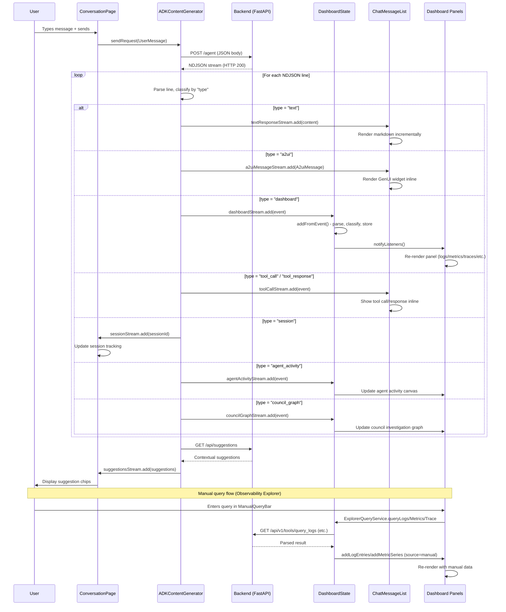

# Flutter Frontend (`autosre/`)

> Material 3 web application with a "Deep Space Command Center" aesthetic for AI-powered SRE incident investigation.

## Overview

The AutoSRE Flutter frontend is a single-page web application that serves as the primary user interface for interacting with the SRE Agent. It provides a conversational AI interface augmented with real-time observability dashboards, interactive visualizations, and a GenUI/A2UI protocol for rendering structured tool outputs directly in the chat stream.

The application connects to the Python FastAPI backend over HTTP, receiving responses as NDJSON (newline-delimited JSON) streams. These streams carry both conversational text and structured data events that populate live dashboard panels for logs, metrics, traces, alerts, and council synthesis results.

**Key capabilities:**
- Conversational AI chat with streaming GenUI widget rendering
- Observability Explorer with manual query capability (MQL, PromQL, SQL)
- Live dashboard panels for logs, metrics, traces, alerts, council decisions, and analytics
- End-User Credentials (EUC) with encrypted Google OAuth token propagation
- Session management with history, rename, and delete
- Agent Graph visualization (BigQuery Property Graph) via embedded AgentOps UI
- Tool configuration management
- Contextual follow-up suggestions

## Architecture Diagram



## Data Flow Diagram



## Feature-First Architecture

The frontend follows a **feature-first** directory structure where each domain capability is encapsulated in its own module under `lib/features/`. Each feature module follows a four-layer pattern:

| Layer | Purpose | Example |
|-------|---------|---------|
| **domain/** | Freezed immutable models, value objects | `LogEntry`, `MetricSeries`, `DashboardConfig` |
| **data/** | Repository classes, API calls, data transformation | `LogRepository`, `DashboardRepository` |
| **application/** | Riverpod notifiers, business logic, state management | `LogNotifier`, `DashboardNotifiers` |
| **presentation/** | Widgets, pages, UI-specific code | `LiveLogsExplorer`, `DashboardsPage` |

Current feature modules:

- **`agent/`** -- Domain models for agent-related data (Freezed)
- **`dashboards/`** -- Custom dashboards CRUD with full 4-layer stack and Riverpod AsyncNotifiers
- **`logs/`** -- Log explorer with PlutoGrid, background isolate parsing, and live streaming
- **`metrics/`** -- Metrics domain models (Freezed) for chart visualization
- **`traces/`** -- Trace domain models (Freezed) for waterfall visualization
- **`shared/`** -- Cross-cutting concerns: Dio HTTP provider, Drift local database, auth controller

## State Management

The application uses a **dual state management** approach:

### Provider (Legacy/Service Layer)
The `app.dart` root widget wraps the app in a `MultiProvider` that supplies global services:

```dart
MultiProvider(
  providers: [
    ChangeNotifierProvider(create: (_) => AuthService()..init()),
    ChangeNotifierProvider(create: (_) => ConnectivityService()),
    ChangeNotifierProvider(create: (_) => DashboardState()),
    Provider(create: (_) => ProjectService()),
    Provider(create: (_) => SessionService()),
    ProxyProvider<DashboardState, ExplorerQueryService>(...),
  ],
  child: MaterialApp(...),
)
```

These services use `ChangeNotifier` for reactive UI updates. The `DashboardState` class is the central hub for all observability data, managing up to 200 items with LRU eviction and batch notification support.

### Riverpod 3.0 (Feature Layer)
Feature modules use Riverpod for state management with code-generated providers (`.g.dart` files) and Freezed immutable models (`.freezed.dart` files). The `main.dart` entry point wraps the app in a `ProviderScope`:

```dart
runApp(const ProviderScope(child: SreNexusApp()));
```

This dual approach allows incremental migration from Provider to Riverpod without a big-bang rewrite.

## GenUI / A2UI Protocol

The frontend implements the **Agent-to-UI (A2UI)** protocol via the `genui` package. This enables the backend to send structured widget specifications that the frontend renders inline within the chat stream.

The `ADKContentGenerator` class (`lib/agent/adk_content_generator.dart`) implements the `ContentGenerator` interface and manages:

- **NDJSON stream parsing** -- Each line is decoded and dispatched based on its `type` field
- **Stream multiplexing** -- 11 dedicated broadcast `StreamController` instances route events to the appropriate consumers (text, a2ui, dashboard, tool calls, session, suggestions, trace info, memory, agent activity, council graph)
- **Connection health** -- Periodic health checks every 10 seconds to `/health`
- **Retry logic** -- Up to 2 retries with exponential backoff on failures
- **Cancellation** -- HTTP client-level cancellation support
- **Large JSON handling** -- Payloads over 50KB are decoded in a background isolate via `compute()`

Custom widget types rendered via GenUI:
- `x-sre-trace-waterfall` -- Distributed trace visualization
- `x-sre-log-entries-viewer` -- Log entry table
- `x-sre-log-pattern-viewer` -- Log pattern clusters
- `x-sre-metric-chart` -- Time-series metric chart
- `x-sre-metrics-dashboard` -- Multi-metric dashboard
- `x-sre-incident-timeline` -- Alert/incident timeline
- `x-sre-council-synthesis` -- Council of Experts result card
- `x-sre-vega-chart` -- Vega-Lite chart

## Observability Explorer

The Observability Explorer is a dual-stream dashboard that displays both agent-collected data and user-initiated manual queries. It is managed by `DashboardState` and powered by `ExplorerQueryService`.

**Dashboard Data Types:**
| Type | Description | Source |
|------|-------------|--------|
| `logs` | Log entries and patterns | Agent + Manual (Cloud Logging) |
| `metrics` | Time-series metric data | Agent + Manual (MQL/PromQL) |
| `traces` | Distributed traces with waterfall | Agent + Manual (Cloud Trace) |
| `alerts` | Incident timelines | Agent + Manual (Alert policies) |
| `council` | Council synthesis results | Agent only |
| `analytics` | Vega-Lite charts, SQL results | Agent + Manual (BigQuery) |
| `agentGraph` | Agent topology graph | Agent only |

**Manual Query Capabilities:**
- **Logs:** Cloud Logging filter syntax with pagination (append/prepend)
- **Metrics:** MQL (ListTimeSeries) or PromQL with language toggle
- **Traces:** Trace ID lookup or filter-based search
- **Alerts:** Alert policy filter
- **BigQuery:** Raw SQL with dataset/table/schema browsing via sidebar

The `ExplorerQueryService` runs heavy JSON parsing in background isolates (`compute()`) to prevent UI thread blocking.

## Theme System

The application uses a custom Material 3 "Deep Space" dark theme defined in `lib/theme/app_theme.dart`.

**Color Palette (`AppColors`):**
| Token | Hex | Usage |
|-------|-----|-------|
| `primaryTeal` | `#6366F1` | Primary accent (Indigo) |
| `primaryCyan` | `#06B6D4` | Signal highlights (Cyan) |
| `primaryBlue` | `#3B82F6` | Secondary accent (Blue) |
| `secondaryPurple` | `#A855F7` | Tertiary accent (Purple) |
| `backgroundDark` | `#0F172A` | Scaffold background (Slate 900) |
| `backgroundCard` | `#1E293B` | Card surfaces (Slate 800) |
| `backgroundElevated` | `#334155` | Elevated surfaces (Slate 700) |
| `success` | `#00E676` | Success indicators |
| `warning` | `#FFAB00` | Warning indicators |
| `error` | `#FF5252` | Error indicators |

**Glass-Morphism System:**
The `GlassDecoration` class provides pre-built `BoxDecoration` factories for consistent frosted-glass styling:
- `card()` -- Standard glass card with configurable opacity and border radius
- `elevated()` -- Elevated surface with optional glow effect
- `input()` -- Rounded input field decoration
- `userMessage()` / `aiMessage()` -- Chat bubble decorations with gradient tints
- `statusBadge()` -- Color-coded status indicators

**Typography:** Outfit (body text) and JetBrains Mono (code blocks) via Google Fonts.

**Animated Background:** `AnimatedGradientBackground` provides a subtle radial gradient animation with a 10-second cycle.

## Testing Approach

Flutter tests live in `autosre/test/` and use a Provider-based dependency injection strategy.

### Test Helper (`test_helper.dart`)
The `wrapWithProviders()` function creates a fully mocked widget tree:

```dart
Widget wrapWithProviders(
  Widget child, {
  AuthService? auth,
  ProjectService? project,
  SessionService? session,
  DashboardState? dashboard,
  ExplorerQueryService? explorer,
  // ... other services
})
```

This wraps the widget under test in a `MultiProvider` with mock implementations of all services. Mock classes include:
- `MockAuthService` -- Configurable authentication state
- `MockProjectService` -- Project selection stub
- `MockSessionService` -- Session CRUD stub
- `MockExplorerQueryService` -- Query execution stub
- `MockADKContentGenerator` -- Stream emission helpers for testing chat flow
- `MockConnectivityService` -- Connection status stub

### Singleton Mocking
The `setupMockSingletons()` function sets static `.mockInstance` fields on service classes, enabling non-widget code to access mocked services during tests. `clearMockSingletons()` resets them in `tearDown`.

### Test Coverage
- **129+ Flutter tests** covering features, models, services, widgets, and pages
- Tests mirror the source directory structure (e.g., `lib/features/logs/` -> `test/features/logs/`)
- Widget tests use `pumpWidget()` with `wrapWithProviders()` for full dependency injection

### Running Tests
```bash
cd autosre && flutter test          # Run all Flutter tests
cd autosre && flutter test --coverage # With coverage report
uv run poe test-all                  # Backend + Flutter tests together
```

## Directory Structure

```
autosre/lib/
+-- main.dart                          # App entry: ProviderScope + runZonedGuarded
+-- app.dart                           # SreNexusApp: MultiProvider + AuthWrapper
+-- catalog.dart                       # Widget catalog
+-- agent/
|   +-- adk_content_generator.dart     # NDJSON stream processor, 11 broadcast channels
+-- features/
|   +-- agent/domain/models.dart       # Agent Freezed models
|   +-- dashboards/                    # Full 4-layer: domain/data/application/presentation
|   +-- logs/                          # Full 4-layer with PlutoGrid + isolate parsing
|   +-- metrics/domain/models.dart     # Metrics Freezed models
|   +-- traces/domain/models.dart      # Trace Freezed models
|   +-- shared/                        # Dio, Drift, auth controller
+-- pages/
|   +-- login_page.dart                # Google Sign-In / Guest mode
|   +-- conversation_page.dart         # Main chat UI + dashboard layout
|   +-- conversation_controller.dart   # Chat state machine
|   +-- tool_config_page.dart          # Tool enable/disable management
|   +-- help_page.dart                 # Help cards
+-- services/
|   +-- auth_service.dart              # Google OAuth, EUC token management
|   +-- connectivity_service.dart      # Backend health monitoring
|   +-- dashboard_state.dart           # Central observability data hub (200-item LRU)
|   +-- explorer_query_service.dart    # Manual query execution (isolate parsing)
|   +-- project_service.dart           # GCP project selection
|   +-- session_service.dart           # Session CRUD
|   +-- tool_config_service.dart       # Tool configuration
|   +-- prompt_history_service.dart    # Prompt history (up/down arrow)
|   +-- version_service.dart           # Build version display
+-- widgets/
|   +-- auth/                          # Google sign-in button (platform-adaptive)
|   +-- common/                        # Error banner, shimmer, source badge
|   +-- canvas/                        # Agent activity, graph, trace, reasoning, alerts
|   +-- conversation/                  # Chat input, message list, app bar, panels
|   +-- dashboard/                     # Live panels, query bar, SQL table, BigQuery sidebar
|   +-- dashboard/cards/               # Council decision card
|   +-- help/                          # Help cards
+-- models/
|   +-- adk_schema.dart                # ADK data models (Trace, LogEntry, MetricSeries, etc.)
|   +-- time_range.dart                # TimeRange and TimeRangePreset
+-- theme/
|   +-- app_theme.dart                 # Material 3 Deep Space theme, GlassDecoration
+-- utils/
    +-- ansi_parser.dart               # ANSI escape code parser for terminal output
```

## Component Roadmap

| Component | Status | Description |
|-----------|--------|-------------|
| Conversation UI (Chat + GenUI) | Stable | Core chat with streaming A2UI widgets |
| Observability Explorer | Stable | Manual queries for logs, metrics, traces, alerts, BigQuery |
| Dashboard State Engine | Stable | 200-item LRU, batch notifications, dual-source tracking |
| Agent Graph (Embedded) | Stable | BQ Property Graph via embedded AgentOps UI |
| Custom Dashboards CRUD | Active | Save/load dashboard configurations (Riverpod) |
| Live Logs Explorer | Active | PlutoGrid-based log viewer with streaming |
| Council Activity Canvas | Stable | Real-time council investigation visualization |
| EUC Token Propagation | Stable | Google OAuth with encrypted header forwarding |
| Riverpod Migration | In Progress | Incremental migration from Provider to Riverpod 3.0 |
| Offline Support | Planned | Drift local database for offline caching |
| Accessibility (a11y) | Planned | WCAG 2.1 AA compliance |

## For AI Agents

When working on the Flutter frontend, keep these patterns in mind:

1. **State management duality** -- Global services use `ChangeNotifier` + Provider; feature modules use Riverpod + Freezed. Do not mix patterns within a single feature module.

2. **NDJSON event types** -- The `ADKContentGenerator` handles 11 event types (`text`, `error`, `a2ui`, `ui`, `dashboard`, `tool_call`, `tool_response`, `session`, `agent_activity`, `council_graph`, `trace_info`, `memory`). When adding a new event type, add a new `StreamController`, expose it as a getter, close it in `dispose()`, and handle it in the `listen()` callback.

3. **Dashboard data flow** -- All observability data flows through `DashboardState.addFromEvent()` for agent data or through `ExplorerQueryService` for manual queries. Both paths converge in `DashboardState` which notifies dashboard panel widgets.

4. **Background isolate parsing** -- Heavy JSON parsing (logs, metrics, traces) uses `compute()` in `ExplorerQueryService` to avoid UI jank. Top-level functions are required for isolate compatibility.

5. **Testing** -- Always use `wrapWithProviders()` from `test_helper.dart`. Mock services expose `noSuchMethod` for unimplemented methods. Call `setupMockSingletons()` for code that accesses service singletons directly.

6. **Theme** -- Use `AppColors` constants and `GlassDecoration` factories. Do not hardcode colors. The color scheme is Slate-based (900/800/700) with Indigo/Cyan/Blue accents.

7. **GenUI widgets** -- Custom widget types are prefixed with `x-sre-`. The widget type string in the dashboard event must match exactly in the `classifyComponent()` switch in `dashboard_state.dart`.

8. **File naming** -- Dart files use `snake_case.dart`. Generated files end in `.freezed.dart` or `.g.dart` and should never be edited manually. Run `dart run build_runner build` after modifying Freezed/Riverpod annotated files.

9. **Lint and test commands:**
   ```bash
   cd autosre && flutter analyze         # Dart linter
   cd autosre && flutter test            # Run tests
   uv run poe lint-all                   # Full lint (backend + frontend)
   uv run poe test-all                   # Full test (backend + frontend)
   ```

10. **Service singletons** -- Services like `AuthService`, `ProjectService`, etc. expose a static `mockInstance` field for testing. In production the singleton is created normally; in tests it is replaced via `setupMockSingletons()`.
