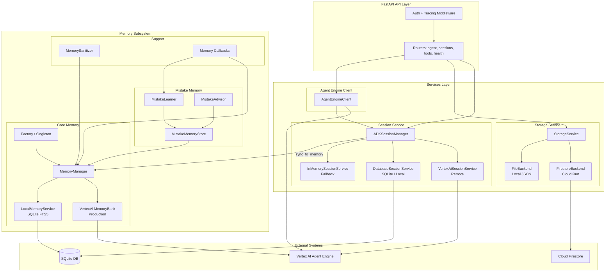
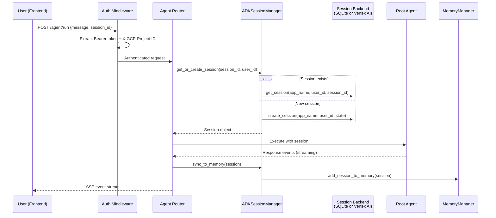
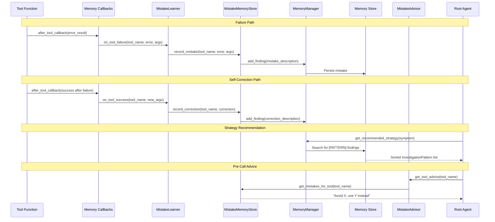

# Services and Memory Subsystem

> **Source**: `sre_agent/services/` and `sre_agent/memory/` | **Dual-mode**: Local (SQLite) and Managed (Vertex AI)

The Services layer provides session management, user preference storage, and remote
agent connectivity. The Memory subsystem enables the agent to persist investigation
findings, learn from past investigations, and self-improve by recording and replaying
mistake patterns.

---

## Architecture Overview

| Concern | Component | Responsibility |
|---------|-----------|----------------|
| **Session State** | `ADKSessionManager` | CRUD on conversation sessions, event append, state updates |
| **User Preferences** | `StorageService` | Selected project, tool config, recent/saved queries |
| **Agent Connectivity** | `AgentEngineClient` | Streaming queries to Vertex AI Agent Engine with EUC |
| **Investigation Memory** | `MemoryManager` | Persist findings, learn patterns, recommend strategies |
| **Mistake Memory** | `MistakeMemoryStore` + `MistakeLearner` + `MistakeAdvisor` | Self-improving loop |
| **Evaluation** | `eval_worker.py` | Scheduled evaluation of agent interaction spans |

All services use singleton factories with lazy initialization and environment-based
backend selection.

---

## Architecture Diagram



---

## Session and Memory Lifecycle

### Session Request Flow



### Memory Learning Flow



---

## Dual-Mode Execution

Determined by the `SRE_AGENT_ID` environment variable:

| Aspect | Local Mode | Remote (Managed) Mode |
|--------|-----------|----------------------|
| **Trigger** | `SRE_AGENT_ID` not set | `SRE_AGENT_ID` set |
| **Agent execution** | In-process within FastAPI | Forwarded to Vertex AI Agent Engine |
| **Session backend** | `DatabaseSessionService` (SQLite) | `VertexAiSessionService` |
| **Memory backend** | `LocalMemoryService` (SQLite FTS5) | `VertexAiMemoryBankService` |
| **Preferences** | `FilePreferencesBackend` (JSON) | `FirestorePreferencesBackend` |
| **EUC flow** | `ContextVar` set by middleware | Session state `_user_access_token` |

Mode selection happens automatically in each service constructor:

- `ADKSessionManager._create_session_service()` checks `SRE_AGENT_ID` / `RUNNING_IN_AGENT_ENGINE`
- `StorageService._create_backend()` checks `K_SERVICE` / `USE_FIRESTORE`
- `MemoryManager._check_init_memory_service()` checks `SRE_AGENT_ID`

---

## Session Management

**File**: `sre_agent/services/session.py`

The `ADKSessionManager` wraps ADK's `SessionService` with SRE Agent convenience methods.

| Method | Description |
|--------|-------------|
| `create_session(user_id, initial_state)` | Creates session with timestamp |
| `get_session(session_id, user_id)` | Retrieves by ID |
| `list_sessions(user_id)` | Lists all, sorted by `updated_at` descending |
| `delete_session(session_id, user_id)` | Deletes a session |
| `append_event(session, event)` | Appends with safety checks for missing storage |
| `update_session_state(session, state_delta)` | Event-based state update (not direct mutation) |
| `sync_to_memory(session)` | Syncs to long-term Memory Bank |
| `get_or_create_session(...)` | Idempotent get-or-create |

**Singleton**: `from sre_agent.services.session import get_session_service`

**Stale session pitfall**: After `await` in async generators, session objects become
stale. Always re-fetch from the database after yield/await points.

---

## Storage Service

**File**: `sre_agent/services/storage.py`

Manages user preferences with auto backend selection (Firestore on Cloud Run, JSON
locally). Both backends implement `PreferencesBackend` (`get`, `set`, `delete`).

| Preference | Method | Description |
|-----------|--------|-------------|
| Selected project | `get/set_selected_project()` | Current GCP project |
| Tool config | `get/set_tool_config()` | Enabled/disabled tools |
| Recent projects | `get/set_recent_projects()` | MRU project list |
| Starred projects | `get/set_starred_projects()` | Pinned projects |
| Recent queries | `add_recent_query()` | FIFO queue (max 1000), deduplicated |
| Saved queries | `add/update/delete_saved_query()` | User-curated library |

---

## Agent Engine Client

**File**: `sre_agent/services/agent_engine_client.py`

Connects FastAPI proxy to a deployed Vertex AI Agent Engine instance.

Streaming strategy (in order): `async_stream_query` > `stream_query` > `query` (sync
in threadpool). Error responses (invalid JSON, permission denied) are converted to
structured error events.

Before each query, the client updates session state with the encrypted OAuth token
and project ID for EUC propagation.

---

## Memory Subsystem

**File**: `sre_agent/memory/manager.py`

The `MemoryManager` enables long-term learning:

### Memory Types

| Type | Prefix | Description |
|------|--------|-------------|
| **Finding** | (none) | Raw investigation finding from a tool |
| **State Change** | (none) | Investigation phase transition |
| **Investigation Pattern** | `[PATTERN]` | Symptom-to-resolution mapping with tool sequence |
| **Tool Error Pattern** | `[TOOL_ERROR_PATTERN]` | Common failures and correct inputs |

### Pattern Learning

When an investigation succeeds, `learn_from_investigation()` captures symptom type,
root cause category, tool sequence, and resolution. Patterns are stored in both
user-scoped and system-shared (`system_shared_patterns`) memory, enabling cross-user
learning.

### Strategy Recommendation

`get_recommended_strategy(symptom)` searches local cache and persistent memory:

```python
patterns = await memory_manager.get_recommended_strategy("High latency on payment-service")
# Returns: [InvestigationPattern(symptom_type="high_latency", tool_sequence=[...], ...)]
```

**Singleton**: `from sre_agent.memory.factory import get_memory_manager`

---

## Mistake Learning System

A three-component self-improvement loop:

**MistakeMemoryStore** (`memory/mistake_store.py`): Persistent store with fingerprint-
based deduplication. Categories: `syntax_error`, `invalid_filter`, `wrong_resource`,
`permission_denied`, `not_found`, `timeout`, `rate_limit`, `other`. Corrections link
to original mistakes when the agent self-corrects.

**MistakeLearner** (`memory/mistake_learner.py`): Event-driven failure detector.
`on_tool_failure()` records mistakes, `on_tool_success()` detects self-corrections
by comparing against a recent failure buffer, `on_tool_exception()` handles exceptions.

**MistakeAdvisor** (`memory/mistake_advisor.py`): Query interface. `get_tool_advice()`
returns per-tool warnings, `get_prompt_lessons()` injects top lessons into system
prompt, `get_mistake_summary()` provides aggregate statistics.

**Cross-session bootstrap**: `MistakeMemoryStore.load_from_memory_bank()` pre-populates
the in-memory cache at session start from persisted memory.

---

## Memory Sanitization

**File**: `sre_agent/memory/sanitizer.py`

`MemorySanitizer.sanitize_global_record(content, user_id, project_id)` strips user
emails, project IDs, tokens, and session identifiers before writing to the
`system_shared_patterns` scope, preventing cross-user information leakage.

---

## Component Roadmap

| Item | Status | Priority | Description |
|------|--------|----------|-------------|
| Session compression | Planned | High | Compact old events to reduce session size |
| Memory search ranking | Planned | Medium | Improve relevance scoring for patterns |
| Cross-project memory | Planned | Medium | Share sanitized patterns across projects |
| Memory TTL / eviction | Planned | Medium | Expire old findings after configurable period |
| Multi-user isolation audit | Planned | High | Formal audit of memory isolation boundaries |
| Mistake analytics | Planned | Low | Dashboard for most common tool mistakes |
| Memory Bank migration | Planned | Low | Migrate from SQLite to Vertex AI Memory Bank |
| Real-time memory sync | Planned | Medium | Push-based updates across sessions |

---

## For AI Agents

### Key Files to Read First

- `sre_agent/services/session.py` -- `ADKSessionManager` and session backends
- `sre_agent/services/storage.py` -- `StorageService` with Firestore/file backends
- `sre_agent/services/agent_engine_client.py` -- Remote Agent Engine client
- `sre_agent/memory/manager.py` -- `MemoryManager` with pattern learning
- `sre_agent/memory/factory.py` -- Singleton factory
- `sre_agent/memory/mistake_store.py` -- Mistake deduplication and persistence
- `sre_agent/memory/mistake_learner.py` -- Failure detection and self-correction
- `sre_agent/memory/mistake_advisor.py` -- Pre-call advice generation
- `sre_agent/memory/callbacks.py` -- Memory event callbacks (before/after tool)
- `sre_agent/memory/sanitizer.py` -- Cross-user sanitization
- `sre_agent/memory/local.py` -- Local SQLite memory with FTS5

### Common Mistakes

1. **Stale session closure**: After `await` in async generators, re-fetch from DB.
2. **Missing `user_id` in memory ops**: Omitting causes findings stored as `anonymous`.
3. **Direct `session.state` mutation**: Use `update_session_state()` (event-based).
4. **Forgetting `sync_to_memory`**: Call at end of request for persistence.
5. **Memory sanitization bypass**: Always use `MemorySanitizer.sanitize_global_record()`
   before writing to `system_shared_patterns`.
6. **Hardcoded backend**: Use singleton factories that auto-detect.
7. **Blocking in async context**: Wrap sync SDK calls in `asyncio.to_thread()`.

### Quick Lookup

| Question | Answer |
|----------|--------|
| Session manager singleton? | `from sre_agent.services.session import get_session_service` |
| Storage singleton? | `from sre_agent.services.storage import get_storage_service` |
| Memory manager singleton? | `from sre_agent.memory.factory import get_memory_manager` |
| Mistake store singleton? | `from sre_agent.memory.mistake_store import get_mistake_store` |
| Mistake advisor singleton? | `from sre_agent.memory.mistake_advisor import get_mistake_advisor` |
| Local mode trigger? | `SRE_AGENT_ID` not set |
| Session DB location? | `.sre_agent_sessions.db` (SQLite) |
| Firestore trigger? | `K_SERVICE` or `USE_FIRESTORE` env vars |
| Shared memory scope? | `user_id="system_shared_patterns"` |
| Token encryption? | `from sre_agent.auth import encrypt_token` |
| Session tests? | `tests/server/`, `tests/integration/` |
| Memory tests? | `tests/unit/sre_agent/memory/` |
