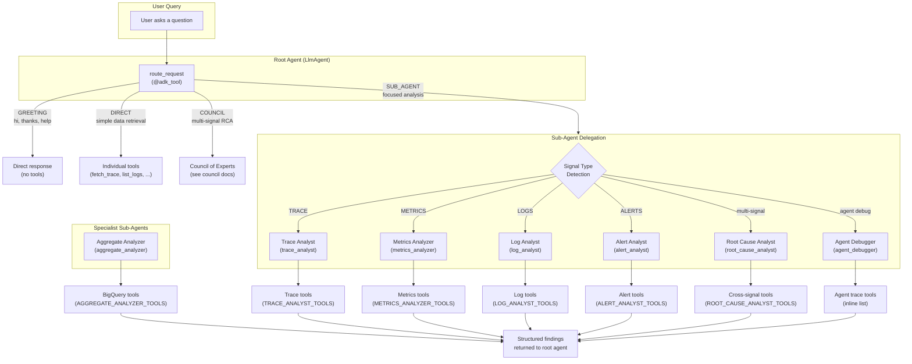
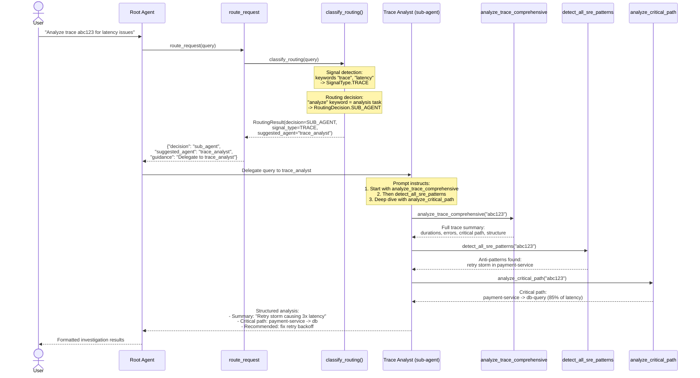

# Sub-Agents

> **Source**: [`sre_agent/sub_agents/`](../../../sre_agent/sub_agents/)
> **Router**: [`sre_agent/core/router.py`](../../../sre_agent/core/router.py)
> **Status**: Production-ready (6 sub-agents, all with shared tool registry)

## Overview

Sub-agents are specialist `LlmAgent` instances that handle focused, single-domain
analysis tasks. They sit in the middle tier of the 3-tier request router, between
lightweight DIRECT tool calls and heavyweight COUNCIL investigations.

Each sub-agent has:
- A **domain-specific prompt** with XML-structured role, tool strategy, workflow,
  and output format sections.
- A **curated tool set** imported from `council/tool_registry.py` (the single
  source of truth for all domain tool assignments -- OPT-4).
- A **model assignment**: either `get_model_name("fast")` (Gemini Flash) for
  latency-sensitive tasks or `get_model_name("deep")` (Gemini Pro) for complex
  synthesis.

Sub-agents are registered in `sre_agent/sub_agents/__init__.py` and added to
the root agent's `sub_agents` list in `sre_agent/agent.py`. The 3-tier router
(`core/router.py`) determines when to delegate to a sub-agent by classifying
the user's query.

## Architecture Diagram

## Data Flow Diagram -- Trace Analysis

## The 3-Tier Router

The `route_request` tool in `sre_agent/core/router.py` classifies every incoming
query before the root agent takes action. It calls `classify_routing()` from
`council/intent_classifier.py` which applies rules in priority order:

| Priority | Check                    | Routing Decision   | Example                         |
|----------|--------------------------|--------------------|---------------------------------|
| 0        | Greeting/conversational  | `GREETING`         | "hi", "thanks", "help"          |
| 1        | Council keywords         | `COUNCIL`          | "root cause", "incident review" |
| 2        | Analysis keywords        | `SUB_AGENT`        | "analyze", "detect", "compare"  |
| 3        | Direct retrieval patterns| `DIRECT`           | "show me traces", "list logs"   |
| 4        | Default                  | `SUB_AGENT`        | Anything else (safe default)    |

The `RoutingResult` includes:
- **`decision`**: Which tier handles the query (GREETING, DIRECT, SUB_AGENT, COUNCIL).
- **`signal_type`**: Detected signal type (TRACE, METRICS, LOGS, ALERTS).
- **`suggested_agent`**: For SUB_AGENT tier, which sub-agent to delegate to.
- **`suggested_tools`**: For DIRECT tier, which tools to call.
- **`investigation_mode`**: For COUNCIL tier, which mode (FAST, STANDARD, DEBATE).

## Sub-Agent Details

### Trace Analyst (`trace_analyst`)

**Module**: `sre_agent/sub_agents/trace.py`
**Model**: `get_model_name("fast")` (Gemini Flash)
**Tool set**: `TRACE_ANALYST_TOOLS` (21 tools)

**Purpose**: Comprehensive trace analysis for latency, errors, structure, and
resiliency patterns. The primary sub-agent for distributed tracing.

**Prompt strategy**:
- Instructs the agent to start with `analyze_trace_comprehensive` -- a
  mega-tool that returns validation, durations, errors, critical path, and
  structure in one call.
- Comparison workflow: identify baseline (good) and target (bad) traces, run
  comprehensive analysis with `baseline_trace_id` set.
- Resiliency checks: `detect_all_sre_patterns` for retry storms, cascading
  timeouts, pool exhaustion.
- Output: Summary, critical path, errors, structural changes, anti-patterns.

**Key tools**:
- `analyze_trace_comprehensive` -- one-shot full trace analysis
- `compare_span_timings` -- baseline vs target comparison
- `analyze_critical_path` -- bottleneck identification
- `detect_all_sre_patterns` -- retry storm, cascading timeout, pool exhaustion
- `detect_retry_storm`, `detect_cascading_timeout`, `detect_connection_pool_issues`
- `find_bottleneck_services` -- service-level bottleneck analysis
- `correlate_logs_with_trace` -- cross-signal correlation
- `correlate_metrics_with_traces_via_exemplars` -- metric-to-trace linking

### Aggregate Analyzer (`aggregate_analyzer`)

**Module**: `sre_agent/sub_agents/trace.py`
**Model**: `get_model_name("deep")` (Gemini Pro)
**Tool set**: `AGGREGATE_ANALYZER_TOOLS` (16 tools)

**Purpose**: Fleet-wide BigQuery analysis to identify patterns before examining
individual traces. Operates at the aggregate level using SQL queries against
`_AllSpans` tables.

**Prompt strategy**:
- Discovery-first: run `discover_telemetry_sources` to find tables.
- BigQuery analysis: `analyze_aggregate_metrics` generates SQL,
  `gcp_execute_sql` runs it.
- Selection: `find_exemplar_traces` to pick worst offenders automatically.
- Workflow: Discover tables -> Aggregate ("Which service?") -> Trend ("When?")
  -> Zoom In (specific trace IDs).
- Output: Fleet status summary, culprit service, proof with tables.

**Key tools**:
- `gcp_execute_sql` -- run generated SQL queries
- `analyze_aggregate_metrics` -- generate fleet-wide metric SQL
- `find_exemplar_traces` -- automatic worst-case trace selection
- `discover_telemetry_sources` -- find BigQuery dataset tables
- `build_service_dependency_graph` -- service topology
- `detect_trend_changes` -- temporal trend analysis

### Metrics Analyzer (`metrics_analyzer`)

**Module**: `sre_agent/sub_agents/metrics.py`
**Model**: `get_model_name("fast")` (Gemini Flash)
**Tool set**: `METRICS_ANALYZER_TOOLS` (13 tools)

**Purpose**: Time-series analysis with PromQL, anomaly detection, and
exemplar-based trace correlation. Quantifies the magnitude and timing of
metric anomalies.

**Prompt strategy**:
- Includes a built-in knowledge base of common GCP metrics
  (`COMMON_GCP_METRICS` from `resources/gcp_metrics.py`).
- PromQL rules: metric name mapping (Cloud Monitoring to PromQL), resource
  filtering, distribution handling.
- Workflow: Quantify spike (PromQL) -> Link to traces (exemplars) -> Compare
  baselines -> Detect anomalies.
- Three-tier tool strategy: PromQL (primary), Raw Fetch (secondary), MCP
  (fallback).
- Output: Tables with metrics/thresholds/comparisons, PromQL in code blocks.

**Key tools**:
- `query_promql` -- primary PromQL queries
- `list_time_series` -- Cloud Monitoring raw fetch
- `detect_metric_anomalies` -- Z-score anomaly detection
- `compare_metric_windows` -- historical baseline comparison
- `calculate_series_stats` -- statistical analysis
- `correlate_metrics_with_traces_via_exemplars` -- metric-to-trace linking
- `mcp_query_range`, `mcp_list_timeseries` -- MCP fallback

### Log Analyst (`log_analyst`)

**Module**: `sre_agent/sub_agents/logs.py`
**Model**: `get_model_name("fast")` (Gemini Flash)
**Tool set**: `LOG_ANALYST_TOOLS` (12 tools)

**Purpose**: Log pattern mining and anomaly detection. Uses Drain3 clustering
and BigQuery analysis to identify patterns at scale rather than reading logs
one by one.

**Prompt strategy**:
- Discovery-first: confirm table names (`_AllLogs`).
- Pattern mining: `analyze_bigquery_log_patterns` clusters logs into signatures.
- Drain3: `extract_log_patterns` for service-specific template extraction.
- Comparison: `compare_time_periods` to identify new vs existing patterns.
- Remediation: after identifying clear error patterns, call
  `generate_remediation_suggestions`.
- Includes Cloud Logging query language syntax reference.
- Output: Tables for pattern statistics, narrate the causal story.

**Key tools**:
- `analyze_bigquery_log_patterns` -- BigQuery log clustering at scale
- `extract_log_patterns` -- Drain3 template extraction
- `list_log_entries` -- targeted log retrieval
- `compare_time_periods` -- temporal comparison
- `generate_remediation_suggestions` -- remediation for identified patterns
- `gcp_execute_sql` -- direct BigQuery fallback

### Alert Analyst (`alert_analyst`)

**Module**: `sre_agent/sub_agents/alerts.py`
**Model**: `get_model_name("fast")` (Gemini Flash)
**Tool set**: `ALERT_ANALYST_TOOLS` (12 tools)

**Purpose**: Rapid incident triage -- determines if "the house is on fire"
(Critical vs Info), contextualizes which policy triggered the alert, and
routes to the appropriate specialist.

**Prompt strategy**:
- Check active alerts immediately as the priority signal.
- Contextualize with alert policies for policy details.
- Severity classification: P1 (page) or P4 (ticket).
- Handoff: recommend which specialist sub-agent investigates deeper.
- Remediation: for well-known issues (OOM, Disk Full), call
  `generate_remediation_suggestions` immediately.
- Output: Active alert details, triggering policy, recommendation.

**Key tools**:
- `list_alerts` -- get all active/recent alerts
- `list_alert_policies` -- alerting configuration
- `get_alert` -- detailed alert inspection
- `generate_remediation_suggestions` -- immediate remediation
- `estimate_remediation_risk` -- risk assessment
- `get_gcloud_commands` -- actionable gcloud commands

### Root Cause Analyst (`root_cause_analyst`)

**Module**: `sre_agent/sub_agents/root_cause.py`
**Model**: `get_model_name("deep")` (Gemini Pro)
**Tool set**: `ROOT_CAUSE_ANALYST_TOOLS` (21 tools)

**Purpose**: Multi-signal synthesis for root cause analysis. Answers three
questions: WHAT happened, WHO/WHAT changed, and HOW BAD is the impact. This
is the most capable sub-agent, with the broadest tool set including research
and GitHub self-healing tools.

**Prompt strategy**:
- Causality: `perform_causal_analysis` to identify the responsible span/service.
- Cross-signal: `build_cross_signal_timeline` to confirm with other signals.
- Change detection: `detect_trend_changes` for timing, log search for deploys.
- Blast radius: `analyze_upstream_downstream_impact` for downstream effects.
- Remediation: `generate_remediation_suggestions` + `get_gcloud_commands`.
- Research: `search_google` + `fetch_web_page` for unfamiliar errors.
- GitHub: `github_search_code`, `github_create_pull_request` for self-healing.
- Output: Root cause, evidence, impact, recommended actions.

**Key tools**:
- `perform_causal_analysis` -- root cause identification
- `build_cross_signal_timeline` -- multi-signal correlation
- `analyze_upstream_downstream_impact` -- blast radius assessment
- `correlate_logs_with_trace`, `correlate_trace_with_metrics` -- cross-signal
- `detect_trend_changes` -- change timing
- `github_search_code`, `github_create_pull_request` -- self-healing

### Agent Debugger (`agent_debugger`)

**Module**: `sre_agent/sub_agents/agent_debugger.py`
**Model**: `get_model_name("fast")` (Gemini Flash)
**Tool set**: Inline list (12 tools)

**Purpose**: Debugs AI agent behavior by analyzing Cloud Trace telemetry with
GenAI semantic conventions from Vertex Agent Engine. Finds anti-patterns like
excessive retries, token waste, and reasoning loops.

**Prompt strategy**:
- Domain knowledge: OTel GenAI semantic conventions
  (`gen_ai.operation.name`, `gen_ai.agent.name`, etc.).
- Span classification: `invoke_agent` = agent invocation,
  `execute_tool` = tool call, `generate_content` = LLM call.
- Anti-pattern detection: excessive retries (>3x), token waste (output >5x
  input), long reasoning chains (>8 LLM calls without tool use).
- Output: Assessment (healthy/degraded/problematic), interaction flow, token
  analysis, issues found, recommendations.

**Key tools**:
- `list_agent_traces` -- find recent agent runs
- `reconstruct_agent_interaction` -- full span tree for a trace
- `analyze_agent_token_usage` -- cost and efficiency analysis
- `detect_agent_anti_patterns` -- optimization opportunities

## Sub-Agents vs Council Panels

Sub-agents and council panels serve different architectural roles, even though
they analyze similar domains:

| Aspect            | Sub-Agents                           | Council Panels                      |
|-------------------|--------------------------------------|-------------------------------------|
| **Invocation**    | Delegated by root agent via router   | Dispatched by CouncilOrchestrator   |
| **Execution**     | Run sequentially (one at a time)     | Run in parallel (5 concurrently)    |
| **Output**        | Free-form text to root agent         | Structured `PanelFinding` JSON      |
| **Tool sets**     | Superset of panel tools (broader)    | Focused subset (tighter)            |
| **Model choice**  | Mixed (fast or deep per agent)       | All panels use "fast"               |
| **Cross-signal**  | Root cause analyst does this         | Critic + Synthesizer handle this    |
| **Prompt style**  | Full ReAct instructions included     | ReAct instructions omitted (OPT-3)  |
| **State output**  | No structured state keys             | Write to `output_key` in session    |
| **Progressive UI**| No completion callbacks              | `after_agent_callback` for progress |

**Tool set relationship**: Sub-agent tool sets are supersets of their
corresponding panel tool sets. For example, `TRACE_ANALYST_TOOLS` includes
everything in `TRACE_PANEL_TOOLS` plus cross-signal correlation tools like
`correlate_metrics_with_traces_via_exemplars` and `query_promql`. Both are
defined in `council/tool_registry.py`.

## Model Assignment Summary

| Sub-Agent            | Model   | Rationale                                         |
|----------------------|---------|---------------------------------------------------|
| `trace_analyst`      | fast    | Individual trace analysis is well-scoped           |
| `aggregate_analyzer` | deep    | Fleet-wide SQL generation needs stronger reasoning |
| `metrics_analyzer`   | fast    | PromQL queries and stats are formulaic             |
| `log_analyst`        | fast    | Pattern extraction is well-structured              |
| `alert_analyst`      | fast    | Triage is classification, not deep reasoning       |
| `root_cause_analyst` | deep    | Multi-signal synthesis requires complex reasoning  |
| `agent_debugger`     | fast    | Span analysis is structured                        |

## Component Roadmap

| Component                        | Status         | Notes                                          |
|----------------------------------|----------------|------------------------------------------------|
| Trace Analyst                    | Completed      | Comprehensive one-shot + comparison workflows  |
| Aggregate Analyzer               | Completed      | Fleet-wide BigQuery analysis                   |
| Metrics Analyzer                 | Completed      | PromQL + exemplar correlation                  |
| Log Analyst                      | Completed      | Drain3 + BigQuery pattern mining               |
| Alert Analyst                    | Completed      | Rapid triage with remediation                  |
| Root Cause Analyst               | Completed      | Multi-signal RCA + GitHub self-healing         |
| Agent Debugger                   | Completed      | GenAI trace analysis                           |
| Tool Registry (OPT-4)           | Completed      | Single source of truth for all tool sets       |
| Research sub-agent               | Completed      | Online research via search + fetch             |
| 3-tier router                    | Completed      | GREETING/DIRECT/SUB_AGENT/COUNCIL routing      |
| SLO Analyst sub-agent            | Future         | Dedicated SLO burn-rate and error-budget agent |
| Infrastructure sub-agent         | Future         | GKE, Cloud Run, GCE resource troubleshooting   |
| Cost Analysis sub-agent          | Future         | Cloud billing and cost anomaly detection       |
| Sub-agent chaining               | Future         | Let sub-agents delegate to each other          |
| Sub-agent output schemas         | Future         | Structured output like council panels          |

## File Reference

| File                | Purpose                                                   |
|---------------------|-----------------------------------------------------------|
| `trace.py`          | Trace Analyst + Aggregate Analyzer definitions            |
| `logs.py`           | Log Analyst definition                                    |
| `metrics.py`        | Metrics Analyzer definition + aliases                     |
| `alerts.py`         | Alert Analyst definition                                  |
| `root_cause.py`     | Root Cause Analyst definition                             |
| `agent_debugger.py` | Agent Debugger definition                                 |
| `research.py`       | Research agent tool factory                               |
| `_init_env.py`      | Shared environment initialization for sub-agents          |
| `__init__.py`       | Exports all sub-agents in `__all__`                       |

## For AI Agents

When modifying sub-agents, follow these rules:

1. **Tool sets come from `council/tool_registry.py`.** Never define tool lists
   inline in sub-agent files (except `agent_debugger.py` which uses specialized
   tools not shared with panels). Import from the registry and convert to list:
   `tools=list(TRACE_ANALYST_TOOLS)`.

2. **Every sub-agent must call `init_sub_agent_env()`** at module level. This
   initializes environment variables shared across all sub-agents. Import from
   `._init_env`.

3. **Prompt structure follows XML tags**: `<role>`, `<objective>`,
   `<tool_strategy>`, `<workflow>`, `<output_format>`. All prompts include
   `STRICT_ENGLISH_INSTRUCTION` and `PROJECT_CONTEXT_INSTRUCTION` from
   `sre_agent/prompt.py`. Sub-agent prompts (but not panel prompts) include
   `REACT_PATTERN_INSTRUCTION`.

4. **Registration checklist** (all 4 points required):
   - Export in `sre_agent/sub_agents/__init__.py` (`__all__`)
   - Add to `sub_agents` list in `sre_agent/agent.py`
   - Tool set in `council/tool_registry.py` (if tools are shared with panels)
   - Test in `tests/unit/sre_agent/sub_agents/`

5. **Signal-to-agent mapping**: The router maps `SignalType` to sub-agent names
   via `_SIGNAL_TO_AGENT` in `intent_classifier.py`. If you add a new sub-agent
   for a new signal domain, add the mapping there.

6. **Model choice matters for cost**: `"fast"` (Gemini Flash) costs ~10x less
   than `"deep"` (Gemini Pro). Only use "deep" when the task genuinely requires
   complex multi-step reasoning (e.g., root cause analysis, SQL generation).

7. **Sub-agents can be used both standalone and as council panel backing.**
   The tool registry ensures alignment. If you add a tool to a sub-agent's
   registry entry, check whether the corresponding panel should also get it.

8. **Tests are in `tests/unit/sre_agent/sub_agents/`** and mock all LLM and
   GCP API calls. Run `uv run poe test` to validate changes.
