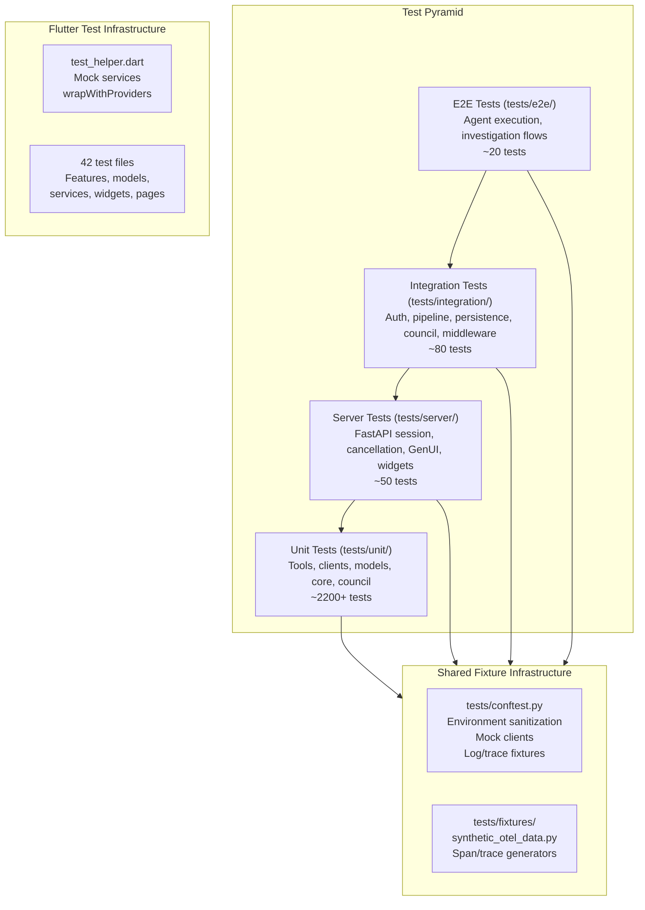
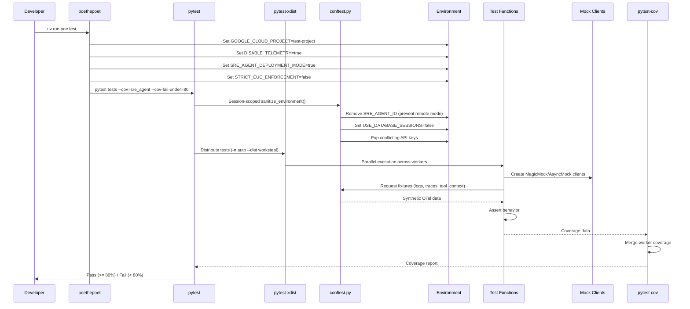

# Testing Infrastructure

> Component documentation for the Auto SRE test suite (`tests/`, `autosre/test/`, `agent_ops_ui/src/__tests__/`).

## Overview

The testing infrastructure enforces quality through a **four-level pyramid** with an 80% minimum coverage gate on all backend code. Tests run in parallel by default via `pytest-xdist` with work-stealing distribution, and all external service calls are mocked to ensure hermetic, fast execution.

**Current stats**: 2429+ backend tests across 239 test files, 129+ Flutter tests across 42 test files. Backend tests complete in under 90 seconds on CI with parallel execution.

The testing philosophy is:
1. **Never call real GCP APIs in tests** -- all Cloud Trace, Logging, Monitoring, and BigQuery calls are mocked
2. **Mirror source paths** -- `sre_agent/tools/clients/trace.py` maps to `tests/unit/sre_agent/tools/clients/test_trace.py`
3. **Test the contract, not the implementation** -- validate inputs/outputs and error handling, not internal method calls
4. **Async-first** -- all tool and service tests use `@pytest.mark.asyncio` since production code is async

## Architecture



## Test Execution Data Flow



## Test Levels

### Unit Tests (`tests/unit/`)

The largest category, mirroring the `sre_agent/` package structure. Each source module has a corresponding test file.

| Subdirectory | Tests | What They Cover |
|-------------|-------|-----------------|
| `unit/sre_agent/tools/` | ~800 | Tool functions: input validation, output format, error handling |
| `unit/sre_agent/tools/clients/` | ~200 | GCP client wrappers: API call construction, response parsing |
| `unit/sre_agent/tools/analysis/` | ~400 | Analysis modules: trace patterns, log clustering, anomaly detection |
| `unit/sre_agent/core/` | ~300 | Runner, router, circuit breaker, policy engine, callbacks |
| `unit/sre_agent/council/` | ~200 | Orchestrator, panels, synthesizer, critic, classifier |
| `unit/sre_agent/` | ~150 | Schema validation, auth, prompt, model config |
| `unit/deploy/` | ~50 | Deployment script logic (mocked GCP calls) |

**Example naming convention**:
```
test_fetch_trace_not_found_returns_error
test_<function>_<condition>_<expected>
```

### Integration Tests (`tests/integration/`)

Test cross-module interactions with mocked external services:

- **Auth integration**: Token validation, EUC credential propagation, middleware chain
- **Pipeline integration**: 3-stage investigation pipeline (Aggregate > Triage > Deep Dive)
- **Persistence integration**: Session CRUD, storage backend switching
- **Council integration**: Panel orchestration, synthesizer merge, debate loop
- **Middleware integration**: Request/response middleware chain, CORS, tracing

### Server Tests (`tests/server/`)

Test the FastAPI application layer:

- **Session management**: Create, list, delete sessions via HTTP
- **Request cancellation**: Graceful handling of aborted SSE streams
- **GenUI rendering**: Dashboard event emission, widget schema generation
- **Tool streaming**: SSE event format, dashboard data channel

### End-to-End Tests (`tests/e2e/`)

Test full agent execution paths with mocked GCP backends:

- **Agent execution**: Root agent processes queries and returns structured responses
- **Investigation flows**: Multi-turn investigation with tool calls
- **Analysis pipelines**: Trace analysis, log pattern detection, metric anomalies

### API Tests (`tests/api/`)

Test specific API endpoint behavior:

- **Help endpoints**: Help content retrieval and formatting

## Fixture System

### `tests/conftest.py` -- Root Fixtures

The root conftest provides session-scoped environment sanitization and commonly used fixtures:

**Session-scoped** (runs once per test session):
- `sanitize_environment()`: Removes `SRE_AGENT_ID` (prevents remote mode), sets `USE_DATABASE_SESSIONS=false`, removes conflicting API keys when Vertex AI is enabled

**Function-scoped fixtures**:

| Fixture | Type | Purpose |
|---------|------|---------|
| `sample_text_payload_logs` | `list[dict]` | 5 log entries with `textPayload` (INFO, ERROR, WARNING) |
| `sample_json_payload_logs` | `list[dict]` | 4 log entries with `jsonPayload` (various field names) |
| `sample_proto_payload_logs` | `list[dict]` | 1 audit log with `protoPayload` |
| `baseline_period_logs` | `list[dict]` | 23 logs from a healthy period (20 INFO + 3 WARNING) |
| `incident_period_logs` | `list[dict]` | 43 logs from an incident (errors, timeouts, retries) |
| `mixed_payload_logs` | `list[dict]` | 7 logs mixing all payload types |
| `sample_trace_spans` | `list[dict]` | 2-span trace (root HTTP + child DB query) |
| `mock_logging_client` | `MagicMock` | Mock Cloud Logging client |
| `mock_trace_client` | `MagicMock` | Mock Cloud Trace client |
| `mock_bigquery_client` | `MagicMock` | Mock BigQuery client |
| `mock_tool_context` | `MagicMock` | Mock ADK ToolContext |

### `tests/fixtures/synthetic_otel_data.py` -- Data Generators

Provides factory functions and dataclasses for generating realistic OTel data:

- `generate_trace_id()`: Random 128-bit trace ID (hex)
- `generate_span_id()`: Random 64-bit span ID (hex)
- `generate_timestamp()`: ISO format timestamp with offset support
- `SpanEventGenerator`: Factory for exception events, log events with realistic stacktraces
- Span builders with configurable attributes, status codes, and parent/child relationships

## Mock Patterns

### Mocking GCP Clients

All GCP client calls are mocked via `unittest.mock.patch` and `MagicMock`/`AsyncMock`:

```python
from unittest.mock import AsyncMock, MagicMock, patch

@pytest.mark.asyncio
async def test_fetch_trace_success():
    mock_client = AsyncMock()
    mock_client.get_trace.return_value = {"traceId": "abc123", "spans": [...]}

    with patch(
        "sre_agent.tools.clients.factory.get_trace_client",
        return_value=mock_client,
    ):
        result = await fetch_trace(trace_id="abc123", project_id="test-project")

    assert '"status": "success"' in result
    mock_client.get_trace.assert_called_once()
```

### Mocking Tool Context and LLM Calls

The ADK `ToolContext` is mocked via `MagicMock()` with `state` dict and `get_auth_response` stub. For LLM calls (council, summarizer), patch `sre_agent.model_config.get_model_name` and `google.genai.Client` to return `MagicMock(text="...")` responses.

## Flutter Testing

### Test Infrastructure (`autosre/test/`)

Flutter tests use the standard `flutter_test` package with `provider` for dependency injection.

**`test_helper.dart`** provides:
- `MockAuthService`: Configurable authentication state
- `MockProjectService`: Returns test project data
- `MockSessionService`: In-memory session management
- `MockToolConfigService`: Tool configuration stubs
- `MockConnectivityService`: Network state simulation
- `MockDashboardState`: Dashboard panel state
- `wrapWithProviders()`: Wraps a widget with all required `Provider` instances for hermetic testing

### Test Categories

| Directory | Tests | What They Cover |
|-----------|-------|-----------------|
| `test/features/logs/` | 2 | Log notifier state, log repository queries |
| `test/models/` | 6 | ADK schema parsing, model equality, copyWith, type safety |
| `test/services/` | 3 | API client, dashboard state, connectivity service |
| `test/widgets/` | 7 | Time picker, data explorer, trace waterfall, SQL table, log facets |
| `test/pages/` | 1 | Help page rendering |
| `test/` (root) | 23 | Conversation page, auth, prompt input, dashboard layout, etc. |

### Running Flutter Tests

```bash
# All Flutter tests
uv run poe test-flutter
# Equivalent to:
cd autosre && flutter test

# Specific test file
cd autosre && flutter test test/widgets/trace_waterfall_test.dart

# With coverage
cd autosre && flutter test --coverage
```

## Running Tests

### Backend Commands

| Command | Purpose |
|---------|---------|
| `uv run poe test` | Full suite with 80% coverage gate (parallel) |
| `uv run poe test-fast` | No coverage, minimal output (fastest iteration) |
| `uv run poe test-all` | Backend + Flutter + React |
| `uv run pytest tests/unit/.../test_trace.py -v` | Specific test file |
| `uv run pytest tests/...::test_name -v` | Specific test function |
| `uv run pytest tests/ -v -s` | With stdout visible |
| `uv run pytest tests/ -n 0 -v` | Sequential (debug parallel issues) |

### Test Environment Variables

Set automatically by `uv run poe test`:

| Variable | Value | Purpose |
|----------|-------|---------|
| `GOOGLE_CLOUD_PROJECT` | `test-project` | Fake project ID for mocked calls |
| `STRICT_EUC_ENFORCEMENT` | `false` | Allow ADC fallback in tests |
| `DISABLE_TELEMETRY` | `true` | Suppress OTel exports |
| `GOOGLE_GENAI_USE_VERTEXAI` | `false` | Use AI Studio path (no project needed) |
| `SRE_AGENT_DEPLOYMENT_MODE` | `true` | Suppress agent init side-effects |

### pytest Configuration (`pyproject.toml`)

```toml
[tool.pytest.ini_options]
pythonpath = "."
addopts = "--import-mode=importlib -n auto --dist worksteal"
asyncio_default_fixture_loop_scope = "function"
```

- `--import-mode=importlib`: Modern import mode for package discovery
- `-n auto`: Auto-detect CPU count for parallel workers
- `--dist worksteal`: Work-stealing distribution for optimal load balancing
- `asyncio_default_fixture_loop_scope = "function"`: Each async test gets a fresh event loop

## Coverage

The 80% coverage gate is enforced via `--cov-fail-under=80` in the `test` task. Coverage is measured on the `sre_agent` package only (not tests, eval, deploy, or frontend code).

```bash
# View detailed coverage report
uv run pytest tests --cov=sre_agent --cov-report=html
# Open htmlcov/index.html

# Check coverage for a specific module
uv run pytest tests/unit/sre_agent/core/ --cov=sre_agent.core --cov-report=term-missing
```

New code should target **100% coverage** on tools and core logic. The 80% gate is a floor, not a target.

## Key Files

| File | Purpose |
|------|---------|
| `tests/conftest.py` | Root fixtures: env sanitization, mock clients, log/trace data |
| `tests/fixtures/synthetic_otel_data.py` | OTel data generators (spans, events, timestamps) |
| `tests/unit/` | Unit tests mirroring `sre_agent/` structure (~2200 tests) |
| `tests/integration/` | Cross-module integration tests (~80 tests) |
| `tests/e2e/` | Full agent execution tests (~20 tests) |
| `tests/server/` | FastAPI server tests (~50 tests) |
| `tests/api/` | API endpoint tests |
| `autosre/test/test_helper.dart` | Flutter mock services and `wrapWithProviders` helper |
| `autosre/test/` | Flutter test files (42 files, 129+ tests) |
| `pyproject.toml` | pytest config, test task definitions, coverage settings |

## Component Roadmap

| Item | Status | Description |
|------|--------|-------------|
| Unit test coverage (80%+) | Done | 2429+ tests with coverage gate |
| Parallel execution | Done | pytest-xdist with work-stealing |
| Synthetic OTel data generators | Done | Realistic trace/span/log factories |
| Flutter test infrastructure | Done | Mock services, provider wrappers |
| Integration test suite | Done | Auth, pipeline, council, middleware |
| E2E agent execution tests | Done | Full investigation flow testing |
| Server endpoint tests | Done | Session, cancellation, GenUI |
| React AgentOps UI tests | Done | Vitest + React Testing Library |
| Snapshot testing (Flutter) | Planned | Golden file tests for widget rendering |
| Load/stress testing | Planned | Agent throughput under concurrent requests |
| Contract testing | Planned | API schema validation between frontend/backend |
| Mutation testing | Planned | Verify test quality via code mutation |
| Visual regression testing | Planned | Screenshot comparison for UI changes |

## For AI Agents

When working with the test infrastructure:

- **Adding a new test**: Mirror the source file path. `sre_agent/tools/analysis/trace/patterns.py` maps to `tests/unit/sre_agent/tools/analysis/trace/test_patterns.py`. Use `@pytest.mark.asyncio` for async functions.
- **Test naming**: Follow `test_<function>_<condition>_<expected>` convention. Example: `test_fetch_trace_empty_id_raises_validation_error`.
- **Mock external calls**: Never call real GCP APIs. Use `patch()` on the client factory functions (`get_trace_client`, `get_logging_client`, etc.) or on the specific client method. Use `AsyncMock` for async client methods.
- **Environment setup**: The `poe test` task sets all required env vars. If running pytest directly, ensure `GOOGLE_CLOUD_PROJECT=test-project`, `DISABLE_TELEMETRY=true`, and `SRE_AGENT_DEPLOYMENT_MODE=true` are set.
- **Fixture reuse**: Check `tests/conftest.py` before creating new fixtures. Log, trace, and mock client fixtures are already available. For complex OTel data, use `tests/fixtures/synthetic_otel_data.py`.
- **Parallel safety**: Tests must be independent. Do not share mutable state between tests. Use function-scoped fixtures (not session-scoped) for mutable data. The `USE_DATABASE_SESSIONS=false` env var ensures tests use in-memory sessions to avoid SQLite locking.
- **Coverage target**: New tools and core logic should aim for 100% coverage. The 80% gate is the minimum. Run `--cov-report=term-missing` to find uncovered lines.
- **Flutter tests**: Use `test_helper.dart`'s `wrapWithProviders()` to set up the widget tree with all required services. Mock services are pre-configured with sensible defaults.
- **Debugging test failures**: Run with `-n 0` to disable parallelism, `-s` to see stdout, and `-v` for verbose output. For async issues, check that all awaited calls are properly mocked with `AsyncMock`.
- **Pydantic model testing**: All models use `frozen=True, extra="forbid"`. Test that extra fields raise `ValidationError` and that models are immutable. This is a common source of bugs when schemas change.
