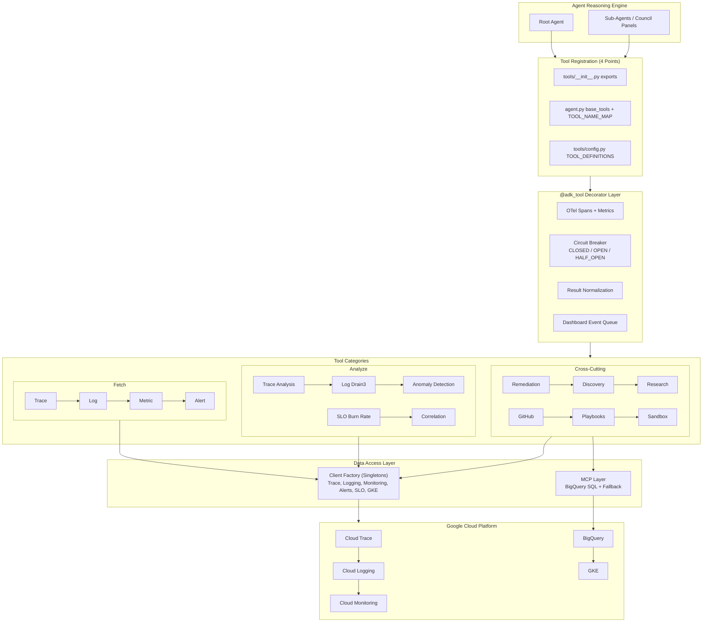
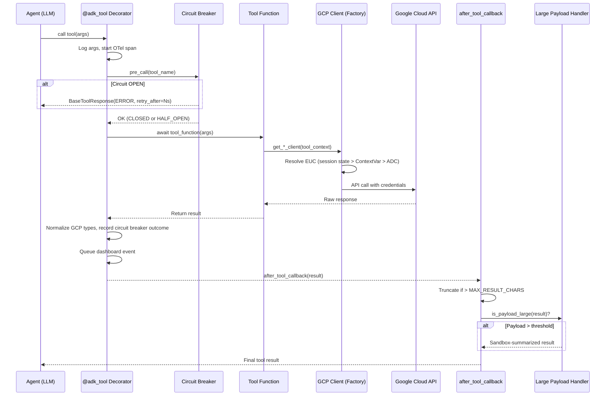

# Tools Ecosystem

> **Source**: `sre_agent/tools/` | **Tool count**: 118+ functions | **Registration points**: 4

The Tools Ecosystem is the primary interface through which the SRE Agent interacts with
Google Cloud Platform observability data. Every tool is wrapped with the `@adk_tool`
decorator, which provides telemetry, logging, error handling, circuit breaker
integration, and result normalization in a single consistent layer.

---

## Architecture Overview

The tools layer sits between the agent reasoning engine and the GCP APIs, organized
into three conceptual tiers:

| Tier | Purpose | Examples |
|------|---------|----------|
| **Fetch** | Retrieve raw observability data from GCP | `fetch_trace`, `list_log_entries`, `list_time_series` |
| **Analyze** | Process data locally using algorithms | `detect_metric_anomalies`, `extract_log_patterns` |
| **Correlate / Synthesize** | Cross-signal reasoning and reporting | `correlate_metrics_with_traces_via_exemplars`, `synthesize_report` |

All tools return structured JSON following the `BaseToolResponse` schema
(`status`, `result`, `error`, `metadata`) defined in `sre_agent/schema.py`.

Key subsystems: **Client Factory** (singleton GCP clients with EUC), **Circuit Breaker**
(three-state failure recovery), **Large Payload Handler** (auto-sandbox for oversized
results), **MCP Layer** (BigQuery SQL with Direct API fallback), **Sandbox** (isolated
code execution for large datasets).

---

## Architecture Diagram



---

## Tool Call Lifecycle



---

## The @adk_tool Decorator

**File**: `sre_agent/tools/common/decorators.py`

| Feature | Description |
|---------|-------------|
| **OTel Spans** | Automatic span creation for every tool invocation |
| **Structured Logging** | Logs args on entry, result/error on exit |
| **Circuit Breaker** | Pre-call check and post-call success/failure recording |
| **Result Normalization** | Converts GCP protobuf types (`MapComposite`, etc.) to native Python |
| **Dashboard Events** | Queues successful results for frontend dashboard streaming |
| **Skip Summarization** | `@adk_tool(skip_summarization=True)` prevents LLM summarization |

```python
from sre_agent.tools.common.decorators import adk_tool

@adk_tool
async def fetch_trace(trace_id: str, tool_context: ToolContext | None = None) -> str:
    """Fetch a distributed trace by ID."""
    client = get_trace_client(tool_context)
    # ... implementation ...
    return json.dumps({"status": "success", "result": {...}})
```

---

## Tool Categories

Defined in `sre_agent/tools/config.py` as the `ToolCategory` enum:

| Category | Enum Value | Directory | Example Tools |
|----------|-----------|-----------|---------------|
| **Discovery** | `discovery` | `tools/discovery/` | `discover_telemetry_sources`, `list_gcp_projects` |
| **Orchestration** | `orchestration` | `tools/investigation.py` | `route_request`, `update_investigation_state` |
| **Trace Fetch** | `trace_fetch` | `tools/clients/trace.py` | `fetch_trace`, `list_traces` |
| **Trace Analyze** | `trace_analyze` | `tools/analysis/trace/` | `analyze_critical_path`, `compare_span_timings` |
| **Log Fetch** | `log_fetch` | `tools/clients/logging.py` | `list_log_entries` |
| **Log Analyze** | `log_analyze` | `tools/analysis/logs/` | `extract_log_patterns` (Drain3) |
| **Metric Fetch** | `metric_fetch` | `tools/clients/monitoring.py` | `list_time_series`, `list_metric_descriptors` |
| **Metric Analyze** | `metric_analyze` | `tools/analysis/metrics/` | `detect_metric_anomalies` |
| **Alert** | `alert` | `tools/clients/alerts.py` | `list_alert_policies`, `list_alerts` |
| **SLO** | `slo` | `tools/analysis/slo/` | `analyze_multi_window_burn_rate` (1h/6h/24h/72h windows) |
| **GKE** | `gke` | `tools/clients/gke.py` | `get_gke_cluster_health`, `get_pod_restart_events` |
| **Remediation** | `remediation` | `tools/analysis/remediation/` | `generate_remediation_suggestions` |
| **Correlation** | `correlation` | `tools/analysis/correlation/` | `correlate_metrics_with_traces_via_exemplars` |
| **MCP** | `mcp` | `tools/mcp/` | BigQuery SQL, heavy PromQL aggregations |
| **Sandbox** | `sandbox` | `tools/sandbox/` | `process_data_in_sandbox` |
| **Research** | `research` | `tools/research.py` | `search_google`, `fetch_web_page` |
| **GitHub** | `github` | `tools/github/` | `github_read_file`, `github_create_pull_request` |
| **Memory** | `memory` | `tools/memory.py` | `add_finding_to_memory`, `search_memory` |

---

## Client Factory Pattern

**File**: `sre_agent/tools/clients/factory.py`

All GCP API clients are created through a singleton factory with EUC propagation.
Credential resolution order inside `_get_client`:

1. **Session state** (EUC via `tool_context`): Agent Engine path
2. **ContextVar** (EUC via middleware): Local execution path
3. **Application Default Credentials**: Fallback when `STRICT_EUC_ENFORCEMENT=false`
4. **PermissionError**: Raised when no credentials found and ADC disabled

| Factory Function | Client Class |
|----------|-------------|
| `get_trace_client()` | `TraceServiceClient` |
| `get_logging_client()` | `LoggingServiceV2Client` |
| `get_monitoring_client()` | `MetricServiceClient` |
| `get_alert_policy_client()` | `AlertPolicyServiceClient` |
| `get_error_reporting_client()` | `ErrorStatsServiceClient` |

Additional clients (GKE, App Hub, Asset Inventory, Dependency Graph) are created in
their respective modules under `tools/clients/`.

---

## MCP vs Direct API

| Criteria | Direct API | MCP (Model Context Protocol) |
|----------|-----------|------------------------------|
| **Use when** | Single fetch, real-time metrics, low-latency | BigQuery SQL, complex aggregations |
| **Latency** | Low (50-200ms) | Higher (500ms-5s) |
| **Data volume** | Small to medium | Large (thousands of rows) |
| **Client** | GCP client library (gRPC) | MCP server (BigQuery backend) |
| **Fallback** | N/A (primary) | Falls back to Direct API via `tools/mcp/fallback.py` |

The `with_fallback` function wraps MCP calls with automatic degradation on connection
refused, timeout, or protocol errors.

---

## Sandbox Execution

**Directory**: `sre_agent/tools/sandbox/`

| Mode | Class | When Used | Environment |
|------|-------|-----------|-------------|
| **Remote** | `SandboxExecutor` | `SRE_AGENT_ID` set | Vertex AI Code Interpreter |
| **Local** | `LocalCodeExecutor` | `SRE_AGENT_LOCAL_EXECUTION=true` | Subprocess with limits |

Data processors (`tools/sandbox/processors.py`): `summarize_metric_descriptors_in_sandbox`,
`summarize_time_series_in_sandbox`, `summarize_log_entries_in_sandbox`,
`summarize_traces_in_sandbox`, `execute_custom_analysis_in_sandbox`.

The **Large Payload Handler** (`core/large_payload_handler.py`) auto-detects oversized
results (>50 items or >100K chars, configurable via env vars) and routes them through
the sandbox with tool-specific summarization templates.

---

## Adding a New Tool

1. Create function in `sre_agent/tools/` (appropriate subdirectory)
2. Add `@adk_tool` decorator (use `skip_summarization=True` for structured data tools)
3. Write docstring (LLM uses this to decide when to call the tool)
4. Return `BaseToolResponse` JSON
5. Export in `sre_agent/tools/__init__.py` (`__all__`)
6. Register in `sre_agent/agent.py` (`base_tools` + `TOOL_NAME_MAP`)
7. Add `ToolConfig` in `sre_agent/tools/config.py` `TOOL_DEFINITIONS`
8. If used by panels: add to tool set in `sre_agent/council/tool_registry.py`
9. Write tests mirroring source path
10. Run `uv run poe lint && uv run poe test`

---

## Component Roadmap

| Item | Status | Priority | Description |
|------|--------|----------|-------------|
| Tool dependency graph | Planned | Medium | Auto-detect dependencies for parallel execution |
| Tool cost tracking | Planned | Medium | Per-tool token and API cost accounting |
| MCP connection pooling | Planned | High | Reuse MCP connections across tool calls |
| Sandbox warm pool | Planned | Medium | Pre-warm sandbox instances to reduce cold start |
| Tool permission scoping | Planned | High | Per-user tool access control based on IAM roles |
| Streaming tool results | Planned | Medium | Stream partial results from long-running tools |
| Tool result caching (L2) | Planned | Medium | Shared cross-session cache for expensive queries |
| Playbook auto-generation | Planned | Low | Generate playbooks from investigation patterns |

---

## For AI Agents

### Key Files to Read First

- `sre_agent/tools/common/decorators.py` -- `@adk_tool` decorator
- `sre_agent/tools/config.py` -- `ToolCategory` enum and `TOOL_DEFINITIONS`
- `sre_agent/tools/clients/factory.py` -- Client factory with EUC
- `sre_agent/agent.py` -- `base_tools`, `TOOL_NAME_MAP`, tool wiring
- `sre_agent/tools/__init__.py` -- `__all__` export list
- `sre_agent/council/tool_registry.py` -- Panel tool sets

### Common Mistakes

1. **Forgetting a registration point**: All 4 places required (`__init__.py`,
   `base_tools`, `TOOL_NAME_MAP`, `TOOL_DEFINITIONS`).
2. **Missing `tool_context` parameter**: Tools needing GCP credentials must accept
   `tool_context: ToolContext | None = None`.
3. **Returning raw Python objects**: Always return JSON strings or `BaseToolResponse`.
4. **Blocking the event loop**: All GCP calls must use `await`.
5. **Large results without sandbox**: Tools returning >50 items need
   `large_payload_handler.py` integration.
6. **Ignoring circuit breaker**: When OPEN, tools return `retry_after_seconds`. Do not
   retry immediately.
7. **Ignoring `STRICT_EUC_ENFORCEMENT`**: In production, ADC fallback is disabled.

### Quick Lookup

| Question | Answer |
|----------|--------|
| Where are tool functions? | `sre_agent/tools/` subdirectories |
| Where is the decorator? | `sre_agent/tools/common/decorators.py` |
| How to get a GCP client? | `from sre_agent.tools.clients.factory import get_*_client` |
| Where to register a new tool? | `__init__.py`, `agent.py` (x2), `config.py` |
| Where are tool tests? | `tests/unit/sre_agent/tools/` (mirrors source) |
| Circuit breaker env var? | `SRE_AGENT_CIRCUIT_BREAKER` (default: `true`) |
| How to skip summarization? | `@adk_tool(skip_summarization=True)` |
| Where are panel tool sets? | `sre_agent/council/tool_registry.py` |
| How does MCP fallback work? | `tools/mcp/fallback.py` `with_fallback()` |
