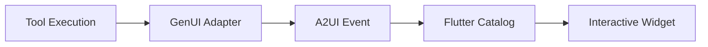

# 🎨 Rendering Telemetry with GenUI (A2UI)

This guide provides a comprehensive overview of how the SRE Agent renders rich, interactive telemetry (charts, traces, logs) within the chat interface using the **Generative UI (A2UI)** protocol.

## 🏗️ Architecture: From Agent to Pixel

The rendering pipeline consists of four distinct stages:



1.  **Tool Execution**: An agent tool (e.g., `fetch_trace`) fetches raw data from a GCP API.
2.  **GenUI Adapter**: The backend transforms this raw data into a strictly typed JSON schema expected by the frontend.
3.  **A2UI Event**: The transformed data is wrapped in an A2UI `surfaceUpdate` event and streamed to the client.
4.  **Flutter Catalog**: The frontend matches the `component.type` to a registered Dart widget and renders it.

---

## 🧩 Component Schemas

All GenUI components follow this base envelope structure:

```json
{
  "id": "unique-component-id",
  "type": "x-sre-component-name",
  "component": {
    "type": "x-sre-component-name",
    "x-sre-component-name": {
      // ... SPECIFIC DATA ...
    }
  }
}
```

### 1. Metric Chart (`x-sre-metric-chart`)
Used for timeseries data (CPU usage, Latency, etc.).

**Data Source**: `query_promql`, `get_service_health`
**Adapter**: `sre_agent.tools.analysis.genui_adapter.transform_metrics`

```json
{
  "metric_name": "kubernetes.io/container/cpu/core_usage_time",
  "points": [
    { "timestamp": "2023-10-27T10:00:00Z", "value": 0.45 },
    { "timestamp": "2023-10-27T10:01:00Z", "value": 0.67 }
  ],
  "labels": {
    "cluster_name": "prod-us-central1"
  }
}
```

### 2. Trace Waterfall (`x-sre-trace-waterfall`)
Visualizes a distributed trace span tree.

**Data Source**: `fetch_trace`
**Adapter**: `sre_agent.tools.analysis.genui_adapter.transform_trace`

```json
{
  "trace_id": "0af7651916cd43dd8448eb211c80319c",
  "spans": [
    {
      "span_id": "123456",
      "parent_span_id": null,
      "name": "Recv.Frontend",
      "start_time": "2023-10-27T10:00:00.000Z",
      "end_time": "2023-10-27T10:00:00.500Z",
      "status": "OK",
      "attributes": {
        "/http/status_code": "200"
      }
    }
  ]
}
```

### 3. Log Pattern Viewer (`x-sre-log-pattern-viewer`)
Displays clustered log entries to reduce noise.

**Data Source**: `extract_log_patterns`
**Adapter**: `sre_agent.tools.analysis.genui_adapter.transform_log_patterns`

```json
{
  "total_logs_analyzed": 5000,
  "patterns": [
    {
      "sample": "Connection refused to database 10.0.0.5",
      "count": 450,
      "severity": "ERROR",
      "first_seen": "2023-10-27T09:00:00Z",
      "last_seen": "2023-10-27T10:00:00Z"
    }
  ]
}
```

### 4. Remediation Plan (`x-sre-remediation-plan`)
Interactive checklist for fixing issues.

**Data Source**: `generate_remediation_suggestions`
**Adapter**: `sre_agent.tools.analysis.genui_adapter.transform_remediation`

```json
{
  "issue": "High CPU Visualization",
  "risk": "medium",
  "steps": [
    {
      "description": "Scale up the replica count",
      "command": "kubectl scale deployment frontend --replicas=5"
    }
  ]
}
```

---

## 🛠️ Backend Implementation

### 1. Create Transformation Logic
All transformations live in `sre_agent/tools/analysis/genui_adapter.py`. Always handle errors gracefully and return a valid structure even if the data is partial.

```python
def transform_my_new_widget(data: dict) -> dict:
    if "error" in data:
        return {"error": data["error"]}

    return {
        "my_field": data.get("some_value", "default")
    }
```

### 2. Register the Tool
In the tool definition (e.g., `sre_agent/tools/analysis/my_tool.py`), use the `GenUiTool` wrapper or ensure the tool outputs the correct schema.

### 3. Yield the Event
The `AgentRouter` (`sre_agent/api/routers/agent.py`) automatically detects tool outputs and calls the appropriate adapter if a matching transformer exists in the `ADAPTER_MAP`.

---

## 🖥️ Frontend Implementation (Flutter)

### 1. Define the Component
In `autosre/lib/catalog.dart`, register the new component type in the `CatalogRegistry`.

```dart
CatalogItem(
  name: "x-sre-my-new-widget",
  widgetBuilder: (context) {
    // context.data contains the JSON payload from the backend
    return MyNewWidget(data: context.data);
  },
)
```

### 2. Create the Widget
Implement the widget in `autosre/lib/widgets/genui/`. Use the strong types defined in `autosre/lib/models/` to parse the JSON `context.data`.

```dart
class MyNewWidget extends StatelessWidget {
  final Map<String, dynamic> data;

  const MyNewWidget({super.key, required this.data});

  @override
  Widget build(BuildContext context) {
    return Container(
      child: Text(data['my_field'] ?? 'No Data'),
    );
  }
}
```

---

## 🔍 Debugging

See [Debugging GenUI](debugging_genui.md) for detailed instructions on how to inspect the event stream and trace rendering issues.
