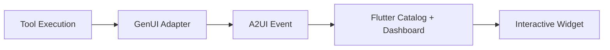

# Rendering Telemetry with GenUI (A2UI)

This guide provides a comprehensive overview of how the SRE Agent renders rich, interactive telemetry (charts, traces, logs) within the chat interface using the **Generative UI (A2UI)** protocol, and how the same data feeds into the **Observability Explorer** dashboard.

## Architecture: From Agent to Pixel

The rendering pipeline consists of four distinct stages:



1.  **Tool Execution**: An agent tool (e.g., `fetch_trace`) fetches raw data from a GCP API.
2.  **GenUI Adapter**: The backend transforms this raw data into a strictly typed JSON schema expected by the frontend (`sre_agent/tools/analysis/genui_adapter.py`).
3.  **A2UI Event**: The transformed data is wrapped in an A2UI `surfaceUpdate` event and streamed to the client. Dashboard data is also emitted via the dedicated `dashboard` event channel.
4.  **Flutter Catalog + Dashboard**: The frontend matches the `component.type` to a registered Dart widget in `CatalogRegistry` (for inline chat rendering) and routes dashboard events to `DashboardState.addFromEvent()` (for the Observability Explorer).

---

## Dual Rendering Paths

Telemetry data is rendered in two locations:

| Path | Trigger | Rendering Location | Implementation |
|------|---------|-------------------|----------------|
| **Chat (A2UI)** | Tool returns data during agent conversation | Inline within chat messages | `CatalogRegistry` in `lib/catalog.dart` maps `x-sre-*` types to widgets |
| **Dashboard** | `create_dashboard_event()` emits via SSE | Observability Explorer side panel | `DashboardState.addFromEvent()` in `lib/services/dashboard_state.dart` routes by `widget_type` |
| **Manual Query** | User submits query via `ManualQueryBar` | Observability Explorer side panel | `ExplorerQueryService` calls backend, results fed to `DashboardState.add*()` with `DataSource.manual` |

Both the A2UI and Dashboard paths use the same backend `genui_adapter.transform_*()` functions, ensuring identical data schemas.

---

## Component Schemas

All GenUI components follow this base envelope structure:

```json
{
  "id": "unique-component-id",
  "type": "x-sre-component-name",
  "component": {
    "type": "x-sre-component-name",
    "x-sre-component-name": {
      // ... SPECIFIC DATA ...
    }
  }
}
```

The `CatalogRegistry._unwrapComponentData()` method handles three envelope formats:
1. **Direct key match**: `{"x-sre-foo": {...}}`
2. **Component wrapper**: `{"component": {"x-sre-foo": {...}}}`
3. **Root type match**: `{"type": "x-sre-foo", ...}`

### Complete Component Registry

The following table lists all registered A2UI components with their catalog name, widget class, data model, and rendering height:

| Component Type | Widget Class | Data Model | Height | Description |
|---------------|-------------|------------|--------|-------------|
| `x-sre-trace-waterfall` | `TraceWaterfall` | `Trace` | auto | Distributed trace span waterfall |
| `x-sre-metric-chart` | `SyncfusionMetricChart` | `MetricSeries` | 380px | Time-series metric line chart |
| `x-sre-log-pattern-viewer` | `LogPatternViewer` | `List<LogPattern>` | 450px | Clustered log pattern summary |
| `x-sre-log-entries-viewer` | `LogEntriesViewer` | `LogEntriesData` | 500px | Raw log entries with severity colors |
| `x-sre-agent-activity` | `AgentActivityCanvas` | `AgentActivityData` | 450px | Agent execution flow visualization |
| `x-sre-service-topology` | `ServiceTopologyCanvas` | `ServiceTopologyData` | 500px | Service dependency graph |
| `x-sre-incident-timeline` | `IncidentTimelineCanvas` | `IncidentTimelineData` | 420px | Chronological incident event timeline |
| `x-sre-metrics-dashboard` | `MetricsDashboardCanvas` | `MetricsDashboardData` | 400px | Multi-metric golden signals dashboard |
| `x-sre-ai-reasoning` | `AIReasoningCanvas` | `AIReasoningData` | 480px | Agent reasoning chain visualization |
| `x-sre-agent-trace` | `AgentTraceCanvas` | `AgentTraceData` | 550px | Agent self-analysis trace view |
| `x-sre-agent-graph` | `AgentGraphCanvas` | `AgentGraphData` | 500px | Multi-trace agent property graph (BQ GRAPH_TABLE) |
| `x-sre-vega-chart` | *(dashboard only)* | `VegaChartData` | varies | Vega-Lite chart specification |
| `x-sre-council-synthesis` | *(dashboard only)* | `CouncilSynthesisData` | varies | Council of Experts synthesis |
| `x-sre-tool-log` | `ToolLogWidget` | `ToolLog` | auto | Inline tool call status log |

### Dashboard-Specific Widget Types

The following `widget_type` values are processed by `DashboardState.addFromEvent()` but do not have corresponding `CatalogItem` entries (they are rendered only in the Observability Explorer):

- `x-sre-vega-chart` -- Vega-Lite chart specs rendered via `LiveChartsPanel`
- `x-sre-council-synthesis` -- Council synthesis rendered via `LiveCouncilPanel`

The `classifyComponent()` function in `dashboard_state.dart` maps widget types to `DashboardDataType` values:

```dart
'x-sre-log-entries-viewer'   -> DashboardDataType.logs
'x-sre-log-pattern-viewer'   -> DashboardDataType.logs
'x-sre-metric-chart'         -> DashboardDataType.metrics
'x-sre-metrics-dashboard'    -> DashboardDataType.metrics
'x-sre-trace-waterfall'      -> DashboardDataType.traces
'x-sre-incident-timeline'    -> DashboardDataType.alerts
'x-sre-council-synthesis'    -> DashboardDataType.council
'x-sre-vega-chart'           -> DashboardDataType.charts
```

---

## Schema Details

### 1. Metric Chart (`x-sre-metric-chart`)

Used for timeseries data (CPU usage, Latency, etc.).

**Data Source**: `query_promql`, `list_time_series`, `get_service_health`
**Adapter**: `sre_agent.tools.analysis.genui_adapter.transform_metrics`
**Chat Widget**: `SyncfusionMetricChart` (`lib/widgets/syncfusion_metric_chart.dart`)
**Dashboard Widget**: `SyncfusionMetricChart` via `LiveMetricsPanel`

```json
{
  "metric_name": "kubernetes.io/container/cpu/core_usage_time",
  "points": [
    { "timestamp": "2023-10-27T10:00:00Z", "value": 0.45 },
    { "timestamp": "2023-10-27T10:01:00Z", "value": 0.67 }
  ],
  "labels": {
    "cluster_name": "prod-us-central1"
  }
}
```

### 2. Trace Waterfall (`x-sre-trace-waterfall`)

Visualizes a distributed trace span tree.

**Data Source**: `fetch_trace`, `list_traces`
**Adapter**: `sre_agent.tools.analysis.genui_adapter.transform_trace`
**Chat Widget**: `TraceWaterfall` (`lib/widgets/trace_waterfall.dart`)
**Dashboard Widget**: `TraceWaterfall` via `LiveTracePanel`

```json
{
  "trace_id": "0af7651916cd43dd8448eb211c80319c",
  "spans": [
    {
      "span_id": "123456",
      "parent_span_id": null,
      "name": "Recv.Frontend",
      "start_time": "2023-10-27T10:00:00.000Z",
      "end_time": "2023-10-27T10:00:00.500Z",
      "status": "OK",
      "attributes": {
        "/http/status_code": "200"
      }
    }
  ]
}
```

### 3. Log Pattern Viewer (`x-sre-log-pattern-viewer`)

Displays clustered log entries to reduce noise.

**Data Source**: `extract_log_patterns`
**Adapter**: `sre_agent.tools.analysis.genui_adapter.transform_log_patterns`
**Chat Widget**: `LogPatternViewer` (`lib/widgets/log_pattern_viewer.dart`)
**Dashboard Widget**: Pattern summary in `LiveLogsExplorer`

```json
{
  "total_logs_analyzed": 5000,
  "patterns": [
    {
      "sample": "Connection refused to database 10.0.0.5",
      "count": 450,
      "severity": "ERROR",
      "first_seen": "2023-10-27T09:00:00Z",
      "last_seen": "2023-10-27T10:00:00Z"
    }
  ]
}
```

### 4. Log Entries Viewer (`x-sre-log-entries-viewer`)

Displays raw log entries with severity colors and expandable payloads.

**Data Source**: `list_log_entries`
**Adapter**: `sre_agent.tools.analysis.genui_adapter.transform_log_entries`
**Chat Widget**: `LogEntriesViewer` (`lib/widgets/log_entries_viewer.dart`)
**Dashboard Widget**: Entry list in `LiveLogsExplorer`

```json
{
  "entries": [
    {
      "timestamp": "2023-10-27T10:00:00Z",
      "severity": "ERROR",
      "payload_preview": "Connection refused to database 10.0.0.5",
      "payload": { "error": "ECONNREFUSED", "host": "10.0.0.5" },
      "is_json_payload": true,
      "resource_type": "gce_instance"
    }
  ]
}
```


### 6. Incident Timeline (`x-sre-incident-timeline`)

Chronological event timeline with severity indicators.

**Data Source**: `list_alerts`, `get_incident_details`
**Adapter**: `sre_agent.tools.analysis.genui_adapter.transform_alerts_to_timeline`
**Chat Widget**: `IncidentTimelineCanvas` (`lib/widgets/canvas/incident_timeline_canvas.dart`)
**Dashboard Widget**: `AlertsDashboardCanvas` via `LiveAlertsPanel`

```json
{
  "events": [
    {
      "timestamp": "2023-10-27T09:55:00Z",
      "type": "alert_opened",
      "severity": "CRITICAL",
      "summary": "CPU utilization exceeded 95%",
      "metadata": { "policy_name": "cpu-high", "project_id": "my-project" }
    }
  ]
}
```

### 7. Metrics Dashboard (`x-sre-metrics-dashboard`)

Multi-metric golden signals dashboard.

**Data Source**: `get_service_health`
**Adapter**: `sre_agent.tools.analysis.genui_adapter.transform_metrics_dashboard`
**Chat Widget**: `MetricsDashboardCanvas` (`lib/widgets/canvas/metrics_dashboard_canvas.dart`)
**Dashboard Widget**: `MetricsDashboardCanvas` via `LiveMetricsPanel`

```json
{
  "metrics": [
    {
      "name": "Request Rate",
      "value": 1250.5,
      "unit": "req/s",
      "trend": "up",
      "series": [...]
    }
  ]
}
```

### 8. Agent Activity (`x-sre-agent-activity`)

Agent execution flow visualization showing tool calls and reasoning.

**Data Source**: Agent execution events
**Chat Widget**: `AgentActivityCanvas` (`lib/widgets/canvas/agent_activity_canvas.dart`)

```json
{
  "nodes": [
    {
      "id": "node-1",
      "label": "fetch_trace",
      "type": "tool_call",
      "status": "completed",
      "duration_ms": 450
    }
  ],
  "edges": [
    { "source": "node-1", "target": "node-2" }
  ]
}
```

### 9. Service Topology (`x-sre-service-topology`)

Service dependency graph showing health status.

**Data Source**: `build_service_graph`
**Chat Widget**: `ServiceTopologyCanvas` (`lib/widgets/canvas/service_topology_canvas.dart`)

```json
{
  "services": [
    {
      "name": "frontend",
      "type": "cloud_run",
      "health": "healthy",
      "dependencies": ["api-gateway", "auth-service"]
    }
  ]
}
```

### 10. AI Reasoning (`x-sre-ai-reasoning`)

Visualization of the agent's reasoning chain and conclusions.

**Data Source**: Agent reasoning events
**Chat Widget**: `AIReasoningCanvas` (`lib/widgets/canvas/ai_reasoning_canvas.dart`)

```json
{
  "steps": [
    {
      "label": "Observed high error rate in checkout-service",
      "type": "observation",
      "confidence": 0.95
    }
  ],
  "conclusion": "Root cause is a misconfigured database connection pool"
}
```

### 11. Agent Trace (`x-sre-agent-trace`)

Agent self-analysis trace showing internal execution flow.

**Data Source**: Agent introspection tools
**Chat Widget**: `AgentTraceCanvas` (`lib/widgets/canvas/agent_trace_canvas.dart`)

### 12. Agent Graph (`x-sre-agent-graph`)

Multi-trace agent property graph visualization built on BigQuery GRAPH_TABLE. Displays the full agent hierarchy (User -> Root Agent -> Sub-Agents -> Tools -> LLMs) with per-node metrics (tokens, cost, latency, error rate) and per-edge statistics (call count, error count, token flow). Supports hierarchical (Sugiyama) and force-directed layouts with interactive node selection and detail panel drill-down.

**Data Source**: BigQuery Property Graph (`agent_trace_graph`) via pre-aggregated hourly table
**Feature Module**: `lib/features/agent_graph/` (domain, data, application, presentation)
**Chat Widget**: `AgentGraphCanvas` (`lib/widgets/canvas/agent_graph_canvas.dart`)

### 13. Council Synthesis (`x-sre-council-synthesis`)

Council of Experts unified assessment (dashboard only).

**Data Source**: Council synthesizer output
**Dashboard Widget**: `LiveCouncilPanel`

```json
{
  "synthesis": "The root cause is a database connection pool exhaustion...",
  "overall_severity": "high",
  "overall_confidence": 0.92,
  "mode": "standard",
  "rounds": 1,
  "panels": [...],
  "critic_report": null,
  "activity_graph": null
}
```

### 14. Vega Chart (`x-sre-vega-chart`)

Vega-Lite chart specification from the analytics agent (dashboard only).

**Data Source**: BigQuery data agent
**Dashboard Widget**: `LiveChartsPanel`

```json
{
  "question": "What are the top 10 slowest endpoints?",
  "answer": "The /api/checkout endpoint has the highest P95 latency...",
  "has_charts": true,
  "vega_lite_charts": [
    {
      "$schema": "https://vega.github.io/schema/vega-lite/v5.json",
      "mark": "bar",
      "encoding": {...}
    }
  ]
}
```

### 15. Tool Log (`x-sre-tool-log`)

Inline tool call status shown during agent execution.

**Data Source**: Tool execution events
**Chat Widget**: `ToolLogWidget` (`lib/widgets/tool_log.dart`)

```json
{
  "tool_name": "fetch_trace",
  "args": { "trace_id": "abc123" },
  "status": "completed",
  "duration_ms": 350
}
```

---

## Backend Implementation

### 1. Create Transformation Logic

All transformations live in `sre_agent/tools/analysis/genui_adapter.py`. Always handle errors gracefully and return a valid structure even if the data is partial.

```python
def transform_my_new_widget(data: dict) -> dict:
    if "error" in data:
        return {"error": data["error"]}

    return {
        "my_field": data.get("some_value", "default")
    }
```

### 2. Register the Tool

In the tool definition (e.g., `sre_agent/tools/analysis/my_tool.py`), ensure the tool outputs the correct schema. Use `@adk_tool(skip_summarization=True)` for structured data tools that feed into GenUI.

### 3. Emit Dashboard Events

For tools whose results should appear in the Observability Explorer, emit a dashboard event via `create_dashboard_event()` in `sre_agent/api/helpers/tool_events.py`:

```python
from sre_agent.api.helpers.tool_events import create_dashboard_event

event = create_dashboard_event(
    category="metrics",
    widget_type="x-sre-metric-chart",
    tool_name="list_time_series",
    data=transformed_data,
)
```

### 4. Route the Event

The `AgentRouter` (`sre_agent/api/routers/agent.py`) automatically detects tool outputs and calls the appropriate adapter if a matching transformer exists in the `ADAPTER_MAP`. Dashboard events are sent via the SSE `dashboard` channel.

---

## Frontend Implementation (Flutter)

### 1. Define the Component in the Catalog

In `autosre/lib/catalog.dart`, register the new component type in the `CatalogRegistry.createSreCatalog()` method:

```dart
CatalogItem(
  name: 'x-sre-my-new-widget',
  dataSchema: S.any(),
  widgetBuilder: (context) {
    try {
      final data = _unwrapComponentData(
        context.data,
        'x-sre-my-new-widget',
      );

      final myData = MyModel.fromJson(data);
      if (myData.isEmpty) return const SizedBox.shrink();

      return _buildWidgetContainer(
        child: MyNewWidget(data: myData),
        height: 400,
      );
    } catch (e) {
      return ErrorPlaceholder(error: e);
    }
  },
),
```

Key patterns:
- Always use `_unwrapComponentData()` to handle the three envelope formats.
- Parse data into strongly typed models from `lib/models/adk_schema.dart`.
- Return `SizedBox.shrink()` for empty data.
- Wrap in `_buildWidgetContainer()` for consistent dark-themed card styling.
- Catch errors and render `ErrorPlaceholder` for graceful degradation.

### 2. Create the Widget

Implement the widget in the appropriate directory:
- `autosre/lib/widgets/` -- for simple widgets (log viewer, chart, etc.)
- `autosre/lib/widgets/canvas/` -- for `CustomPainter`-based visualizations

Use the strong types defined in `autosre/lib/models/adk_schema.dart` to parse JSON data.

```dart
class MyNewWidget extends StatelessWidget {
  final MyModel data;

  const MyNewWidget({super.key, required this.data});

  @override
  Widget build(BuildContext context) {
    return Container(
      child: Text(data.myField),
    );
  }
}
```

### 3. Add Dashboard Support (Optional)

If the component should also appear in the Observability Explorer:

1. Add a `widget_type` case to `DashboardState.addFromEvent()` in `lib/services/dashboard_state.dart`.
2. Add a `classifyComponent()` mapping from the widget type to a `DashboardDataType`.
3. Add a typed field to `DashboardItem` (e.g., `myWidgetData`).
4. Add a typed `add*()` method to `DashboardState`.
5. Render the data in the appropriate `Live*Panel` widget.

---

## Debugging

See [Debugging GenUI](debugging_genui.md) for detailed instructions on how to inspect the event stream and trace rendering issues.

Common debugging steps:
1. Check the browser DevTools Network tab for SSE events.
2. Look for `Unknown dashboard widget_type:` messages in the Flutter console (printed by `DashboardState.addFromEvent()`).
3. Verify the backend transformer output matches the expected frontend model schema.
4. Use the "Copy Data" button on `DashboardCardWrapper` to inspect the raw JSON that was fed to the widget.
