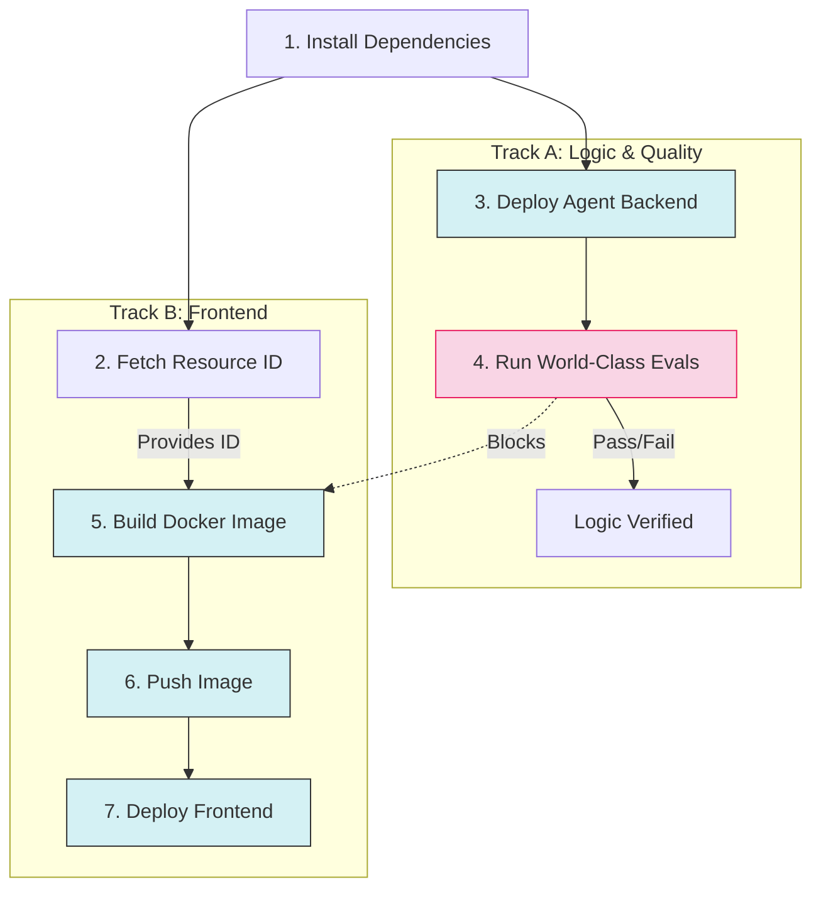

# Deployment Architecture

The SRE Agent uses a **parallel deployment strategy** to optimize build times by decoupling the backend (Agent Engine) deployment from the frontend (Cloud Run) build process. This strategy is implemented in both the **CI/CD pipeline** and the **local deployment scripts**.

## CI/CD Pipeline (`cloudbuild.yaml`)

The Cloud Build pipeline orchestrates the deployment in two parallel tracks:

### Pipeline Visualization



### Steps Explained

1.  **Install Dependencies**: Sets up `uv` and Python environment.
2.  **Fetch Resource ID**: quickly looks up the *existing* Agent Engine resource ID (using `deploy/get_id.py`).
    *   *Purpose*: This ID is needed immediately by the frontend build (Track B).
    *   *Constraint*: This step fails if no agent exists (First Deployment must be manual).
3.  **Deploy Agent Backend (Track A)**:
    *   **Logic**: Uses `deploy/deploy.py` to update the Agent Engine logic.
4.  **Run World-Class Evals (Track A - Quality Gate)**:
    *   **Starts After**: `deploy-backend`.
    *   **Logic**: Executes `uv run poe eval`. Uses the Cloud Build service account to semantically judge the agent's performance.
    *   **Impact**: Blocks the frontend build if thresholds (trajectory/rubric) are not met.
5.  **Build Docker Image (Track B)**:
    *   **Waits For**: `fetch-resource-id` (Step 2) AND `run-evals` (Step 4).
    *   **Logic**: Builds the frontend container with `SRE_AGENT_ID`.
6.  **Push Image (Track B)**: Pushes the container to Artifact Registry.
7.  **Deploy Frontend (Track B)**: Deploys to Cloud Run.

## First-Time Deployment

Because Step 2 (`fetch-resource-id`) expects an existing agent, the very first deployment **must be done manually** from a local machine or via a specific Cloud Build job that skips the fetch Step.

To deploy for the first time:

```bash
# 1. Create the Backend Agent
uv run python deploy/deploy.py --create --project_id YOUR_PROJECT_ID ...

# 2. Trigger the Cloud Build pipeline
gcloud builds submit ...
```

Once the agent exists, the CI/CD pipeline will work automatically.

## Environment Variables Strategy

*   **Agent Engine (Backend)**: Receives configuration via `deploy.py` (e.g., `STRICT_EUC_ENFORCEMENT`, encryption keys).
*   **Cloud Run (Frontend)**: Receives the **Agent Engine Resource ID** via two methods:
    1.  **Build Arg**: Baked into the image as a default.
    2.  **Env Var**: Injected at runtime by `cloudbuild.yaml` (overrides default).

## Failure Modes

*   **If Backend Fails, Frontend Succeeds**: The new Frontend will be calculating against the *old* Backend logic. This is generally safe for minor updates but requires care for breaking schema changes.
*   **If Frontend Fails**: The Backend might be updated but no UI changes are visible.

## Local Parallel Deployment (`deploy_all.py`)

The `uv run poe deploy-all` command (which runs `deploy/deploy_all.py`) also supports parallel deployment when an existing agent is detected.

### How it works:
1.  **Discovery**: The script performs a quick lookup for an existing stable Agent ID by name (`sre_agent`).
2.  **Parallel Tracks**: If an ID is found, it launches the backend and frontend deployments in parallel using threads.
3.  **Prefixing**: Logs are prefixed with `[BACKEND]` and `[FRONTEND]` to distinguish the output.

### Verification:
To verify the parallel flow is working locally:
1.  Run `uv run poe list` to see your current agent IDs.
2.  Run `uv run poe deploy-all`.
3.  Look for the message: `🚀 PARALLEL DEPLOYMENT INITIATED (Patching existing agent)`.
4.  Navigate to the provided Cloud Run URL once finished.

### First-Time Deployment (Local):
If no agent is found, the script automatically falls back to **sequential deployment** to safely capture the new ID.
