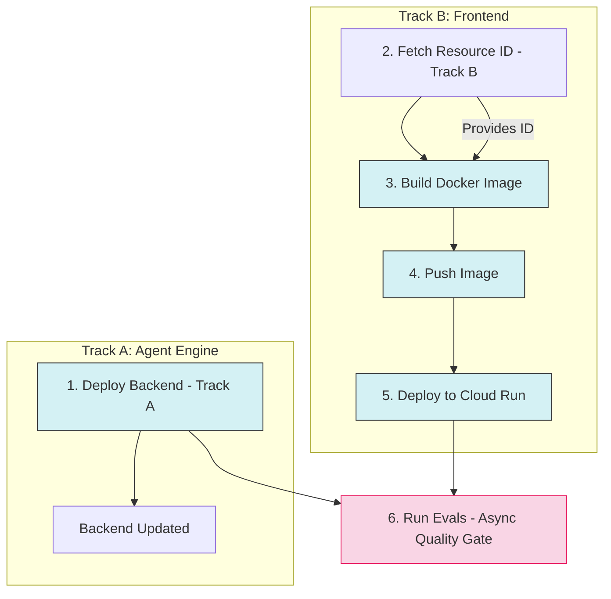

# Deployment Architecture

The SRE Agent uses a **parallel deployment strategy** to optimize build times by decoupling the backend (Agent Engine) deployment from the frontend (Cloud Run) build process. This strategy is implemented in both the **CI/CD pipeline** and the **local deployment scripts**.

## CI/CD Pipeline (`cloudbuild.yaml`)

The Cloud Build pipeline orchestrates the deployment in two parallel tracks:

### Pipeline Visualization



### Steps Explained

1.  **Deploy Agent Backend (Track A)** (`deploy-backend`):
    *   **Starts**: Immediately (`waitFor: ['-']`).
    *   **Logic**: Installs `uv`, syncs dependencies, then uses `deploy/deploy.py --create` to update the Agent Engine logic. The smart deploy will find the existing agent by name (`sre_agent`) and patch it.
    *   **Secrets consumed**: `SRE_AGENT_ENCRYPTION_KEY`, `GOOGLE_CUSTOM_SEARCH_API_KEY`, `GITHUB_TOKEN` (from Secret Manager via `secretEnv`).
    *   **Env vars consumed**: `GOOGLE_CLOUD_PROJECT`, `GOOGLE_CLOUD_LOCATION`, `AGENT_ENGINE_LOCATION`, `GOOGLE_CLOUD_STORAGE_BUCKET`, `GOOGLE_CUSTOM_SEARCH_ENGINE_ID`, `GITHUB_REPO`, `SRE_AGENT_COUNCIL_ORCHESTRATOR`, `SRE_AGENT_SLIM_TOOLS`.
    *   **Note**: `STRICT_EUC_ENFORCEMENT` and `SRE_AGENT_ENFORCE_POLICY` are set to `false` for the CI/CD build environment (since the build service account is not a real user).

2.  **Fetch Resource ID (Track B)** (`fetch-resource-id`):
    *   **Starts**: Immediately (`waitFor: ['-']`), in parallel with Track A.
    *   **Logic**: Uses the Vertex AI REST API directly (with `curl` + `jq`) to quickly look up the existing Agent Engine resource ID by display name (`sre_agent`). Writes the result to `backend_resource_name.txt`.
    *   **Purpose**: This ID is needed immediately by the frontend build (Track B) and avoids waiting for the full `uv`/Python environment setup.
    *   **Constraint**: This step **fails if no agent exists**. First deployment must be manual (see below).

3.  **Build Docker Image (Track B)** (`build-image`):
    *   **Waits For**: `fetch-resource-id` (Step 2).
    *   **Logic**: Builds the unified Docker image with `SRE_AGENT_ID`, `SRE_AGENT_URL`, `BUILD_SHA`, and `BUILD_TIMESTAMP` as build args. The agent URL is constructed from the resource name.

4.  **Push Image (Track B)** (`push-image`):
    *   **Waits For**: `build-image` (Step 3).
    *   **Logic**: Pushes the image to `gcr.io/$PROJECT_ID/autosre:latest`.

5.  **Deploy Frontend (Track B)** (`deploy-frontend`):
    *   **Waits For**: `push-image` (Step 4).
    *   **Logic**: Deploys the image to Cloud Run with the following configuration:
        *   **Resources**: 16 GiB memory, 4 vCPUs
        *   **Access**: `--allow-unauthenticated` (configurable)
        *   **Env vars**: `WEB_CONCURRENCY=1`, `SRE_AGENT_URL`, `SRE_AGENT_ID`, `GCP_PROJECT_ID`, `GCP_REGION`, telemetry/logging settings
        *   **Secrets**: `GOOGLE_API_KEY`, `GEMINI_API_KEY`, `GOOGLE_CLIENT_ID`, `SRE_AGENT_ENCRYPTION_KEY` (from Secret Manager via `--set-secrets`)

6.  **Run Evals (Asynchronous Quality Gate)** (`run-evals`):
    *   **Waits For**: `deploy-frontend` (Step 5).
    *   **Logic**: Installs `uv`, syncs dependencies, executes `uv run poe eval` to semantically judge the agent's performance.
    *   **Impact**: **Non-blocking** (`allowFailure: true`). The deployment completes even if evals fail, allowing for tiered quality monitoring without impacting velocity.
    *   **Secrets consumed**: `SRE_AGENT_ENCRYPTION_KEY`, `GOOGLE_CUSTOM_SEARCH_API_KEY`, `GITHUB_TOKEN`, `EVAL_PROJECT_ID`.
    *   **Project override**: Uses `EVAL_PROJECT_ID` from Secret Manager if available; otherwise falls back to the build project.

### Cloud Build Substitution Variables

| Variable | Default | Purpose |
|----------|---------|---------|
| `_LOCATION` | `us-central1` | GCP region for deployment |
| `_BUCKET` | `your-staging-bucket-name` | GCS staging bucket for Agent Engine |
| `_GOOGLE_CUSTOM_SEARCH_ENGINE_ID` | `""` | Programmable Search Engine ID |
| `_GITHUB_REPO` | `srtux/sre-agent` | Default GitHub repository |
| `_SRE_AGENT_COUNCIL_ORCHESTRATOR` | `""` | Enable Council of Experts |
| `_SRE_AGENT_SLIM_TOOLS` | `""` | Enable slim tool set |

### Secret Manager Integration

The pipeline references the following secrets from Google Cloud Secret Manager:

| Secret Name | Cloud Build Env | Used In |
|-------------|-----------------|---------|
| `sre-agent-encryption-key` | `SRE_AGENT_ENCRYPTION_KEY` | `deploy-backend`, `run-evals` |
| `google-custom-search-api-key` | `GOOGLE_CUSTOM_SEARCH_API_KEY` | `deploy-backend`, `run-evals` |
| `github-token` | `GITHUB_TOKEN` | `deploy-backend`, `run-evals` |
| `eval-project-id` | `EVAL_PROJECT_ID` | `run-evals` |

Additionally, the Cloud Run deployment step mounts these secrets at runtime:

| Secret Name | Cloud Run Env Var |
|-------------|-------------------|
| `gemini-api-key` | `GOOGLE_API_KEY`, `GEMINI_API_KEY` |
| `google-client-id` | `GOOGLE_CLIENT_ID` |
| `sre-agent-encryption-key` | `SRE_AGENT_ENCRYPTION_KEY` |

### Research and GitHub API Key Propagation

The `GOOGLE_CUSTOM_SEARCH_API_KEY`, `GOOGLE_CUSTOM_SEARCH_ENGINE_ID`, `GITHUB_TOKEN`, and `GITHUB_REPO` variables follow different paths depending on deployment method:

*   **CI/CD (Cloud Build)**: `GOOGLE_CUSTOM_SEARCH_API_KEY` and `GITHUB_TOKEN` are injected from Secret Manager via `secretEnv`. `GOOGLE_CUSTOM_SEARCH_ENGINE_ID` and `GITHUB_REPO` are passed via substitution variables. These are all consumed by the `deploy-backend` step, which runs `deploy.py`. Inside `deploy.py`, they are read from the environment and propagated to the Agent Engine via the `env_vars_to_propagate` mechanism.
*   **Local deployment**: Set these in your `.env` file. `deploy.py` reads them from the local environment and propagates them to the Agent Engine.
*   **Cloud Run frontend**: Does not need these variables (they are only used by the Agent Engine backend).

## First-Time Deployment

Because Step 2 (`fetch-resource-id`) expects an existing agent, the very first deployment **must be done manually** from a local machine:

```bash
# 1. Create the Backend Agent
uv run python deploy/deploy.py --create

# 2. (Optional) Grant permissions
uv run python deploy/grant_permissions.py --project-id $GOOGLE_CLOUD_PROJECT

# 3. Trigger the Cloud Build pipeline
gcloud builds submit --config cloudbuild.yaml \
  --substitutions=_LOCATION=us-central1,_BUCKET=your-bucket
```

Once the agent exists, the CI/CD pipeline will work automatically on subsequent runs.

## Environment Variables Strategy

*   **Agent Engine (Backend)**: Receives configuration via `deploy.py`. Variables are baked into the Agent Engine environment at deploy time:
    *   Always set: Telemetry config, `RUNNING_IN_AGENT_ENGINE=true`, `SRE_AGENT_ENCRYPTION_KEY`, `LOG_FORMAT`, `LOG_LEVEL`, policy settings
    *   Conditionally propagated: `GOOGLE_CUSTOM_SEARCH_API_KEY`, `GOOGLE_CUSTOM_SEARCH_ENGINE_ID`, `GITHUB_TOKEN`, `GITHUB_REPO`, `SRE_AGENT_COUNCIL_ORCHESTRATOR`, `SRE_AGENT_SLIM_TOOLS`, `SRE_AGENT_CIRCUIT_BREAKER`, `SRE_AGENT_CONTEXT_CACHE_TTL`
*   **Cloud Run (Frontend)**: Receives configuration via two methods:
    1.  **Build Arg**: `SRE_AGENT_ID` and `SRE_AGENT_URL` baked into the image as defaults.
    2.  **Runtime Env Var**: Injected at runtime by `cloudbuild.yaml` (overrides image defaults).
    3.  **Runtime Secrets**: `GOOGLE_API_KEY`, `GEMINI_API_KEY`, `GOOGLE_CLIENT_ID`, `SRE_AGENT_ENCRYPTION_KEY` from Secret Manager.

## Failure Modes

*   **If Backend Fails, Frontend Succeeds**: The new Frontend will be running against the *old* Backend logic. This is generally safe for minor updates but requires care for breaking schema changes.
*   **If Frontend Fails, Backend Succeeds**: The Backend is updated but no UI changes are visible. Users still interact with the old frontend.
*   **If Evals Fail**: Non-blocking. The deployment is already complete. Review eval results in Cloud Build logs for quality regression monitoring.

## Local Parallel Deployment (`deploy_all.py`)

The `uv run poe deploy-all` command (which runs `deploy/deploy_all.py`) also supports parallel deployment when an existing agent is detected.

### How it works:
1.  **Discovery**: The script performs a quick lookup for an existing stable Agent ID by name (`sre_agent`) using the Vertex AI SDK.
2.  **Parallel Tracks**: If an ID is found, it launches the backend and frontend deployments in parallel using Python threads.
3.  **Prefixing**: Logs are prefixed with `[BACKEND]` and `[FRONTEND]` to distinguish the output.

### Verification:
To verify the parallel flow is working locally:
1.  Run `uv run poe list` to see your current agent IDs.
2.  Run `uv run poe deploy-all`.
3.  Look for the message: `PARALLEL DEPLOYMENT INITIATED (Patching existing agent)`.
4.  Navigate to the provided Cloud Run URL once finished.

### First-Time Deployment (Local):
If no agent is found, the script automatically falls back to **sequential deployment** to safely capture the new resource ID before starting the frontend deployment.

## Cloud Run Resource Configuration

The Cloud Run service is deployed with the following resource allocation:

| Resource | Value | Rationale |
|----------|-------|-----------|
| Memory | 16 GiB | Each uvicorn worker uses ~250-350 MB with full GCP SDK stack |
| CPU | 4 vCPUs | Matches `WEB_CONCURRENCY` for parallel request handling |
| Timeout | 300 seconds | Agent investigations can take several minutes |
| `WEB_CONCURRENCY` | 2 (deploy_web.py) / 1 (cloudbuild.yaml) | Number of uvicorn worker processes |

> **Note**: The `server.py` defaults `WEB_CONCURRENCY` to 4 for local development. Deployment scripts override this to 1-2 for Cloud Run to leave headroom for the GCP SDK memory footprint.
