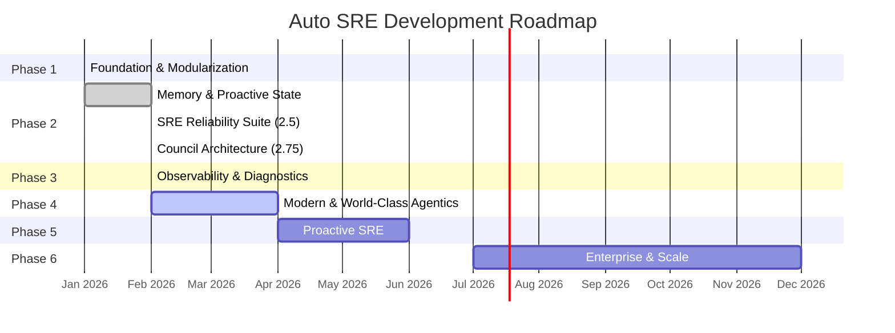

# Auto SRE Project Roadmap

This directory tracks the project roadmap organized by phases. Each phase has clearly defined goals, tasks, and status tracking to help both humans and AI agents understand what's been done, what's in progress, and what's planned.

> **For AI Agents**: Check this roadmap before starting work to understand the current project state. Update the relevant phase doc after completing significant work.

---

## Roadmap Overview



---

## Phase Summary

| Phase | Period | Status | Goal | Key Deliverables |
|-------|--------|--------|------|-----------------|
| [Phase 1](phase-1-foundation.md) | Jan 2026 | Completed | Technical debt reduction, reasoning structure | Modular API, ReAct pattern, tool taxonomy, EUC auth |
| [Phase 2](phase-2-memory.md) | Jan-Feb 2026 | Completed | Deep context retention, guided investigations | Memory integration, investigation state machine, CI/CD |
| [Phase 2.5](phase-2-memory.md#phase-25-sre-reliability-suite) | Feb 2026 | Completed | Production-grade resilience | Circuit breaker, SLO analysis, postmortem, change correlation |
| [Phase 2.75](phase-2-memory.md#phase-275-parallel-council--debate-architecture) | Feb 2026 | Completed | Parallel multi-agent investigation | Council of Experts, debate pipeline, intent classifier |
| [Phase 3](phase-3-observability.md) | Feb 2026 | Completed | Observability, eval, sandbox, self-healing | Explorer dashboard, eval framework, sandbox execution, GitHub tools, playbooks |
| [Phase 4](phase-4-modern.md) | Feb-Apr 2026 | **In Progress** | Transparency, continuous quality, governance | Streaming reasoning, CI evals, observability-on-self, HITL |
| [Phase 5](phase-5-proactive.md) | Q2 2026 | Planned | Anticipate problems proactively | Anomaly detection, knowledge graph, panel self-assessment |
| [Phase 6](phase-6-enterprise.md) | Q3-Q4 2026 | Planned | Multi-team, multi-cloud governance | Collaborative investigations, canary deployments, multi-cloud |

---

## Tracking Conventions

Each phase document uses this task tracking format:

```markdown
| Task | Status | Component | Description |
|------|--------|-----------|-------------|
| Task Name | done/in-progress/planned | Component Name | Brief description |
```

**Status values:**
- `done` -- Completed and tested
- `in-progress` -- Currently being worked on
- `planned` -- Scheduled for this phase
- `blocked` -- Waiting on a dependency
- `backlog` -- Identified but not yet scheduled

**Component values** reference the [component documentation](../components/README.md):
- Backend Core, Council, Sub-Agents, Tools, Services & Memory
- Flutter Frontend, AgentOps UI
- Evaluation, Deployment, Testing

---

## How to Update the Roadmap

1. When completing a task: Change status to `done` in the relevant phase doc
2. When starting a task: Change status to `in-progress`
3. When adding new work: Add a row to the appropriate phase
4. When completing a phase: Update the summary table above
5. After major milestones: Update [PROJECT_PLAN.md](../PROJECT_PLAN.md) as well

---

## Backlog (Cross-Phase)

These items have been identified but not yet assigned to a specific phase:

| Task | Priority | Component | Description |
|------|----------|-----------|-------------|
| Council intent classifier tie-breaking | Medium | Council | Deterministic tie-breaking for signal type detection |
| API rate limiting | High | Backend Core | Add slowapi middleware with per-endpoint rate limits |
| CORS tightening | Medium | Backend Core | Explicit header allowlist, disable credentials with wildcard origins |
| Sync tool circuit breaker | Low | Tools | Add circuit breaker to sync_wrapper in decorators.py |
| Test quality improvements | Medium | Testing | Replace time.sleep() with freezegun, add fixture suites |
| genui_adapter robustness | Medium | Tools | Guard against IndexError and type errors |
| Token estimation alignment | Low | Backend Core | Align CHARS_PER_TOKEN between compactor and callbacks |
| Session state TTL cleanup | Medium | Backend Core | TTL-based cleanup for _compaction_state and _active_executions |

---

*Last updated: 2026-02-23*
