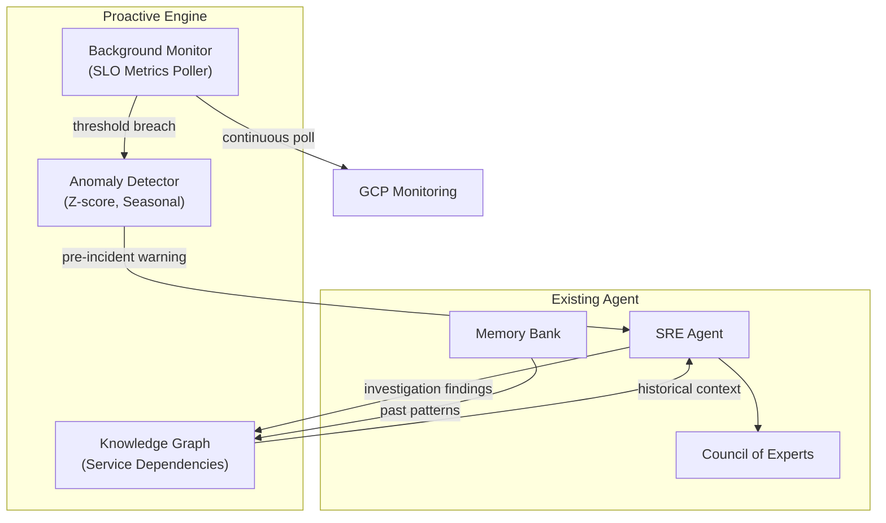

# Phase 5: Proactive SRE

**Period**: Q2 2026 | **Status**: Planned | **Goal**: The agent anticipates problems before users ask

---

## Overview

Phase 5 transforms Auto SRE from a reactive investigation agent into a proactive reliability partner. The agent will continuously monitor SLO metrics, detect emerging anomalies, and surface pre-incident warnings before users even know there's a problem.

---

## Tasks

| Task | Status | Component | Description |
|------|--------|-----------|-------------|
| Proactive Anomaly Detection | planned | Tools | Background monitoring: poll SLO metrics, Z-score/seasonal decomposition, pre-incident warnings |
| Cross-Incident Knowledge Graph | planned | Services & Memory | Persistent service graph auto-populated from investigations, queryable history |
| Panel Self-Assessment | planned | Council | Confidence-aware re-dispatch for low-confidence panels, auto-escalation to Debate |
| Investigation History & Replay | planned | Services & Memory | Past investigations with timestamps, replay against current data, diff view |
| Graceful Degradation Hierarchy | planned | Tools | Multi-level: Full MCP -> Simplified MCP -> Direct API -> Cached -> Synthetic |
| Cost Attribution & Chargeback | planned | Backend Core | Per-team/project LLM token + GCP API cost tracking, monthly reports |
| Anomaly Correlation Engine | planned | Tools | Simultaneous Z-score comparison across metrics and logs |
| Resource Saturation Suite | planned | Tools | OOMKilled, CPU throttling, connection pool exhaustion detection |
| Messaging & Pub/Sub Tracing | planned | Tools | Dead-letter queue and message lag investigation |

---

## Prerequisites

| Prerequisite | From Phase | Notes |
|-------------|-----------|-------|
| Memory Bank integration | Phase 2 | Foundation exists, needs scaling for knowledge graph |
| Service dependency graph | Phase 3.14 | `core/graph_service.py` provides DependencyGraph |
| MCP fallback chain | Phase 3.0 | `tools/mcp/fallback.py` provides first level |
| Token cost tracking | Phase 3.0 | `core/model_callbacks.py` tracks per-request costs |

---

## Architecture Vision

---

## Success Criteria

- [ ] Agent detects anomalies 15+ minutes before alert policies fire
- [ ] Knowledge graph has >80% service coverage after 30 days of investigations
- [ ] Low-confidence panels are re-dispatched with refined queries
- [ ] Investigation replay shows meaningful diffs for recurring issues
- [ ] Cost attribution reports are accurate to within 5% of actual spend

---

*Last updated: 2026-02-23*
