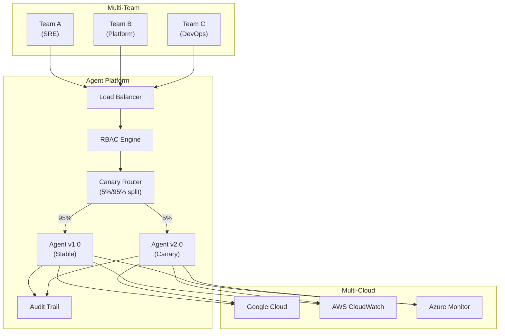

# Phase 6: Enterprise & Scale

**Period**: Q3-Q4 2026 | **Status**: Planned | **Goal**: Multi-team, multi-cloud, production-grade governance

---

## Overview

Phase 6 scales Auto SRE from a single-team tool into an enterprise-grade platform supporting multiple teams, multiple cloud providers, and advanced deployment strategies like canary rollouts and prompt A/B testing.

---

## Tasks

| Task | Status | Component | Description |
|------|--------|-----------|-------------|
| Collaborative Investigations | planned | Flutter Frontend | Multi-user sessions with shared links, real-time cursors, comments, escalation |
| Canary Deployment Pipeline | planned | Deployment | Deploy new agent to 5% traffic, automated eval comparison, auto-promote/rollback |
| Prompt A/B Testing | planned | Backend Core | Per-variant quality tracking, auto-selection, RAG few-shot from memory |
| Mobile-Responsive Dashboard | planned | Flutter Frontend | Responsive breakpoints, collapsible sidebar, swipeable panels, push notifications |
| Chaos Engineering Sub-Agent | planned | Sub-Agents | Validate resilience hypotheses with controlled fault injection |
| Multi-Cloud Support (AWS) | planned | Tools | AWS CloudWatch client factory integration |
| Multi-Cloud Support (Azure) | planned | Tools | Azure Monitor client factory integration |
| RBAC & Team Management | planned | Backend Core | Role-based access control with team-scoped investigations |
| Audit Trail & Compliance | planned | Backend Core | Immutable audit log of all agent actions for SOC2/ISO compliance |
| Custom Alert Policies | planned | Tools | User-defined alert rules triggered by agent investigations |

---

## Architecture Vision

---

## Prerequisites

| Prerequisite | From Phase | Notes |
|-------------|-----------|-------|
| Proactive monitoring | Phase 5 | Required for chaos engineering validation |
| Cost attribution | Phase 5 | Foundation for multi-team billing |
| CI-driven evaluations | Phase 4 | Required for canary quality comparison |
| Memory Bank scaling | Phase 5 | Required for RAG-based prompt A/B testing |

---

## Success Criteria

- [ ] 3+ teams can run concurrent investigations without interference
- [ ] Canary deployments catch quality regressions before full rollout
- [ ] Multi-cloud support covers GCP + at least one additional provider
- [ ] Mobile dashboard provides full investigation capability on tablets
- [ ] Audit trail meets SOC2 compliance requirements

---

*Last updated: 2026-02-23*
